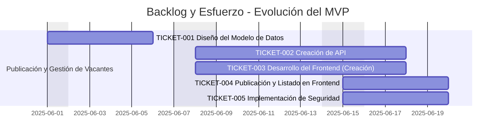
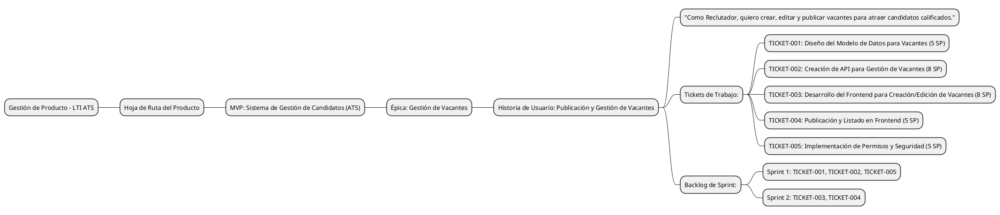

# 1. Features para el MVP de un ATS (Applicant Tracking System). 
Esta lista está pensada para cubrir los aspectos esenciales que permiten validar la propuesta de valor del sistema "LTI", abarcando desde la publicación de vacantes hasta el seguimiento y análisis de las contrataciones:

---
**1.1. Gestión de Vacantes**

- **Creación y Edición de Vacantes:**
Permitir que los reclutadores creen nuevas ofertas de trabajo, editen información (título, descripción, requisitos, ubicación, salario, etc.) y actualicen vacantes existentes.

- **Publicación y Difusión de Vacantes:**
Facilitar la publicación de vacantes en el sitio web corporativo y su difusión automática en portales de empleo y redes sociales.

- **Borradores y Aprobación:**
Funcionalidad para guardar vacantes en borrador y someterlas a un flujo de aprobación antes de la publicación final.

- **Categorización y Etiquetado:**
Organizar las vacantes por departamentos, categorías o etiquetas para facilitar la búsqueda y el análisis.

---

**1.2. Recepción y Gestión de Candidaturas**

- **Formulario de Aplicación y Subida de CV:**
Interfaz amigable para que los candidatos apliquen a una vacante, con campos para información personal, CV, carta de presentación, etc.

- **Soporte para Múltiples Formatos:**
Permitir la carga de CVs en formatos PDF, Word, etc.

- **Parsing y Extracción Automática de Datos:**
Procesar automáticamente la información de los CVs para extraer datos clave y agilizar el filtrado.

- **Almacenamiento Seguro y Cumplimiento Normativo:**
Guardar los datos de manera segura y cumplir con normativas de protección de datos (por ejemplo, GDPR).

---

**1.3. Filtrado y Selección de Candidatos**

- **Búsqueda y Filtros Avanzados:**
Permitir filtrar candidaturas por palabras clave, experiencia, ubicación, etc.

- **Scoring y Ranking de Candidatos:**
Implementar algoritmos (incluyendo machine learning) para asignar un puntaje a cada candidato en función de su idoneidad.

- **Etiquetado y Clasificación:**
Posibilidad de marcar candidatos con etiquetas (por ejemplo, “alta prioridad”, “en revisión”, “descartado”) para facilitar la toma de decisiones.

---

**1.4. Programación y Gestión de Entrevistas**

- **Calendario Integrado:**
Herramienta para agendar entrevistas que se sincronice con calendarios externos (Google Calendar, Outlook, etc.).

- **Notificaciones y Recordatorios Automáticos:**
Envío automático de emails o SMS a candidatos y reclutadores para confirmar y recordar las entrevistas.

- **Integración con Plataformas de Videoconferencia:**
Conexión directa con servicios como Zoom o Microsoft Teams para realizar entrevistas remotas.

- **Feedback y Evaluación:**
Registro de comentarios y calificaciones de cada entrevista para seguimiento del proceso.

---

**1.5. Seguimiento del Proceso de Selección**

- **Pipeline Visual de Candidatos:**
Mostrar el progreso de cada candidato a lo largo del proceso (aplicado, en revisión, entrevista, oferta, contratado).

- **Historial y Comentarios Colaborativos:**
Permitir a los reclutadores agregar notas y evaluaciones, y mantener un historial de interacciones.

- **Dashboard y Reportes:**
Paneles visuales que muestren métricas clave como time-to-hire, coste por contratación, tasa de conversión, etc.

---

**1.6. Gestión de Usuarios y Roles**

- **Administración de Accesos y Permisos:**
Gestión de roles diferenciados (candidato, reclutador, manager, administrador) con distintos niveles de acceso.

- **Autenticación y Seguridad:**
Implementar autenticación segura (por ejemplo, mediante tokens JWT) y control de acceso para proteger la información.

---

**1.7. Integraciones y Automatización**

- **Integración con HRIS/CRM:**
Conexión con sistemas externos para sincronizar datos de recursos humanos.

- **APIs Abiertas:**
Exponer APIs (REST/GraphQL) para que otros sistemas puedan integrarse y consumir información del ATS.

- **Automatización de Flujos:**
Workflows que automaticen tareas repetitivas, como envío de notificaciones, actualización de estados o recordatorios.

---

**1.8. Experiencia de Usuario y Accesibilidad**

- **Interfaz Responsive y Amigable:**
Diseño adaptable a diferentes dispositivos y fácil de usar para minimizar la curva de aprendizaje.

- **Soporte Multilenguaje:**
Posibilidad de ofrecer el ATS en distintos idiomas, según el mercado.

---

**1.9. Cumplimiento y Seguridad**

- **Protección de Datos:**
Asegurar el cumplimiento de normativas de privacidad (GDPR, LOPD, etc.) en el manejo y almacenamiento de datos personales.

- **Auditoría y Logging:**
Registro detallado de acciones para auditoría y solución de problemas.

- **Encriptación y Seguridad de la Comunicación:**
Utilizar encriptación para datos en tránsito y en reposo.

---

# 2. Matriz MOSCOW para el MVP del ATS
Esta matriz prioriza las funcionalidades en función de su importancia para el lanzamiento inicial:

| **MOSCOW**      | **Características**                                                                                                                                                            |
|-----------------|---------------------------------------------------------------------------------------------------------------------------------------------------------------------------------|
| **Must Have**   | - Gestión de Vacantes: Creación, edición y publicación. - Recepción y almacenamiento de candidaturas. - Formulario de aplicación. - Filtrado básico de candidaturas. - Programación de entrevistas con calendario integrado. - Gestión de usuarios y roles básicos (candidato, reclutador). - Interfaz web responsive. - Seguridad básica (autenticación y control de acceso).  |
| **Should Have** | - Parsing automático de CVs. - Notificaciones y recordatorios automáticos (email/SMS). - Dashboard básico de métricas (time-to-hire, coste por contratación). - Integración con videoconferencias.   |
| **Could Have**  | - Funcionalidades avanzadas de machine learning para scoring y ranking de candidatos. - Edición avanzada de vacantes (plantillas, previsualización). - Integración automática con redes sociales para difusión. - Soporte multilenguaje.         |
| **Won't Have**  | - Integración completa con sistemas HRIS/CRM. - Módulo avanzado de onboarding y seguimiento post-contratación. - Reportes analíticos y dashboards personalizados complejos.                    |

**Conclusión**
Esta lista extensiva de features junto con la matriz MOSCOW establece una base sólida para el MVP del ATS. Cada funcionalidad está pensada para cubrir los procesos críticos del reclutamiento y permite validar la propuesta de valor de LTI en el mercado, a la vez que deja espacio para futuras mejoras en iteraciones posteriores.

---
---
# 3. Historias de Usuario principales:

---
**3.1 Historia de Usuario 1: Publicación y Gestión de Vacantes**

* Título de la Historia de Usuario: Publicación y Gestión de Vacantes

* Como: Reclutador

* Quiero: Crear, editar y publicar vacantes en el sistema

* Para que: Pueda atraer a candidatos calificados y mantener actualizadas las ofertas de trabajo

**Criterios de Aceptación:**

	* El reclutador debe poder iniciar sesión y acceder a un panel de gestión de vacantes.

	* El sistema debe permitir crear una vacante con campos obligatorios (título, descripción, requisitos, fecha de publicación, etc.).

	* El reclutador debe poder editar y actualizar la información de una vacante existente.

	* Las vacantes publicadas deben aparecer en la sección pública para que los visitantes las visualicen.

	* Se debe validar que las funciones de creación, edición y publicación solo estén disponibles para usuarios autenticados.

**Notas Adicionales:**

	* Considerar el uso de un control de acceso basado en roles.

	* Incluir una opción de "borrador" para guardar vacantes sin publicar.

	* Se pueden sugerir palabras clave para mejorar la visibilidad en portales de empleo (integración con algoritmos de NLP).

**Historias de Usuario Relacionadas:**

	* "Aplicación y Filtrado de Candidaturas"

	* "Dashboard de Reportes de Vacantes"
	
---	
	

**3.2 Historia de Usuario 2: Aplicación y Filtrado de Candidaturas**

* Título de la Historia de Usuario: Aplicación y Filtrado de Candidaturas

* Como: Candidato (para aplicar) / Reclutador (para filtrar)

* Quiero: Poder aplicar a vacantes y que el sistema filtre las candidaturas automáticamente

* Para que: Se agilice la selección inicial y se prioricen los candidatos más idóneos

**Criterios de Aceptación:**

	* Los candidatos deben poder acceder a un formulario para aplicar a las vacantes, incluyendo la carga de CV y otros datos relevantes.

	* El sistema debe almacenar de forma segura la información enviada por los candidatos.

	* El filtrado de candidaturas debe realizarse de manera automática utilizando filtros básicos (palabras clave, experiencia) y, opcionalmente, un algoritmo de scoring.

	* Solo los usuarios autenticados con rol de reclutador pueden acceder a la funcionalidad de filtrado avanzado y ver el ranking de candidatos.

**Notas Adicionales:**

	* Se utilizarán técnicas de NLP para parsear y extraer información de los CVs.

	* La implementación del filtrado puede mejorar con machine learning a medida que se disponga de más datos.

	* Se debe contemplar un mecanismo para que el reclutador pueda marcar manualmente candidatos relevantes o descartarlos, retroalimentando el sistema.

**Historias de Usuario Relacionadas:**

	* "Publicación y Gestión de Vacantes" (la aplicación está vinculada a una vacante publicada)

	* "Programación y Seguimiento de Entrevistas"
	
---

**3.3 Historia de Usuario 3: Programación y Seguimiento de Entrevistas**

* Título de la Historia de Usuario: Programación y Seguimiento de Entrevistas

* Como: Reclutador / Manager

* Quiero: Poder programar entrevistas y realizar el seguimiento del proceso de selección

* Para que: Se facilite la coordinación y se optimice la toma de decisiones en el proceso de contratación

**Criterios de Aceptación:**

	* El reclutador debe poder acceder a una interfaz de calendario integrada para agendar entrevistas.

	* El sistema debe enviar notificaciones automáticas (email/SMS) a los candidatos y reclutadores cuando se programe o modifique una entrevista.

	* Debe existir una funcionalidad para registrar el estado de la entrevista y almacenar evaluaciones o comentarios post-entrevista.

	* Solo los usuarios autenticados con rol de reclutador o manager deben tener acceso a esta funcionalidad.

	* La interfaz debe mostrar un historial completo del proceso de selección de cada candidato.

**Notas Adicionales:**

	* La integración con servicios de calendario y videoconferencia (por ejemplo, Google Calendar o Zoom) es esencial.

	* Se sugiere implementar un sistema orientado a eventos para gestionar notificaciones y actualizaciones en tiempo real.

	* El seguimiento del proceso se organizará mediante una arquitectura por capas para separar la lógica de negocio, presentación y acceso a datos.

**Historias de Usuario Relacionadas:**

	* "Aplicación y Filtrado de Candidaturas"

	* "Dashboard de Reportes y Métricas de Entrevistas"
	
**NOTA:**

* Estas tres historias de usuario representan los casos de uso principales del ATS, alineados con los objetivos y funcionalidades definidas para el sistema LTI. Cada una incluye criterios específicos para asegurar que la funcionalidad cumpla con las expectativas tanto de candidatos como de reclutadores.

---

# 4. Ejemplos de Como aplicar algoritmos de machine learning

**4.1. Publicación y Gestión de Vacantes**
**Objetivo:**
Optimizar la forma en que se redactan y publican las vacantes para maximizar la atracción de candidatos idóneos.

**Ejemplos de Aplicación de ML:**

- **Análisis de Sentimiento y NLP para Optimizar Descripciones:**
Utiliza técnicas de procesamiento de lenguaje natural (NLP) para analizar el tono y la claridad de las descripciones de vacantes.

	- **Algoritmo: Modelos de análisis de sentimiento (por ejemplo, utilizando librerías como NLTK, spaCy o transformers).**

	- **Caso de Uso:** Sugerir mejoras en el lenguaje (más inclusivo, claro y atractivo) basado en el análisis de descripciones que han tenido mayor éxito en la atracción de candidatos.

- **Recomendación de Palabras Clave:**
Utiliza algoritmos de extracción de palabras clave (TF-IDF o modelos basados en embeddings) para sugerir términos y habilidades que deben incluirse en las ofertas, basándose en datos históricos de vacantes exitosas.

	- **Algoritmo:** TF-IDF o Word2Vec para identificar términos relevantes.

	- **Caso de Uso:** Proveer sugerencias automáticas para enriquecer el contenido de la vacante, aumentando la visibilidad en portales de empleo y redes sociales.
	
---

**4.2. Aplicación y Filtrado de Candidaturas**
**Objetivo:**
Automatizar y mejorar la selección inicial de candidatos mediante el análisis de CVs y otros documentos.

**Ejemplos de Aplicación de ML:**

- **Clasificación de CVs:**
Entrenar un modelo supervisado que, basado en datos históricos (por ejemplo, candidatos que fueron contratados vs. descartados), aprenda a predecir la idoneidad de un candidato.

	- **Algoritmo:** Modelos de clasificación como Logistic Regression, Random Forest, o incluso modelos de deep learning.

	- **Caso de Uso:** El sistema asigna un puntaje o etiqueta (apto/no apto) a cada candidatura, ayudando a los reclutadores a filtrar automáticamente los CVs.

- **Procesamiento y Extracción de Información:**
Utilizar técnicas de NLP para extraer información estructurada de CVs en formato libre (por ejemplo, experiencia, habilidades y formación académica).

	- **Algoritmo:** Named Entity Recognition (NER) utilizando modelos preentrenados como spaCy o BERT.

	- **Caso de Uso:** Automatizar el parsing de CVs para llenar automáticamente los campos del sistema y realizar un filtrado más preciso.

- **Ranking de Candidatos:**
Implementar un sistema de ranking basado en la similitud entre la descripción de la vacante y los perfiles de los candidatos.

	- **Algoritmo:** Medidas de similitud de texto (como cosine similarity con embeddings) o modelos de recomendación.

	- **Caso de Uso:** Ordenar las candidaturas según la adecuación del perfil, facilitando a los reclutadores la priorización de candidatos.
	
---

**4.3. Programación y Seguimiento de Entrevistas**
**Objetivo:**
Optimizar el proceso de agendamiento y seguimiento de entrevistas, reduciendo tiempos y mejorando la coordinación.

**Ejemplos de Aplicación de ML:**

- **Optimización del Agendamiento:**
Utilizar algoritmos de optimización y machine learning para recomendar las mejores franjas horarias para entrevistas, considerando la disponibilidad de los entrevistadores y candidatos.

	- **Algoritmo:** Algoritmos de optimización, como la programación lineal o técnicas de clustering para agrupar horarios compatibles.

	- **Caso de Uso:** Sugerir automáticamente horarios que minimicen conflictos y maximicen la eficiencia del proceso.

- **Análisis de Sentimiento en Retroalimentación:**
Aplicar técnicas de NLP para analizar la retroalimentación escrita de los entrevistadores y predecir la probabilidad de éxito o adecuación del candidato.

	- **Algoritmo:** Análisis de sentimiento mediante modelos preentrenados o clasificación textual.

	- **Caso de Uso:** Ofrecer a los reclutadores insights sobre la idoneidad de un candidato basándose en la evaluación subjetiva del equipo.

- **Predicción de Éxito en la Entrevista:**
Basándose en datos históricos, entrenar un modelo que prediga el éxito en las entrevistas de un candidato.

	- **Algoritmo:** Modelos de regresión o clasificación (por ejemplo, Random Forest o XGBoost).

	- **Caso de Uso:** Proporcionar una puntuación predictiva que ayude a priorizar candidatos que tengan mayor probabilidad de encajar en el puesto.

---

**NOTA:**
* Cada uno de estos ejemplos integra machine learning para automatizar y mejorar el proceso en áreas críticas del ATS, apoyando las historias de usuario y reduciendo la carga manual en el proceso de selección y coordinación.

---

# 5. Requisitos Técnicos para el MVP del ATS

**5.1. Infraestructura y Arquitectura**
* Arquitectura de Microservicios:

	- Dividir la aplicación en servicios independientes para Vacantes, Candidaturas y Entrevistas.

	- Utilizar un API Gateway que dirija las solicitudes a cada microservicio.

* Implementación en la Nube:

	- Desplegar la solución en un entorno cloud (por ejemplo, AWS, Azure o Google Cloud) para escalabilidad y alta disponibilidad.

	- Uso de contenedores (Docker) y orquestación (Kubernetes) para facilitar despliegues y escalado automático.

* Integración Continua y Despliegue Continuo (CI/CD):

	- Configurar pipelines para testing, integración y despliegue automatizado.
	
---

**5.2. Front-End**
* Frameworks y Librerías:

	- Uso de frameworks modernos (por ejemplo, React, Angular o Vue.js) para desarrollar una interfaz web responsiva y accesible.

	- Diseño adaptable (responsive) para soportar dispositivos móviles y escritorio.

* Seguridad y Autenticación:

	- Integrar un mecanismo de autenticación (por ejemplo, OAuth2 o JWT) para proteger las áreas de creación, edición y seguimiento.

---

**5.3. Back-End y API**
* Frameworks y Lenguajes:

	- Uso de lenguajes y frameworks orientados a servicios REST/GraphQL, por ejemplo, Node.js (Express, NestJS), Python (Django/Flask) o Java (Spring Boot).

	- Diseño de APIs claras y documentadas para la comunicación entre microservicios y con el front-end.

* Seguridad en la Comunicación:

	- Uso de HTTPS para asegurar las comunicaciones entre cliente y servidor.

	- Implementar autenticación y autorización mediante tokens (por ejemplo, JWT).

* Gestión de Sesiones y Control de Acceso:

	- Control de roles para diferenciar funcionalidades disponibles para visitantes y usuarios logueados.
	
---

**5.4. Base de Datos**
* Sistema de Gestión de Bases de Datos Relacional:

	- Uso de PostgreSQL o MySQL para almacenar información de candidatos, vacantes, entrevistas, etc.

	- Diseño de un modelo de datos que incluya relaciones N:M (mediante tablas intermedias) y claves primarias (PK) y foráneas (FK) para mantener la integridad referencial.

* Optimización y Escalabilidad:

	- Configuración de índices para acelerar las búsquedas y filtrados.

	- Planificación de backups y estrategias de recuperación.
	
---

**5.5. Machine Learning y Procesamiento de Datos**
* Frameworks y Librerías de ML:

	- Utilizar librerías como scikit-learn, TensorFlow, o PyTorch para entrenar y desplegar modelos de clasificación y scoring de candidaturas.

	- Emplear técnicas de NLP (Natural Language Processing) usando librerías como spaCy, NLTK o modelos basados en BERT para el parsing de CV y análisis de texto.

* Infraestructura de Datos:

	- Configurar pipelines de procesamiento de datos para la extracción, transformación y carga (ETL) de información desde los CVs.

	- Almacenar resultados y puntajes de ML en la base de datos para su posterior consulta y análisis.

---

**5.6. Integraciones Externas**
* Servicios de Calendario y Videoconferencia:

	- Integrar APIs de Google Calendar, Outlook o servicios de videoconferencia como Zoom o Microsoft Teams para la programación de entrevistas.

* Servicios de Notificación:

	- Configurar servicios de envío de emails y SMS (por ejemplo, mediante SendGrid o Twilio) para notificaciones y recordatorios automáticos.
	
---

**5.7. Monitoreo y Mantenimiento**
* Logging y Auditoría:

	- Implementar soluciones de logging centralizado (por ejemplo, ELK Stack o servicios cloud como AWS CloudWatch) para monitorizar las acciones y detectar incidencias.

* Performance y Escalabilidad:

	- Monitorear la performance de la aplicación y la base de datos para identificar cuellos de botella.

	- Herramientas de monitorización para microservicios (por ejemplo, Prometheus y Grafana).

* Backup y Recuperación:

	- Configurar estrategias de backup automatizado y pruebas de recuperación para la base de datos y otros componentes críticos.
	
---

**5.8. Requerimientos de Seguridad**
* Protección de Datos:

	- Implementar encriptación para datos en tránsito (TLS/SSL) y en reposo (en la base de datos).

	- Asegurarse de cumplir con normativas de protección de datos (GDPR, LOPD).

* Control de Acceso:

	- Gestión de roles y permisos para limitar el acceso a funcionalidades sensibles (por ejemplo, creación de vacantes, filtrado avanzado).

	- Autenticación segura con mecanismos robustos.

---

**NOTA**
* Estos requisitos técnicos forman la base para implementar un MVP sólido y escalable, alineado con las historias de usuario y las funcionalidades principales definidas para el ATS. 
* Cada uno de estos puntos se traduce en una serie de tareas específicas durante el desarrollo, y juntos garantizan que el sistema cumpla con los objetivos de eficiencia, seguridad y escalabilidad.

---

# 6. Cinco problemas comunes que los usuarios podrían enfrentar en el sistema LTI, junto con sugerencias de mejoras para cada uno:

**6.1. Usabilidad y Navegación Confusa**
- **Problema:**
Los usuarios (tanto candidatos como reclutadores) podrían encontrar la interfaz poco intuitiva, con flujos de navegación complejos o poco claros, lo que puede dificultar la búsqueda y gestión de vacantes o candidaturas.

- **Mejoras Sugeridas:**

	- **Rediseño de la interfaz:** Realizar pruebas de usabilidad para identificar puntos de fricción y simplificar la navegación.

	- **Guías y tutoriales:** Incluir onboarding interactivo y documentación en línea para nuevos usuarios.

	- **Diseño responsive y minimalista:** Asegurar que la experiencia sea coherente en distintos dispositivos y que se destaquen las funcionalidades esenciales.
	
---

**6.2. Filtrado Inadecuado de Candidaturas**
- **Problema:**
El algoritmo de filtrado podría no estar optimizado, generando falsos positivos o descartando candidatos potencialmente adecuados. Esto podría aumentar la carga manual para el equipo de RR. HH. y generar desconfianza en el sistema.

- **Mejoras Sugeridas**

	- **Refinamiento del algoritmo de ML:** Entrenar el modelo con datos históricos y ajustarlo periódicamente para mejorar la precisión en el scoring.

	- **Feedback Loop:** Permitir que los reclutadores marquen manualmente candidatos como relevantes o no, retroalimentando el algoritmo.

	- **Incorporación de múltiples criterios:** Combinar filtros basados en palabras clave, experiencia y otros atributos relevantes.
	
---

**6.3. Problemas en la Integración con Sistemas Externos**
- **Problema:**
La integración con calendarios, plataformas de videoconferencia y servicios de notificación puede presentar fallos o demoras, lo que afecta la programación de entrevistas y la comunicación entre candidatos y reclutadores.

- **Mejoras Sugeridas:**

	- **Robustecer las APIs de integración:** Asegurar conexiones seguras y estables con servicios externos, implementando mecanismos de reintento y manejo de errores.

	- **Sincronización en tiempo real:** Utilizar websockets o servicios de mensajería para garantizar que los cambios se reflejen de forma inmediata en el sistema.

	- **Pruebas de integración continuas:** Realizar tests periódicos que verifiquen la comunicación con calendarios y plataformas de videoconferencia.
	
---

**6.4. Rendimiento y Escalabilidad Limitados**
- **Problema:**
Con el crecimiento en el volumen de candidatos y vacantes, el sistema podría enfrentar lentitud en la carga de datos, consultas ineficientes o cuellos de botella en la comunicación entre microservicios.

- **Mejoras Sugeridas:**

	- **Optimización de consultas y uso de índices:** Revisar el modelo de datos y aplicar técnicas de optimización en la base de datos (índices, particionado).

	- **Escalabilidad horizontal:** Utilizar contenedores y orquestación (Docker/Kubernetes) para distribuir la carga de trabajo y mejorar la resiliencia.

	- **Implementación de caché:** Introducir mecanismos de caching para reducir la carga en la base de datos en operaciones repetitivas.
	
---

**6.5. Notificaciones y Seguimiento Inconsistentes**
- **Problema:**
Los reclutadores y candidatos pueden experimentar retrasos o fallos en la recepción de notificaciones (por ejemplo, recordatorios de entrevistas o actualizaciones de estado), lo que afecta la coordinación y el seguimiento del proceso.

- **Mejoras Sugeridas:**

	- **Sistema de notificaciones en tiempo real:** Implementar servicios de mensajería (como websockets o Firebase) para enviar actualizaciones instantáneas.

	- **Monitoreo y alertas:** Configurar sistemas de monitoreo que detecten fallos en las notificaciones y activen alertas para el equipo de soporte.

	- **Personalización y confirmación:** Permitir a los usuarios configurar sus preferencias de notificación y confirmar la recepción de mensajes críticos.

---

**NOTA:**
Estos cinco puntos abordan problemas tanto en la experiencia del usuario como en la infraestructura técnica, y las mejoras sugeridas ayudarán a crear un MVP más robusto, eficiente y alineado con las necesidades del negocio.

---

# 7. Product Backlog para el MVP de LTI (ATS) – Método MoSCoW

La metodología MoSCoW clasifica los elementos en cuatro categorías:

* Must Have (Debe Tener): Funcionalidades esenciales sin las cuales el MVP no es viable.

* Should Have (Debería Tener): Funcionalidades importantes pero no críticas para el lanzamiento inicial.

* Could Have (Podría Tener): Funcionalidades “agradables de tener” que pueden añadirse en iteraciones futuras.

* Won't Have (No Tendrá): Funcionalidades descartadas para el MVP, a evaluar en futuras versiones.

**Backlog General**

|ID	| Historia de Usuario / Feature	            | Descripción / Requisitos	                                                                                                                                                          | Prioridad (MoSCoW)	  |                      Comentarios                                     |
|---|-------------------------------------------|-------------------------------------------------------------------------------------------------------------------------------------------------------------------------------------|-----------------------|----------------------------------------------------------------------|
| 1	| Publicación y Gestión de Vacantes         | Permitir a los reclutadores ver, crear, editar y publicar vacantes. Solo los usuarios logueados pueden crear, editar y publicar.	                                                  |   Must Have	          | Fundamental para atraer candidatos; incluye control de acceso.       |
| 2	| Recepción y Filtrado de Candidaturas      | Permitir que cualquier usuario aplique a una vacante y que el sistema, utilizando algoritmos básicos (con posibilidad de ML en el futuro), filtre automáticamente las candidaturas. |   Must Have	          | Automatiza el proceso y reduce la carga manual en RR.HH.             |
| 3	| Programación y Seguimiento de Entrevistas | Permitir a los reclutadores programar entrevistas integrando calendarios y notificaciones, y realizar seguimiento del proceso (registro de evaluaciones y estados).	              |   Must Have	          | Fundamental para la coordinación del proceso de selección.           |
| 4	| Módulo de Seguridad y Autenticación       | Implementar autenticación segura (por ejemplo, usando JWT) y control de acceso basado en roles para proteger funcionalidades críticas.	                                          |   Must Have	          | Garantiza el acceso seguro a funciones sensibles del sistema.        |
| 5	| Dashboard Básico de Métricas              | Mostrar métricas clave del proceso (time-to-hire, coste por contratación, tasa de conversión) en un panel de control simple.	                                                      |   Must Have	          | Brinda datos para la toma de decisiones y validación del proceso.    |
| 6	| Parsing Automático de CVs	                | Utilizar técnicas de NLP para extraer información estructurada de los CVs, agilizando el llenado del perfil del candidato.	                                                      |   Should Have	      | Mejora la precisión del filtrado, pero se puede iterar en fases.     |
| 7	| Integración con Videoconferencias         | Integrar con servicios externos como Zoom o Microsoft Teams para la realización de entrevistas remotas.	                                                                          |   Should Have         | Facilita la coordinación de entrevistas sin desplazar a los usuarios.|
| 8	| Notificaciones Avanzadas                  | Envío automático de notificaciones y recordatorios vía email y SMS, con confirmación de recepción.	                                                                              |   Should Have	      | Aumenta la eficiencia, pero no es crítico para el MVP inicial.       |
| 9	| Algoritmos Avanzados de ML para Scoring   | Implementar modelos de machine learning más avanzados para optimizar el ranking y la clasificación de candidaturas, a partir de datos históricos y feedback de reclutadores.	      |   Could Have	      | Funcionalidad evolutiva para mejorar el filtrado tras el lanzamiento.|
| 10| Soporte Multilenguaje                     | Permitir la interfaz y notificaciones en varios idiomas para adaptarse a mercados internacionales.	                                                                              |   Could Have	      | Agrega valor para mercados globales, pero no es crítico para el MVP. |
| 11| Integración con HRIS/CRM	                | Conectar el ATS con sistemas externos de gestión de recursos humanos para sincronización de datos.	                                                                              |   Won't Have	      | Fuera del alcance del MVP, a evaluar en futuras versiones.           |
| 12| Módulo de Onboarding Post-Contratación	| Funcionalidades para la integración de nuevos empleados (seguimiento de incorporación, documentación, etc.).	                                                                      |   Won't Have	      | Funcionalidad avanzada, a planificar para versiones posteriores.     |

---

**Comentarios y Sugerencias para la Priorización**

- **Must Have:** Los ítems 1, 2, 3, 4 y 5 son esenciales para validar la propuesta de valor del ATS en el MVP, ya que cubren las funciones básicas de publicación, recepción, filtrado y coordinación de entrevistas, junto con los requerimientos de seguridad y métricas para la toma de decisiones.

- **Should Have:** Los ítems 6 y 7 mejoran la eficiencia y la experiencia, permitiendo optimizar el proceso sin ser críticos para el funcionamiento básico.

- **Could Have:** Los ítems 9 y 10 aportan mejoras significativas en la sofisticación del sistema, pero pueden desarrollarse en iteraciones posteriores.

- **Won't Have:** Los ítems 11 y 12 son funcionalidades que, aunque valiosas, se consideran fuera del alcance para el MVP inicial y se podrán evaluar para futuras versiones.

---

**Conclusión**

Este modelo de Product Backlog, basado en la metodología MoSCoW, permite priorizar las funcionalidades clave para el MVP de LTI, asegurando que se cubren los requerimientos críticos mientras se deja espacio para mejoras adicionales en futuras iteraciones. La estructura facilita la planificación y seguimiento del desarrollo, y sirve como base para discusiones con el equipo y stakeholders.

---

# 8. Propuesta para elegir otros metodos: "Prompt #12"
Respuesta Bot:
---
No existe un algoritmo de machine learning “plug and play” que, por sí solo, determine la estructura ideal de un producto o priorización de funcionalidades. Sin embargo, sí podemos combinar enfoques cuantitativos y cualitativos para tomar decisiones más fundamentadas. Aquí te explico algunas opciones y cómo se pueden fusionar con la técnica Kano:

**8.1. Métodos Cuantitativos y Algorítmicos**

* Análisis Multicriterio (MCDA) / AHP (Analytic Hierarchy Process):
Estos métodos ayudan a asignar pesos y puntajes a cada funcionalidad en función de diversos criterios (por ejemplo, valor para el usuario, costo, riesgo, impacto en el negocio).

	- Ventaja: Permiten comparar y priorizar características de forma estructurada y cuantitativa.

	- Aplicación: Podrías definir criterios clave (impacto en el usuario, alineación estratégica, facilidad de implementación) y usar AHP para calcular una puntuación final para cada feature.

* Modelos de Scoring y Regresión:
Si tienes datos históricos (o puedes simular escenarios) sobre el rendimiento de ciertos features, podrías entrenar modelos de regresión para predecir el impacto (en términos de retención, conversión, etc.) de cada funcionalidad.

	- Limitación: Requiere datos suficientes y de calidad, lo cual puede no estar disponible en un MVP.

**8.2. Técnica Kano**

* Kano Model:
Es una herramienta que clasifica las características del producto en categorías como "must-be", "one-dimensional" y "delighters" (entre otras).

	- Aplicación: Se realiza mediante encuestas a los usuarios para evaluar cómo reaccionarían ante la ausencia o presencia de ciertas funcionalidades.

	- Ventaja: Permite entender qué características generan satisfacción y cuáles son esenciales.

**8.3. Fusionar AHP/MCDA con Kano**

* Integración:
Puedes utilizar el modelo Kano para recopilar datos cualitativos sobre la percepción de cada funcionalidad (por ejemplo, determinar cuáles son “must-be” vs. “delighters”) y luego integrar esa información en un proceso de priorización cuantitativo como AHP.

	- Ejemplo:

		1. Realiza encuestas utilizando el enfoque Kano para clasificar las funcionalidades.

		2. Asigna pesos basados en las categorías Kano (por ejemplo, los “must-be” pueden recibir un peso muy alto).

		3. Usa AHP para evaluar cada funcionalidad según criterios adicionales (costo, riesgo, impacto).

		4. Fusiona ambas puntuaciones para obtener una priorización final.

* Beneficio:
Esta fusión combina la intuición y percepción de los usuarios (Kano) con un análisis cuantitativo estructurado (AHP/MCDA), lo que puede ayudarte a tomar decisiones más informadas sobre qué features priorizar en el MVP.

**Mi Opinión**

Como experto, te diría que para validar la estructura y priorización de tu backlog no confíes únicamente en juicios subjetivos o en algoritmos sin contexto. Una combinación de técnicas, como usar el modelo Kano para entender la percepción del usuario y AHP para ponderar criterios objetivos, suele ser la estrategia más robusta. Esto te permite respaldar tus decisiones de priorización con datos y análisis, lo que es especialmente útil en ambientes colaborativos y cuando se busca justificar las elecciones ante stakeholders.

**En resumen:**

	* No hay un algoritmo ML único para esta tarea.

	* Fusionar técnicas como Kano con métodos de priorización cuantitativa (AHP/MCDA) es una estrategia viable y robusta.

	* El enfoque combinado te permitirá medir y comparar el impacto potencial de cada funcionalidad de forma sistemática.
---
---

# 9. Propuesta FINAL "Product Backlog"

Propuesta de estructura para el Product Backlog del MVP de LTI, que integra tres metodologías:

**9.1 MoSCoW:** Para clasificar las funcionalidades en Must, Should, Could y Won't Have.

**9.2 Kano:** Para determinar la percepción del usuario, clasificándolas (por ejemplo, "Basic" – funcionalidades esenciales que generan insatisfacción si faltan, "Performance" – cuanto mejor se implementen, mayor satisfacción, y "Delighter" – funcionalidades que sorprenden positivamente).

**9.3 RICE:** Para obtener una puntuación que ayude a priorizar cuantitativamente cada ítem (donde RICE significa Reach, Impact, Confidence y Effort).

Esta estructura te ayudará a crear tickets de trabajo con una buena priorización para trabajar en un entorno Agile.

---
---
# Product Backlog MVP - LTI (ATS)

La siguiente tabla integra las metodologías MoSCoW, Kano y RICE para priorizar las funcionalidades del MVP.

| **ID** | **Feature / Historia**                                        | **MoSCoW** | **Kano**         | **RICE Score** | **Comentarios / Consideraciones**                                                                                                          |
|--------|---------------------------------------------------------------|------------|------------------|----------------|---------------------------------------------------------------------------------------------------------------------------------------------|
| 1      | Gestión de Vacantes (crear, editar, publicar y ver vacantes)  | Must Have  | Basic            | 85             | Funcionalidad esencial para atraer candidatos. La parte de creación/edición requiere autenticación.                                          |
| 2      | Recepción y almacenamiento de candidaturas                    | Must Have  | Basic            | 80             | Permite que candidatos apliquen; se requiere almacenar la información de manera segura.                                                     |
| 3      | Filtrado básico de candidaturas (filtros por palabras clave)    | Must Have  | Performance      | 75             | Automatiza la selección inicial. Es vital para reducir la carga manual en RR. HH.                                                            |
| 4      | Programación de entrevistas con integración de calendarios    | Must Have  | Performance      | 70             | Permite agendar entrevistas. Se beneficiaría de notificaciones automáticas.                                                                |
| 5      | Seguridad y autenticación (JWT, control de acceso)              | Must Have  | Basic            | 85             | Esencial para proteger funciones sensibles y garantizar que solo usuarios autorizados accedan a funciones avanzadas.                           |
| 6      | Dashboard básico de métricas                                  | Must Have  | Performance      | 65             | Proporciona insights clave (time-to-hire, coste por contratación) para la toma de decisiones.                                               |
| 7      | Parsing automático de CVs                                     | Should Have| Delighter        | 55             | Mejora la eficiencia del filtrado; se puede implementar en fases posteriores para enriquecer la información extraída.                        |
| 8      | Integración con videoconferencias                             | Should Have| Performance      | 50             | Facilita entrevistas remotas. Ideal para mejorar la experiencia, pero no es crítico en el MVP.                                                |
| 9      | Notificaciones y recordatorios automáticos                    | Should Have| Performance      | 50             | Aumenta la eficiencia en la coordinación de entrevistas y seguimiento; se puede ajustar con retroalimentación del usuario.                     |
| 10     | Algoritmos avanzados de ML para scoring de candidaturas         | Could Have | Delighter        | 35             | Funcionalidad evolutiva; mejora el ranking de candidatos, pero requiere datos históricos y feedback para entrenar adecuadamente.               |
| 11     | Soporte multilenguaje                                           | Could Have | Delighter        | 30             | Agrega valor en mercados internacionales, pero puede dejarse para versiones posteriores.                                                     |
| 12     | Integración completa con sistemas HRIS/CRM                     | Won't Have | Delighter        | 20             | Fuera del alcance del MVP; se evaluará en futuras iteraciones si el mercado lo demanda.                                                     |
| 13     | Módulo de onboarding post-contratación                         | Won't Have | Delighter        | 15             | No crítico para la fase inicial, pero importante para la experiencia completa del ciclo de contratación en futuras versiones.                 |

**Explicación de la Matriz**

- **MoSCoW:**

	- **Must Have:** Funcionalidades esenciales para validar la propuesta de valor del ATS.

	- **Should Have:** Características importantes que mejoran la experiencia pero no son críticas para el lanzamiento inicial.

	- **Could Have:** Funcionalidades “agradables de tener” que se pueden incluir en iteraciones futuras.

	- **Won't Have:** Funcionalidades que quedan fuera del alcance del MVP.

- **Kano:**

	- **Basic:** Funcionalidades esenciales que los usuarios esperan; su ausencia genera insatisfacción.

	- **Performance:** Funcionalidades cuya mejora incrementa la satisfacción de los usuarios.

	- **Delighter:** Características que sorprenden positivamente a los usuarios, generando alta satisfacción si están presentes, pero cuya ausencia no causa insatisfacción.

- **RICE Score:**

	- **Se asigna una puntuación basada en:**

		- **Reach (Alcance):** Número estimado de usuarios afectados.

		- **Impact (Impacto):** Grado en que la funcionalidad mejora la experiencia o proceso.

		- **Confidence (Confianza):** Nivel de certeza en las estimaciones.

		- **Effort (Esfuerzo):** Cantidad de recursos y tiempo requeridos (se invierte, por ejemplo, puntaje menor para mayor esfuerzo).

	- **El puntaje RICE se obtiene generalmente con la fórmula:**
	
        
        $RICE Score = \frac{Reach × Impact × Confidence}{Effort}$
	- Aquí se han asignado valores estimados (la escala puede ser de 0 a 100) para orientar la priorización.

**Cómo Aplicarlo en el Contexto Agile**

**Priorización:**
Con esta matriz se podrá identificar rápidamente cuáles son las funcionalidades críticas (Must Have, con altos RICE Score y clasificadas como Basic o Performance en Kano) que se deben abordar en el MVP.

**Creación de Tickets:**
Cada ítem del backlog se desglosará en tickets de trabajo, donde se estimará el esfuerzo (por ejemplo, usando Planning Poker) y se asignarán responsables.

**Iteraciones:**
La priorización ayudará a definir el alcance de cada sprint, permitiendo abordar primero las funcionalidades que generan mayor valor y son esenciales para la operatividad del sistema.

**Comentarios Finales**
Esta estructura te ofrece una base cuantitativa y cualitativa para priorizar el backlog del MVP de LTI. La combinación de MoSCoW, Kano y RICE permite:

	- Justificar la prioridad de cada feature.

	- Asegurar que se aborden las funcionalidades críticas en la primera iteración.

	- Planificar el desarrollo de futuras iteraciones de manera escalable.

---
---
---

# 10. 📌 TICKETS DE TRABAJO - Historia de Usuario 1: Publicación y Gestión de Vacantes 🚀 

## 📖 Historia de Usuario 1  
**Como** Reclutador  
**Quiero** Crear, editar y publicar vacantes en el sistema  
**Para que** Pueda atraer a candidatos calificados y mantener actualizadas las ofertas de trabajo  

---

## 🎯 Épica: Gestión de Vacantes
Este conjunto de tickets abarca todas las funcionalidades relacionadas con la creación, edición y publicación de vacantes dentro del ATS.

---

## 📝 TICKETS DE TRABAJO

### 🎟️ [TICKET-001] - Diseño del Modelo de Datos para Vacantes
**Descripción:**  
Definir y estructurar el modelo de datos de vacantes en la base de datos.  

**Criterios de Aceptación:**  
✅ Crear una tabla **vacantes** en la base de datos con los siguientes atributos:  
   - `id` (PK, autoincremental)  
   - `titulo` (String, obligatorio)  
   - `descripcion` (Text, obligatorio)  
   - `ubicacion` (String, opcional)  
   - `salario` (Decimal, opcional)  
   - `tipo_contrato` (Enum: "Full-time", "Part-time", "Freelance")  
   - `fecha_publicacion` (DateTime, automático)  
   - `estado` (Enum: "Borrador", "Publicado", "Cerrado")  
   - `creador_id` (FK, relaciona con usuarios)  
✅ Implementar relaciones en la base de datos entre **vacantes** y **usuarios** (FK con la tabla de reclutadores).  
✅ Escribir migraciones en **PostgreSQL/MySQL** para la creación de la tabla.  

**Story Points:** 5️⃣  
**Dependencias:** Ninguna  
**Notas:**  
📌 El estado inicial de una vacante debe ser "Borrador" hasta que el usuario la publique.  

---

### 🎟️ [TICKET-002] - Creación de API para Gestión de Vacantes
**Descripción:**  
Implementar los endpoints en el backend para la gestión de vacantes.  

**Criterios de Aceptación:**  
✅ Crear los siguientes endpoints REST en **Node.js (Express) / Python (Django Rest Framework) / Java (Spring Boot):**  
   - `POST /api/vacantes` → Crear una nueva vacante.  
   - `GET /api/vacantes` → Listar todas las vacantes.  
   - `GET /api/vacantes/{id}` → Obtener detalles de una vacante específica.  
   - `PUT /api/vacantes/{id}` → Editar una vacante.  
   - `DELETE /api/vacantes/{id}` → Eliminar una vacante.  
✅ Validar que solo **usuarios autenticados** pueden crear y editar vacantes.  
✅ Implementar validaciones en los campos obligatorios.  
✅ Manejar respuestas HTTP adecuadas (`201 Created`, `400 Bad Request`, `404 Not Found`, etc.).  

**Story Points:** 8️⃣  
**Dependencias:** [TICKET-001]  
**Notas:**  
📌 Se debe usar JWT para autenticación y autorización.  
📌 Aplicar middlewares para restringir el acceso según roles.  

---

### 🎟️ [TICKET-003] - Desarrollo del Frontend para la Creación y Edición de Vacantes
**Descripción:**  
Implementar la interfaz gráfica para permitir a los reclutadores crear y editar vacantes.  

**Criterios de Aceptación:**  
✅ Diseñar la pantalla de **gestión de vacantes** en React/Angular/Vue con los siguientes campos:  
   - **Título** (input)  
   - **Descripción** (editor de texto enriquecido)  
   - **Ubicación** (input opcional)  
   - **Salario** (input opcional)  
   - **Tipo de contrato** (selector desplegable)  
   - **Estado** (borrador/publicado/cerrado)  
   - **Botón Guardar**  
✅ Implementar validaciones en el formulario.  
✅ Llamar a la API (`POST /api/vacantes`, `PUT /api/vacantes/{id}`) al guardar los datos.  
✅ Mostrar mensajes de éxito o error en pantalla.  

**Story Points:** 8️⃣  
**Dependencias:** [TICKET-002]  
**Notas:**  
📌 La interfaz debe ser **responsiva** y adaptable a dispositivos móviles.  

---

### 🎟️ [TICKET-004] - Publicación y Listado de Vacantes en el Frontend
**Descripción:**  
Implementar la vista pública de vacantes donde los candidatos puedan ver las ofertas disponibles.  

**Criterios de Aceptación:**  
✅ Diseñar la página de **vacantes disponibles** con una tabla o tarjetas con la siguiente información:  
   - **Título de la vacante**  
   - **Ubicación**  
   - **Salario**  
   - **Fecha de publicación**  
   - **Estado**  
✅ Implementar paginación para manejar grandes volúmenes de vacantes.  
✅ Consumir API (`GET /api/vacantes`).  
✅ Filtrar por estado (solo mostrar vacantes publicadas).  

**Story Points:** 5️⃣  
**Dependencias:** [TICKET-002]  
**Notas:**  
📌 Se recomienda usar Redux/Context API en React o Vuex en Vue para la gestión de estado.  

---

### 🎟️ [TICKET-005] - Implementación de Permisos y Seguridad
**Descripción:**  
Restringir las acciones en la gestión de vacantes para que solo los reclutadores puedan crearlas, editarlas y publicarlas.  

**Criterios de Aceptación:**  
✅ Implementar **middleware de autenticación** para validar JWT en cada endpoint.  
✅ Restringir acceso según roles:  
   - Solo **reclutadores autenticados** pueden crear/editar/publicar vacantes.  
   - Solo **administradores** pueden eliminar vacantes.  
   - Los **candidatos no autenticados** solo pueden ver vacantes publicadas.  
✅ Responder con `403 Forbidden` si un usuario sin permisos intenta acceder a una funcionalidad restringida.  

**Story Points:** 5️⃣  
**Dependencias:** [TICKET-002]  
**Notas:**  
📌 Se pueden usar librerías como **jsonwebtoken** en Node.js o **Django Rest Framework Permissions** en Python para gestionar permisos.  

---

## 📌 **Resumen de Story Points y Dependencias**
| **ID**   | **Tarea**                                | **Story Points** | **Dependencias**  |
|----------|---------------------------------|----------------|----------------|
| TICKET-001 | Diseño del Modelo de Datos          | 5️⃣             | Ninguna         |
| TICKET-002 | Creación de API                     | 8️⃣             | TICKET-001      |
| TICKET-003 | Desarrollo del Frontend (Creación)  | 8️⃣             | TICKET-002      |
| TICKET-004 | Publicación y Listado en Frontend   | 5️⃣             | TICKET-002      |
| TICKET-005 | Implementación de Seguridad        | 5️⃣             | TICKET-002      |

**Total de Story Points Estimados: 31️⃣**  
(Sujeto a refinamiento en Planning Poker)

---

## 🔥 **Conclusión**
Este conjunto de tickets de trabajo permite desglosar la historia de usuario en tareas concretas y bien definidas. Además:
- Se establecen dependencias claras para organizar el trabajo.
- Se asignan estimaciones (Story Points) para planificación Agile.
- Se definen validaciones y aspectos técnicos detallados.

---
---
---

# 11. Estimación de Esfuerzo para Tickets de Trabajo - Historia de Usuario 1: Publicación y Gestión de Vacantes

La siguiente estimación utiliza la **secuencia Fibonacci** combinada con la **técnica Planning Poker** para asignar puntos de historia a cada ticket. Esta metodología es muy popular en entornos Agile, ya que:

- **Captura la incertidumbre:** La secuencia Fibonacci (1, 2, 3, 5, 8, 13, …) refleja que a medida que las tareas son más complejas, la diferencia en el esfuerzo estimado crece exponencialmente.
- **Fomenta el consenso:** Planning Poker permite que cada miembro del equipo asigne puntos de historia de forma independiente y luego se discuta hasta llegar a un consenso.
- **Simplicidad e intuición:** Los puntos de historia se asignan basados en la complejidad, esfuerzo e incertidumbre, sin tener que convertirlos directamente a horas, facilitando la comparación entre tareas.

## Product Backlog (Historia de Usuario 1: Publicación y Gestión de Vacantes)

| **ID**    | **Tarea / Ticket**                              | **Descripción Breve**                                                                                                                                                               | **Story Points (Fibonacci)** | **Dependencias**   | **Notas**                                                                                                     |
|-----------|-------------------------------------------------|-------------------------------------------------------------------------------------------------------------------------------------------------------------------------------------|------------------------------|--------------------|---------------------------------------------------------------------------------------------------------------|
| TICKET-001 | Diseño del Modelo de Datos para Vacantes        | Definir y estructurar la tabla de vacantes en la base de datos con atributos clave (id, título, descripción, ubicación, salario, tipo de contrato, fecha de publicación, estado, etc.). | 5                            | Ninguna            | Estado inicial: "Borrador". Se incluirá FK para relacionar con usuarios (reclutadores).                       |
| TICKET-002 | Creación de API para Gestión de Vacantes        | Implementar endpoints REST para crear, editar, listar, obtener y eliminar vacantes, con validaciones y seguridad (JWT).                                                               | 8                            | TICKET-001         | Solo usuarios autenticados pueden crear, editar y eliminar. Utilizar middlewares para controlar accesos.       |
| TICKET-003 | Desarrollo del Frontend para Creación/Edición de Vacantes | Crear la interfaz gráfica para que los reclutadores puedan gestionar vacantes, incluyendo formularios con validaciones y mensajes de éxito/error.                                    | 8                            | TICKET-002         | Interfaz responsiva y adaptable a dispositivos móviles.                                                       |
| TICKET-004 | Publicación y Listado de Vacantes en el Frontend  | Implementar la vista pública que muestra las vacantes disponibles en forma de tarjetas o tabla, con paginación y filtrado para mostrar solo vacantes publicadas.                    | 5                            | TICKET-002         | Uso de Redux/Context API para la gestión de estado.                                                            |
| TICKET-005 | Implementación de Permisos y Seguridad          | Restringir las acciones de creación, edición y publicación de vacantes para usuarios autenticados, utilizando middleware para validar JWT y controlar roles.                      | 5                            | TICKET-002         | Utilizar librerías como jsonwebtoken (Node.js) o DRF Permissions (Python) para gestionar el acceso seguro.      |

**Total de Story Points Estimados: 5 + 8 + 8 + 5 + 5 = 31 puntos**

---

## Sustento de la Metodología

- **Fibonacci & Planning Poker:**  
  La secuencia Fibonacci permite capturar la variabilidad e incertidumbre en las tareas. Durante las sesiones de Planning Poker, cada miembro asigna puntos de forma independiente, lo que fomenta la discusión y el consenso, y ayuda a equilibrar la percepción del esfuerzo entre los miembros del equipo.

- **Beneficios:**  
  - **Comparación Rápida:** Las diferencias entre 5, 8 y 13 puntos ayudan a distinguir entre tareas simples, moderadas y complejas.  
  - **Flexibilidad:** Permite ajustar la estimación a medida que se obtiene más información o se clarifican los requisitos.  
  - **Colaboración:** El debate generado durante la estimación mejora la precisión y el entendimiento de las tareas.

---

## Cómo Proceder

1. **Sesión de Planning Poker:**  
   Reúne al equipo de desarrollo y utiliza cartas o una herramienta online de Planning Poker para asignar puntos de historia a cada ticket, basados en la complejidad, esfuerzo e incertidumbre.

2. **Discusión y Ajuste:**  
   Si hay discrepancias en las estimaciones, discutan los motivos y vuelvan a votar hasta llegar a un consenso.

3. **Registro en el Backlog:**  
   Documenta las estimaciones en el Product Backlog, junto con cualquier comentario relevante para la planificación de sprints y seguimiento del progreso.

---

**Nota:**
Esta estructura te ayudará a tener una visión clara y cuantificada del esfuerzo requerido para desarrollar el MVP del ATS, facilitando la creación de tickets y la planificación Agile.

---

# 12. EXTRA_1: Visualización 

# Visualización y Seguimiento del Product Backlog

Para monitorizar la evolución del Product Backlog y la estimación de esfuerzo en el tiempo, existen varias alternativas. A continuación, se describen algunas opciones, junto con ejemplos de cómo implementarlas en VS Code utilizando Mermaid o herramientas complementarias.

---

## Opciones para Visualizar la Evolución del Backlog

### 1. Burndown / Burnup Charts
- **Descripción:**  
  Estos gráficos muestran el trabajo pendiente (o completado) a lo largo del tiempo, permitiendo ver la velocidad del equipo y el progreso en cada sprint.
- **Implementación:**  
  Aunque Mermaid no tiene una sintaxis nativa para burndown, se pueden exportar datos a Excel o Google Sheets para generar el gráfico. También, algunas herramientas Agile (como Jira o Trello) ofrecen estos gráficos de forma automática.

### 2. Gantt Charts
- **Descripción:**  
  Los diagramas de Gantt muestran la planificación de los tickets a lo largo de una línea de tiempo, indicando la duración estimada de cada tarea y sus dependencias.
- **Implementación en VS Code:**  
  Utiliza Mermaid con la sintaxis de Gantt. Aquí tienes un ejemplo:

*Este diagrama de Gantt muestra la secuencia y duración estimada de los tickets de trabajo, permitiéndote visualizar el progreso planificado en el tiempo.*

**3. Cumulative Flow Diagrams (CFD)**

* Descripción:
Los CFD muestran el estado de las tareas (por ejemplo, "Por hacer", "En proceso" y "Hecho") a lo largo del tiempo, identificando cuellos de botella.

* Implementación:
Esta opción puede ser generada con herramientas de gestión Agile o mediante hojas de cálculo (Excel/Google Sheets) si cuentas con los datos de estado en cada sprint.

### Alternativas y Recomendaciones
* VS Code con Mermaid:
Es una opción práctica para incluir diagramas en tus documentos Markdown. Instala la extensión Markdown Preview Mermaid Support para previsualizar los diagramas.

* Excel / Google Sheets:
Si dispones de datos históricos o planificados (por ejemplo, puntos de historia completados en cada sprint), puedes crear burndown o burnup charts para obtener una visión dinámica del progreso.

* Herramientas Agile:
Si ya utilizas Jira, Trello u otra herramienta, estas suelen generar automáticamente gráficos de burndown, burnup y CFD, facilitando el seguimiento sin necesidad de crear diagramas manualmente.

### Resumen y Recomendación

Para tu entorno y recursos (VS Code o Cursor), recomiendo utilizar:

* Mermaid en VS Code para crear un diagrama de Gantt que muestre la planificación de los tickets y su duración.

* Complementar con hojas de cálculo para generar burndown/burnup charts si cuentas con datos de progreso.

**NOTA:**
Esto te permitirá tener una visión clara y actualizada de la evolución del Product Backlog y el esfuerzo estimado, facilitando la planificación de sprints y el seguimiento del avance del proyecto.
---
---
---

# 13. EXTRA_2: Diagrama en PlantUML

diagrama en PlantUML utilizando el formato "mindmap" para mostrar de forma jerárquica la visión general de la gestión de producto, abarcando desde la Hoja de Ruta del Producto hasta los Tickets de Trabajo y el Backlog de Sprint:

**Instrucciones:**

* Asegúrate de tener instalada y configurada la extensión PlantUML en VS Code.

* Crea o inserta este bloque de código en tu documento Markdown (por ejemplo, "LTI-iniciales.md").

* Abre la previsualización de PlantUML para verificar que el diagrama se renderice correctamente.

Este diagrama te permitirá visualizar de forma jerárquica cómo se estructura la gestión de producto para la historia de "Publicación y Gestión de Vacantes", mostrando la Hoja de Ruta, la Épica, la Historia de Usuario, los Tickets de Trabajo y la distribución en Sprints del Backlog.

---

