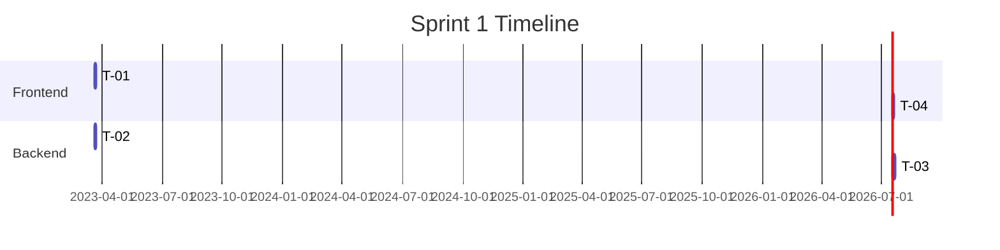
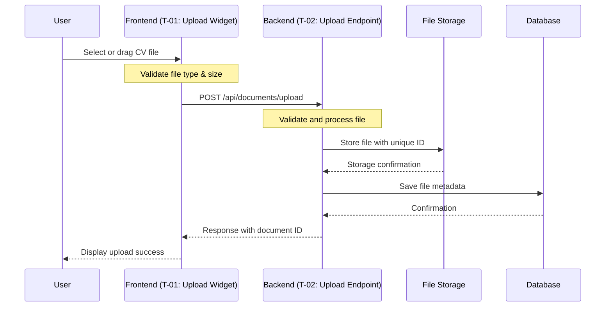

# Talento Express MVP Implementation Documentation

## Table of Contents

- [🚀 1. Project Overview](#1-project-overview)
- [📚 2. Epics](#2-epics)
- [📝 3. User Stories](#3-user-stories)
- [📋 4. Product Backlog](#4-product-backlog)
- [🔍 5. Sprint Backlog](#5-sprint-backlog)
- [🚧 6. Implementation Details for Tasks T-01 & T-02](#6-implementation-details-for-tasks-t-01--t-02)
- [⚖️ 7. Effort Estimation](#7-effort-estimation)

## 1. Project Overview

Talento Express MVP is an innovative Applicant Tracking System (ATS) designed to revolutionize recruitment through AI technology. The first version will focus on three key areas:

1. AI-powered CV processing to automatically extract and analyze candidate information
2. Collaborative workflow tools for hiring teams to evaluate candidates
3. Structured interview management system

The goal is to combine AI capabilities with human oversight to create a more efficient, fair, and effective hiring process that saves time while improving hiring quality.

## 2. Epics

### Epic E-01: AI-Powered CV Processing

- **Description**: Build system to receive, process, and extract key information from candidate CVs using AI technology.
- **Business Value**: Reduces manual screening time by 70% and enables recruiters to focus on candidate evaluation rather than administrative tasks.

### Epic E-02: Collaborative Hiring Workflow

- **Description**: Create tools for hiring teams to review candidates, provide structured feedback, and track decisions.
- **Business Value**: Improves hiring team alignment and ensures consistent candidate evaluation.

### Epic E-03: Interview Management System

- **Description**: Develop features for scheduling, preparing, and capturing feedback from candidate interviews.
- **Business Value**: Streamlines the interview process and creates a better candidate experience.

## 3. User Stories

### User Story US-01: CV Upload and Processing

- **User Story ID**: US-01
- **Title**: CV Upload and Data Extraction
- **Epic ID reference**: E-01
- **Description**: As a recruiter, I want to upload candidate CVs and have the system automatically extract key information so I can quickly evaluate candidate qualifications without manual data entry.
- **Acceptance Criteria**:
  1. Users can upload CV files in PDF, DOCX, and TXT formats
  2. System extracts candidate details including contact info, work history, education, and skills
  3. Extracted information is displayed in a structured format
  4. System shows confidence level for each extracted data point
  5. Users can manually correct any extraction errors

### User Story US-02: Candidate-Job Matching

- **User Story ID**: US-02
- **Title**: AI-Powered Candidate-Job Matching
- **Epic ID reference**: E-01
- **Description**: As a hiring manager, I want the system to match candidates to job requirements so I can identify promising candidates more quickly.
- **Acceptance Criteria**:
  1. System creates match scores between candidates and job openings
  2. Matches consider skills, experience, and other job requirements
  3. Match explanations show why candidates received specific scores
  4. Matches update automatically when profiles or job descriptions change

### User Story US-03: Candidate Feedback Collection

- **User Story ID**: US-03
- **Title**: Structured Team Feedback
- **Epic ID reference**: E-02
- **Description**: As a hiring team member, I want to provide structured feedback on candidates that is visible to other team members so we can make better hiring decisions together.
- **Acceptance Criteria**:
  1. Customizable feedback forms for different hiring stages
  2. All team members can see feedback from others in real-time
  3. System supports ratings, comments, and evaluation criteria
  4. Users receive notifications when new feedback is added

## 4. Product Backlog (Moscow prioritization)

```
| Epic ID | User Story ID | Task ID | Description                                      | Priority | T-shirt Size |
|---------|---------------|---------|--------------------------------------------------|----------|--------------|
| E-01    |               |         | AI-Powered CV Processing                         | Must     |              |
| E-01    | US-01         |         | CV Upload and Data Extraction                    | Must     | L            |
| E-01    | US-01         | T-01    | Create File Upload Widget                        | Must     | S            |
| E-01    | US-01         | T-02    | Build File Upload Endpoint                       | Must     | S            |
| E-01    | US-01         | T-03    | Implement Document Parser                        | Must     | M            |
| E-01    | US-01         | T-04    | Develop Data Display Component                   | Must     | S            |
| E-01    | US-02         |         | AI-Powered Candidate-Job Matching                | Must     | L            |
| E-01    | US-02         | T-05    | Create Matching Algorithm                        | Must     | M            |
| E-01    | US-02         | T-06    | Build Match Results UI                           | Should   | S            |
| E-02    |               |         | Collaborative Hiring Workflow                    | Must     |              |
| E-02    | US-03         |         | Structured Team Feedback                         | Must     | M            |
| E-02    | US-03         | T-07    | Create Feedback Form Component                   | Must     | S            |
| E-02    | US-03         | T-08    | Build Feedback API                               | Must     | S            |
| E-03    |               |         | Interview Management System                      | Should   |              |
```

## 5. Sprint Backlog

For the first sprint, we'll focus on the "CV Upload and Processing" feature with these specific tasks:

```
| Task ID | Short Title            | Layer    | Assigned | Story Points | Effort     |
|---------|------------------------|----------|----------|--------------|------------|
| T-01    | Create Upload Widget   | Frontend | Miguel   | 2            | ~4h        |
| T-02    | Build Upload Endpoint  | Backend  | Sofia    | 3            | ~8h        |
| T-03    | Implement CV Parser    | Backend  | Sofia    | 8            | ~16h       |
| T-04    | Build Data Display UI  | Frontend | Miguel   | 5            | ~10h       |
```



## 6. Implementation Details for Tasks T-01 & T-02



### Task T-01: Create Upload Widget

#### Task Overview

- **Description**: Create a React component for uploading CV files with drag-and-drop functionality and file type validation.
- **Definition of done**:
  - Component allows file selection via button click or drag-and-drop
  - Validates file types (PDF, DOCX, TXT) before upload
  - Shows upload progress and success/error states
  - Limits file size to 5MB
- **Dependencies**: Will be used by CV Upload page, needs endpoint from T-02

#### Component Details

- **Purpose**: Provide intuitive interface for users to upload CV files
- **User interaction flow**:
  1. User drags file or clicks to open file browser
  2. Component validates file type and size
  3. User sees progress indicator during upload
  4. User sees success confirmation or error message
- **Props/state requirements**:
  - Props: `onFileUpload` callback, `allowedFileTypes`, `maxFileSize`
  - State: `isDragging`, `isUploading`, `uploadProgress`, `error`
- **UI/UX considerations**:
  - Clear drop zone with visual cues for dragging
  - Simple error messages for invalid files
  - Progress indicator during upload

#### Testing Approach

- **What to test**:
  - File type validation (accept PDF, DOCX, TXT, reject others)
  - File size validation
  - Upload progress display
- **Edge cases**:
  - Network interruption during upload
  - Very large files
  - Unsupported file types
- **Unit test**: Test validation logic and component rendering states
- **Integration test**: Test with mock API endpoint
- **E2E**: Verify complete upload flow with actual backend

### Task T-02: Build Upload Endpoint

#### Task Overview

- **Description**: Create a backend API endpoint to receive and store CV files securely.
- **Definition of done**:
  - Endpoint accepts multipart form data
  - Validates file types and sizes
  - Stores files with unique identifiers
  - Returns success/error responses
- **Dependencies**: Required for T-01 and T-03

#### Endpoint Details

- **Endpoint definition**:
  - URL: POST /api/documents/upload
  - Authentication: Required (JWT token)
- **Request/response format**:
  - Request: Multipart form with `file` field
  - Response Success:
    ```
    {
      "documentId": "doc-123",
      "filename": "resume.pdf",
      "uploadedAt": "2023-06-15T10:30:00Z",
      "status": "uploaded"
    }
    ```
  - Response Error:
    ```
    {
      "error": "Invalid file type",
      "details": "Only PDF, DOCX, and TXT files are accepted"
    }
    ```
- **Data flow**:
  1. Receive file from client
  2. Validate file type and size
  3. Generate unique ID
  4. Store file in secure storage
  5. Save metadata to database
  6. Return response to client

#### Testing Approach

- **What to test**:
  - Successful upload of valid files
  - Rejection of invalid file types
  - Rejection of oversized files
- **Edge cases**:
  - Concurrent uploads from same user
  - Very large files
  - Malformed requests
- **Unit test**: Test validation logic and error handling
- **Integration test**: Test file storage and database interaction
- **E2E**: Test with actual frontend component

## 7. Effort Estimation

### Fibonacci Story Points

For estimating the effort required for each task, we use the Fibonacci sequence (1, 2, 3, 5, 8, 13, 21). This approach provides a non-linear scale that reflects the inherent uncertainty in estimating more complex tasks.

```
| Task ID | Story Points | Justification                                                                    |
|---------|--------------|----------------------------------------------------------------------------------|
| T-01    | 2            | Simple UI component with well-defined requirements and existing UI library       |
| T-02    | 3            | Straightforward API endpoint with standard validation and storage requirements   |
| T-03    | 8            | Complex AI processing with unknown parsing challenges and accuracy considerations|
| T-04    | 5            | Moderately complex UI with dynamic data display and error handling              |
```

### Estimation Considerations

When assigning story points, we considered:

1. **Technical Complexity**: How difficult is the technical implementation?
2. **Integration Points**: How many systems or components does the task interact with?
3. **Uncertainty**: How much is unknown or requires investigation?
4. **Testing Requirements**: How complex is testing for this task?

### Fibonacci Scale Interpretation

- **1 point**: Trivial task, extremely simple and well-understood
- **2 points**: Simple task with clear solution and minimal unknowns
- **3 points**: Straightforward task with some complexity but well-defined approach
- **5 points**: Moderately complex task with some unknowns
- **8 points**: Complex task with significant unknowns or multiple integration points
- **13 points**: Very complex task requiring specialized knowledge or research
- **21 points**: Extremely complex task with high uncertainty; should consider breaking down

The total sprint capacity is 18 story points, which represents a balanced workload for a two-person team over a two-week sprint.
