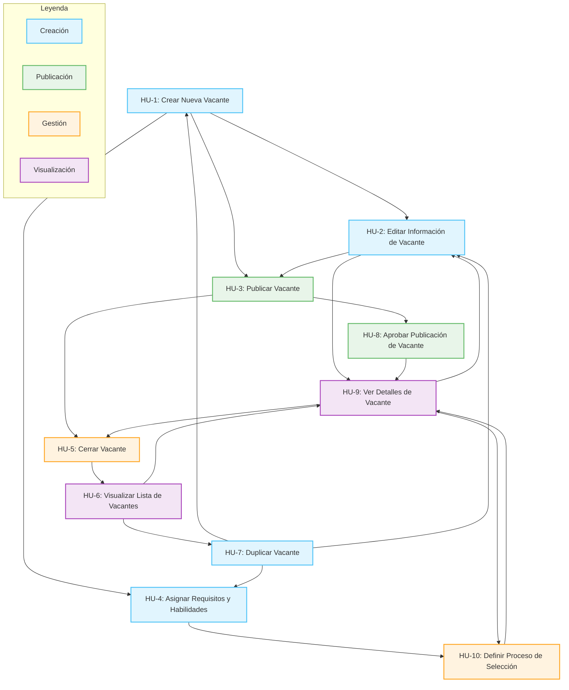
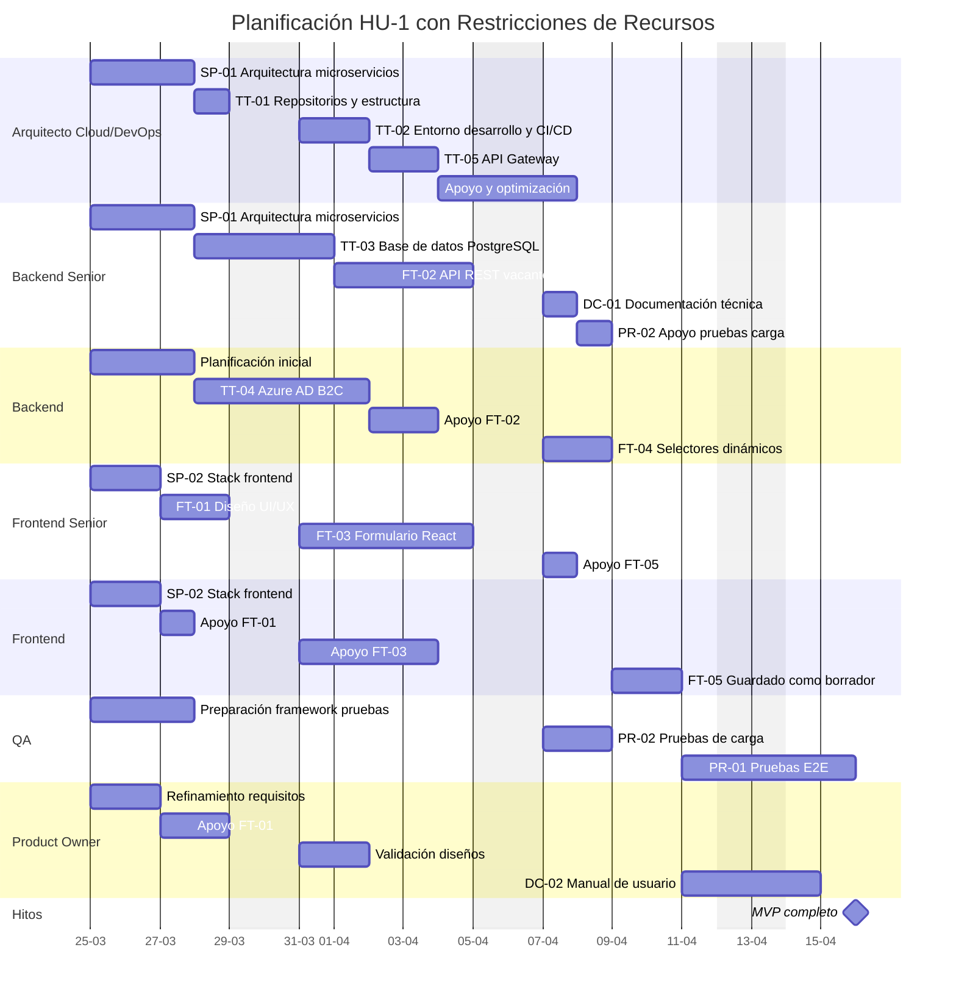

# DESCRIPCIÓN DEL PRODUCTO

Nuestra solución ATS de vanguardia revoluciona el reclutamiento mediante la integración de inteligencia artificial avanzada en cada fase del proceso de selección. Desarrollada bajo los estándares LEADER TECHNOLOGY INNOVATION (LTI), esta plataforma redefine cómo las organizaciones identifican, evalúan y contratan talento excepcional.
Con nuestro sistema, los equipos de RRHH aprovechan el poder de la IA para:

Generar descripciones de trabajo optimizadas y distribuirlas estratégicamente en múltiples canales digitales
Analizar automáticamente las aplicaciones mediante algoritmos de coincidencia semántica y evaluación predictiva
Implementar evaluaciones adaptativas que identifican habilidades técnicas y competencias blandas
Orquestar procesos de entrevista basados en datos con recomendaciones de preguntas personalizadas
Tomar decisiones de contratación respaldadas por análisis predictivo de desempeño

La arquitectura LTI garantiza la escalabilidad, cumplimiento normativo y adaptabilidad continua del sistema mediante aprendizaje automático, reduciendo hasta un 60% el tiempo de contratación mientras mejora significativamente la calidad y retención de las incorporaciones. Nuestra solución no solo gestiona candidatos: transforma datos en estrategia de talento.

En el estudio anterior habíamos identificado los tres casos de uso fundamentales para el MVP del sistema ATS con IA, que son:

- **Creación y Gestión de Vacantes:** Permite a los reclutadores crear nuevas vacantes con información básica (título, descripción, requisitos, departamento, ubicación, tipo de contrato) y gestionar su estado (abierta, en proceso, cerrada).
- **Recepción y Organización de Candidaturas:** Sistema para recibir aplicaciones de candidatos a través de un formulario web estandarizado, almacenar sus CVs y datos de contacto, y asociarlos a vacantes específicas.
- **Seguimiento del Proceso de Selección:** Herramienta para mover candidatos a través de las etapas básicas del proceso (aplicación recibida, revisión CV, entrevista programada, entrevista realizada, oferta, contratado/rechazado) con capacidad para registrar retroalimentación en cada fase.

Estos casos de uso constituyen el núcleo fundamental de cualquier ATS y recopilan los datos esenciales que posteriormente permitirán desarrollar las funcionalidades de IA más avanzadas que se describen en el documento.

Desde una perspectiva de Product Manager y Business Analyst, el orden ideal para abordar estos tres casos de uso sería:

1. **Creación y Gestión de Vacantes**
Esta debe ser la primera prioridad porque representa el punto de entrada al sistema. Sin vacantes creadas y gestionadas adecuadamente, no hay nada a lo que los candidatos puedan aplicar. Este caso de uso establece la estructura fundamental de datos que alimentará los procesos posteriores y permite a los reclutadores comenzar a utilizar el sistema de inmediato para un propósito específico.
Valor incremental: Los equipos de RRHH pueden empezar a digitalizar y centralizar sus procesos de creación de vacantes, obteniendo un repositorio estructurado de posiciones abiertas, incluso antes de que los candidatos interactúen con el sistema.

2. **Recepción y Organización de Candidaturas**
Una vez que las vacantes están en el sistema, el siguiente paso lógico es habilitar la recepción de aplicaciones. Este caso de uso permite comenzar a capturar datos valiosos de candidatos y establecer la relación entre candidatos y vacantes.
Valor incremental: El equipo de reclutamiento obtiene una forma estructurada de recibir candidaturas vinculadas a vacantes específicas, lo que ya representa una mejora significativa sobre métodos no centralizados como el correo electrónico.

3. **Seguimiento del Proceso de Selección**
Finalmente, una vez que hay vacantes creadas y candidaturas recibidas, se necesita un mecanismo para avanzar candidatos a través de las etapas del proceso.
Valor incremental: Los reclutadores pueden gestionar de manera efectiva todo el ciclo de vida del candidato, visualizar el estado del pipeline y mantener todos los datos organizados en un único sistema.

Este enfoque secuencial representa el camino de menor resistencia para la adopción y el valor comercial, ya que cada paso construye sobre el anterior, permitiendo a los usuarios experimentar beneficios inmediatos mientras se desarrollan nuevas capacidades. Además, este orden facilita la recopilación temprana de datos esenciales que serán necesarios para alimentar las capacidades de IA más avanzadas previstas para el futuro.

# Historias de Usuario: Creación y Gestión de Vacantes

## Tabla Resumen de Historias de Usuario

Proporcionamos inicialmente un listado y una visión gráfica de la relación entre las diferentes historias de usuario identificadas:

| ID | Título de la Historia de Usuario |
|----|----------------------------------|
| HU-1 | Crear Nueva Vacante |
| HU-2 | Editar Información de Vacante |
| HU-3 | Publicar Vacante |
| HU-4 | Asignar Requisitos y Habilidades |
| HU-5 | Cerrar Vacante |
| HU-6 | Visualizar Lista de Vacantes |
| HU-7 | Duplicar Vacante |
| HU-8 | Aprobar Publicación de Vacante |
| HU-9 | Ver Detalles de Vacante |
| HU-10 | Definir Proceso de Selección para la Vacante |

A continuación, pasamos al detalle de cada historia de usuario identificada.

## Historia de Usuario #1: Crear Nueva Vacante

**Como** Reclutador,  
**quiero** crear una nueva vacante en el sistema con la información básica necesaria,  
**para que** pueda comenzar el proceso de búsqueda de candidatos para un puesto específico.

### Criterios de Aceptación:
- El sistema debe permitir crear una vacante con los siguientes campos obligatorios: título, descripción, departamento, ubicación, tipo de contrato y nivel de experiencia.
- El sistema debe permitir campos opcionales como: rango salarial mínimo/máximo, fecha de cierre, modalidad de trabajo (presencial/remoto/híbrido).
- Al crear una vacante, su estado inicial debe ser "borrador".
- El sistema debe validar que todos los campos obligatorios estén completos antes de guardar.
- El sistema debe asignar automáticamente al reclutador actual como responsable de la vacante.
- Se debe generar un identificador único para cada nueva vacante.

### Notas Adicionales:
- La interfaz debe ser intuitiva y mostrar claramente qué campos son obligatorios.
- Considerar añadir un asistente de IA para ayudar en la redacción de la descripción del puesto (previsto para fases posteriores).
- Debe guardar automáticamente como borrador cada cierto tiempo para evitar pérdida de información.

### Historias de Usuario Relacionadas:
- HU-2: Editar Información de Vacante
- HU-3: Publicar Vacante
- HU-4: Asignar Requisitos y Habilidades

---

## Historia de Usuario #2: Editar Información de Vacante

**Como** Reclutador,  
**quiero** editar la información de una vacante existente,  
**para que** pueda mantener actualizada la descripción y requisitos del puesto según evolucionen las necesidades.

### Criterios de Aceptación:
- El sistema debe permitir la edición de todos los campos de una vacante existente.
- Si la vacante ya está publicada, el sistema debe generar un registro de cambios visible.
- Las ediciones en vacantes ya publicadas deben actualizarse automáticamente en todos los canales donde esté publicada.
- El sistema debe validar nuevamente los campos obligatorios después de la edición.
- Se debe mostrar la fecha de última modificación en la vacante.

### Notas Adicionales:
- Considerar si algunos cambios (como reducción de salario o incremento de requisitos) deberían requerir aprobación adicional.
- La interfaz debe permitir ver el estado actual de cada campo mientras se edita.

### Historias de Usuario Relacionadas:
- HU-1: Crear Nueva Vacante
- HU-3: Publicar Vacante
- HU-9: Ver Detalles de Vacante

---

## Historia de Usuario #3: Publicar Vacante

**Como** Reclutador,  
**quiero** cambiar el estado de una vacante de borrador a publicada,  
**para que** sea visible para los candidatos potenciales y comience el proceso de reclutamiento.

### Criterios de Aceptación:
- El sistema debe permitir cambiar el estado de "borrador" a "publicada" sólo si todos los campos obligatorios están completos.
- El sistema debe verificar si la vacante requiere aprobación del gerente antes de ser publicada según políticas de la empresa.
- Al publicar, el sistema debe registrar automáticamente la fecha de publicación.
- Una vez publicada, la vacante debe aparecer en la página web de carreras de la empresa.
- El sistema debe generar automáticamente una URL única para compartir la vacante.
- Debe existir opción para programar una fecha de publicación automática en el futuro.

### Notas Adicionales:
- En etapas posteriores, la publicación podría incluir distribución automática en portales de empleo y redes sociales.
- Considerar notificaciones a equipos internos cuando se publica una nueva vacante.

### Historias de Usuario Relacionadas:
- HU-1: Crear Nueva Vacante
- HU-2: Editar Información de Vacante
- HU-8: Aprobar Publicación de Vacante

---

## Historia de Usuario #4: Asignar Requisitos y Habilidades

**Como** Reclutador,  
**quiero** añadir habilidades técnicas y competencias requeridas a una vacante,  
**para que** pueda especificar claramente el perfil del candidato ideal y facilitar la filtración posterior.

### Criterios de Aceptación:
- El sistema debe permitir seleccionar habilidades desde un catálogo predefinido y/o crear nuevas.
- Cada habilidad debe poder marcarse como "requerida" o "deseable".
- Para cada habilidad se debe poder especificar un nivel mínimo (1-5) y años de experiencia mínimos.
- Se debe poder asignar un peso o importancia relativa a cada habilidad (1-10).
- El sistema debe permitir organizar las habilidades por categorías (técnicas, blandas, idiomas, certificaciones).
- Debe existir un límite razonable de habilidades requeridas para evitar descripciones irrealistas.

### Notas Adicionales:
- Considerar integrar una sugerencia de habilidades basada en el título y descripción del puesto.
- En futuras versiones, el sistema podría recomendar habilidades basándose en patrones de vacantes similares exitosas.

### Historias de Usuario Relacionadas:
- HU-1: Crear Nueva Vacante
- HU-2: Editar Información de Vacante
- HU-10: Definir Proceso de Selección para la Vacante

---

## Historia de Usuario #5: Cerrar Vacante

**Como** Reclutador,  
**quiero** cerrar una vacante que ya no está disponible,  
**para que** no reciba más aplicaciones y refleje con precisión las oportunidades actuales de la empresa.

### Criterios de Aceptación:
- El sistema debe permitir cambiar el estado de una vacante a "cerrada" en cualquier momento.
- Al cerrar una vacante, se debe solicitar un motivo de cierre: "cubierta", "cancelada", "pausada" u "otro".
- El sistema debe registrar automáticamente la fecha de cierre.
- Las vacantes cerradas no deben aparecer en el portal público de empleos.
- El sistema debe ofrecer la opción de notificar automáticamente a los candidatos activos sobre el cierre.
- Debe existir la posibilidad de reabrir una vacante cerrada (dentro de un período determinado).

### Notas Adicionales:
- Considerar estadísticas de tiempo de cobertura y número de aplicaciones para análisis posteriores.
- Es importante mantener un historial de vacantes cerradas para análisis y reportes.

### Historias de Usuario Relacionadas:
- HU-3: Publicar Vacante
- HU-6: Visualizar Lista de Vacantes
- HU-9: Ver Detalles de Vacante

---

## Historia de Usuario #6: Visualizar Lista de Vacantes

**Como** Reclutador,  
**quiero** ver un listado de todas las vacantes con filtros por estado y departamento,  
**para que** tenga una visión general del pipeline de reclutamiento y pueda gestionar mis prioridades.

### Criterios de Aceptación:
- El sistema debe mostrar una lista de todas las vacantes con columnas para: título, departamento, ubicación, estado, fecha de publicación y número de candidatos.
- Se debe poder filtrar por múltiples criterios: estado, departamento, reclutador asignado, fecha de publicación.
- Se debe poder ordenar la lista por cualquiera de las columnas visibles.
- La lista debe incluir indicadores visuales del estado de cada vacante (borrador, publicada, cerrada).
- Debe existir un buscador por texto que permita encontrar vacantes por palabra clave.
- La lista debe actualizarse en tiempo real o tener un botón de actualización.

### Notas Adicionales:
- Considerar vista Kanban como alternativa a la lista para visualizar el estado de las vacantes.
- Incluir indicadores de rendimiento como tiempo promedio en estado publicado y ratio de aplicaciones.

### Historias de Usuario Relacionadas:
- HU-5: Cerrar Vacante
- HU-7: Duplicar Vacante
- HU-9: Ver Detalles de Vacante

---

## Historia de Usuario #7: Duplicar Vacante

**Como** Reclutador,  
**quiero** duplicar una vacante existente con todos sus detalles,  
**para que** pueda ahorrar tiempo al crear puestos similares sin tener que ingresar la misma información repetidamente.

### Criterios de Aceptación:
- El sistema debe permitir crear una copia de una vacante existente con un solo clic.
- La nueva vacante debe conservar todos los campos de la original excepto: estado (siempre "borrador"), fechas, candidaturas asociadas y cualquier identificador único.
- El sistema debe añadir un prefijo o sufijo al título que indique que es una copia (ej: "Copia de...").
- Después de duplicar, el sistema debe llevar al usuario directamente a la edición de la nueva vacante.
- Se deben duplicar también las habilidades requeridas y deseadas, con sus respectivos niveles y pesos.
- El sistema debe permitir duplicar incluso vacantes que ya están cerradas.

### Notas Adicionales:
- Considerar la posibilidad de crear plantillas a partir de vacantes exitosas para uso futuro.
- Podría ser útil una función para duplicar una vacante y crear varias posiciones idénticas (ej: "crear 5 copias").

### Historias de Usuario Relacionadas:
- HU-1: Crear Nueva Vacante
- HU-2: Editar Información de Vacante
- HU-4: Asignar Requisitos y Habilidades

---

## Historia de Usuario #8: Aprobar Publicación de Vacante

**Como** Gerente,  
**quiero** revisar y aprobar las vacantes antes de su publicación,  
**para que** pueda asegurar que cumplen con los estándares de la empresa y el presupuesto asignado.

### Criterios de Aceptación:
- El sistema debe enviar una notificación al gerente correspondiente cuando una vacante está lista para revisión.
- Los gerentes deben poder ver todos los detalles de la vacante en la pantalla de aprobación.
- Debe existir la opción de aprobar, rechazar o solicitar cambios específicos.
- Si se rechazan o solicitan cambios, el sistema debe notificar al reclutador con los comentarios correspondientes.
- El sistema debe mantener un registro de las aprobaciones, incluyendo quién aprobó y cuándo.
- El flujo de aprobación debe ser configurable por departamento (algunos podrían no requerir aprobación).

### Notas Adicionales:
- Considerar un proceso de aprobación en cascada para vacantes con salarios superiores a ciertos umbrales.
- El dashboard de gerentes debería mostrar claramente cuántas vacantes están pendientes de su aprobación.

### Historias de Usuario Relacionadas:
- HU-3: Publicar Vacante
- HU-9: Ver Detalles de Vacante

---

## Historia de Usuario #9: Ver Detalles de Vacante

**Como** Reclutador/Gerente,  
**quiero** ver todos los detalles de una vacante específica,  
**para que** pueda comprender completamente los requisitos y el estado actual del proceso de reclutamiento.

### Criterios de Aceptación:
- El sistema debe mostrar toda la información de la vacante en una interfaz clara y bien organizada.
- La vista debe incluir: información básica, descripción completa, requisitos, habilidades, estado actual y fechas relevantes.
- Se debe mostrar un historial de cambios de la vacante (quién cambió qué y cuándo).
- La vista debe incluir métricas relevantes: número de aplicaciones, tiempo activa, conversión por etapas.
- Desde esta vista se debe poder acceder directamente a la edición, duplicación o cierre de la vacante.
- Se debe mostrar información sobre el flujo de aprobación si es aplicable.

### Notas Adicionales:
- Considerar una vista de "modo candidato" que muestre exactamente cómo ven la vacante los aplicantes.
- Podría ser útil un enlace directo para compartir la vista de la vacante con otros miembros del equipo.

### Historias de Usuario Relacionadas:
- HU-2: Editar Información de Vacante
- HU-5: Cerrar Vacante
- HU-6: Visualizar Lista de Vacantes
- HU-10: Definir Proceso de Selección para la Vacante

---

## Historia de Usuario #10: Definir Proceso de Selección para la Vacante

**Como** Reclutador,  
**quiero** configurar las etapas específicas del proceso de selección para cada vacante,  
**para que** pueda establecer un flujo de trabajo personalizado según las necesidades del departamento contratante.

### Criterios de Aceptación:
- El sistema debe permitir seleccionar entre plantillas predefinidas de procesos de selección o crear uno personalizado.
- Se deben poder añadir, eliminar y reordenar etapas del proceso (ej: revisión CV, entrevista telefónica, prueba técnica, etc).
- Cada etapa debe poder configurarse con: nombre, descripción, duración estimada, responsables y tipo de evaluación.
- Se debe poder establecer criterios de evaluación específicos para cada etapa.
- El sistema debe permitir definir puntos de decisión automáticos o manuales para el avance entre etapas.
- Debe existir la opción de agregar instrucciones específicas para los evaluadores en cada etapa.

### Notas Adicionales:
- Considerar la posibilidad de asociar plantillas de correos electrónicos para comunicación con candidatos en cada etapa.
- En el futuro, el sistema podría recomendar procesos de selección basándose en el éxito histórico de contrataciones similares.

### Historias de Usuario Relacionadas:
- HU-1: Crear Nueva Vacante
- HU-4: Asignar Requisitos y Habilidades
- HU-9: Ver Detalles de Vacante

# Backlog Priorizado: Caso de Uso "Creación y Gestión de Vacantes"

## Introducción

Este documento presenta diferentes enfoques de priorización para las historias de usuario del caso de uso "Creación y Gestión de Vacantes". La aplicación de múltiples metodologías de priorización proporciona una visión integral que facilita la toma de decisiones estratégicas para la planificación del desarrollo.

## 1. Priorización MoSCoW

La técnica MoSCoW clasifica las historias en cuatro categorías:
- **Must have (M)**: Imprescindibles para el MVP
- **Should have (S)**: Importantes, pero no críticas
- **Could have (C)**: Deseables si hay recursos disponibles
- **Won't have (W)**: No incluidas en esta iteración

| ID | Título | Categoría MoSCoW | Justificación |
|----|--------|------------------|---------------|
| HU-1 | Crear Nueva Vacante | M | Funcionalidad básica sin la cual el sistema no tendría propósito |
| HU-2 | Editar Información de Vacante | M | Necesario para corregir errores y actualizar información |
| HU-6 | Visualizar Lista de Vacantes | M | Fundamental para la gestión y navegación por el sistema |
| HU-9 | Ver Detalles de Vacante | M | Esencial para revisar información completa de cada vacante |
| HU-3 | Publicar Vacante | S | Importante, pero podría simplificarse inicialmente |
| HU-5 | Cerrar Vacante | S | Necesario para el ciclo completo, pero puede implementarse después |
| HU-4 | Asignar Requisitos y Habilidades | S | Mejora significativamente la funcionalidad, pero podría iniciarse con estructura básica |
| HU-8 | Aprobar Publicación de Vacante | C | Añade control de calidad, pero podría omitirse en la versión inicial |
| HU-10 | Definir Proceso de Selección | C | Valioso para personalización, pero puede estandarizarse al inicio |
| HU-7 | Duplicar Vacante | C | Ahorra tiempo, pero no es crítico para el funcionamiento básico |

## 2. Priorización por Valor/Esfuerzo (RICE)

La metodología RICE evalúa las historias según:
- **Reach (Alcance)**: Cuántos usuarios se benefician
- **Impact (Impacto)**: Nivel de mejora para esos usuarios (1=mínimo, 3=alto)
- **Confidence (Confianza)**: Certeza sobre estimaciones (%)
- **Effort (Esfuerzo)**: Estimado en días/persona

La puntuación RICE = (Alcance × Impacto × Confianza) / Esfuerzo

| ID | Título | Alcance | Impacto | Confianza | Esfuerzo | Puntuación RICE | Prioridad |
|----|--------|---------|---------|-----------|----------|-----------------|-----------|
| HU-1 | Crear Nueva Vacante | 10 | 3 | 100% | 5 | 6.0 | 1 |
| HU-6 | Visualizar Lista de Vacantes | 10 | 3 | 100% | 3 | 10.0 | 1 |
| HU-9 | Ver Detalles de Vacante | 10 | 3 | 90% | 2 | 13.5 | 1 |
| HU-2 | Editar Información de Vacante | 8 | 3 | 90% | 3 | 7.2 | 2 |
| HU-3 | Publicar Vacante | 7 | 3 | 80% | 3 | 5.6 | 2 |
| HU-5 | Cerrar Vacante | 6 | 2 | 90% | 2 | 5.4 | 2 |
| HU-4 | Asignar Requisitos y Habilidades | 7 | 2 | 80% | 4 | 2.8 | 3 |
| HU-8 | Aprobar Publicación de Vacante | 5 | 2 | 70% | 4 | 1.75 | 3 |
| HU-7 | Duplicar Vacante | 5 | 1 | 90% | 2 | 2.25 | 3 |
| HU-10 | Definir Proceso de Selección | 6 | 2 | 70% | 5 | 1.68 | 3 |

## 3. Priorización por Dependencias Técnicas

Este enfoque prioriza las historias según las dependencias técnicas, partiendo de funcionalidades fundamentales hacia características más avanzadas.

| Orden | ID | Título | Dependencias | Justificación |
|-------|----|---------|--------------|----|
| 1 | HU-1 | Crear Nueva Vacante | Ninguna | Funcionalidad base necesaria para todas las demás |
| 2 | HU-2 | Editar Información de Vacante | HU-1 | Depende de la existencia de vacantes |
| 3 | HU-9 | Ver Detalles de Vacante | HU-1, HU-2 | Necesita vacantes creadas y estructura de datos completa |
| 4 | HU-6 | Visualizar Lista de Vacantes | HU-1, HU-9 | Requiere vacantes creadas y forma de visualizarlas |
| 5 | HU-4 | Asignar Requisitos y Habilidades | HU-1, HU-2 | Extiende la estructura básica de vacantes |
| 6 | HU-3 | Publicar Vacante | HU-1, HU-2, HU-4 | Necesita vacantes completas con requisitos |
| 7 | HU-8 | Aprobar Publicación de Vacante | HU-3 | Añade un paso al proceso de publicación |
| 8 | HU-5 | Cerrar Vacante | HU-3 | Actúa sobre vacantes ya publicadas |
| 9 | HU-7 | Duplicar Vacante | HU-1, HU-2, HU-4 | Requiere todas las funcionalidades de creación |
| 10 | HU-10 | Definir Proceso de Selección | HU-1, HU-3 | Se implementa después de tener el flujo básico funcional |

## 4. Priorización por Enfoque de MVP (Minimum Viable Product)

Este enfoque identifica el conjunto mínimo de historias necesarias para tener un producto funcional que aporte valor real a los usuarios, seguido por mejoras incrementales.

### Fase 1: MVP Básico
| ID | Título | Justificación |
|----|--------|---------------|
| HU-1 | Crear Nueva Vacante | Funcionalidad core inicial |
| HU-2 | Editar Información de Vacante | Necesario para mantener información actualizada |
| HU-6 | Visualizar Lista de Vacantes | Esencial para la navegación básica |
| HU-9 | Ver Detalles de Vacante | Completa la funcionalidad de visualización |
| HU-3 | Publicar Vacante | Cierra el ciclo mínimo funcional (versión simplificada) |

### Fase 2: Funcionalidades de Valor Añadido
| ID | Título | Justificación |
|----|--------|---------------|
| HU-4 | Asignar Requisitos y Habilidades | Mejora significativa en la calidad de vacantes |
| HU-5 | Cerrar Vacante | Completa el ciclo de vida de la vacante |
| HU-7 | Duplicar Vacante | Mejora la eficiencia de los reclutadores |

### Fase 3: Características Avanzadas
| ID | Título | Justificación |
|----|--------|---------------|
| HU-8 | Aprobar Publicación de Vacante | Añade control de calidad y validación |
| HU-10 | Definir Proceso de Selección | Personaliza y optimiza el proceso de contratación |

## 5. Resumen y Recomendación Final

Basándonos en las cuatro metodologías de priorización, podemos observar patrones consistentes:

| ID | Título | MoSCoW | RICE | Dependencias | MVP | Prioridad Consolidada |
|----|--------|--------|------|--------------|-----|----------------------|
| HU-1 | Crear Nueva Vacante | M | 1 | 1 | 1 | **1** |
| HU-6 | Visualizar Lista de Vacantes | M | 1 | 4 | 1 | **2** |
| HU-9 | Ver Detalles de Vacante | M | 1 | 3 | 1 | **3** |
| HU-2 | Editar Información de Vacante | M | 2 | 2 | 1 | **4** |
| HU-3 | Publicar Vacante | S | 2 | 6 | 1 | **5** |
| HU-4 | Asignar Requisitos y Habilidades | S | 3 | 5 | 2 | **6** |
| HU-5 | Cerrar Vacante | S | 2 | 8 | 2 | **7** |
| HU-7 | Duplicar Vacante | C | 3 | 9 | 2 | **8** |
| HU-8 | Aprobar Publicación de Vacante | C | 3 | 7 | 3 | **9** |
| HU-10 | Definir Proceso de Selección | C | 3 | 10 | 3 | **10** |

### Recomendación para Implementación:

1. **MVP Básico**:
   - HU-1: Crear Nueva Vacante
   - HU-6: Visualizar Lista de Vacantes
   - HU-9: Ver Detalles de Vacante
   - HU-2: Editar Información de Vacante

2. **Ciclo Completo Básico**:
   - HU-3: Publicar Vacante
   - HU-4: Asignar Requisitos y Habilidades
   - HU-5: Cerrar Vacante

3. **Mejoras de Productividad**:
   - HU-7: Duplicar Vacante
   - HU-8: Aprobar Publicación de Vacante
   - HU-10: Definir Proceso de Selección

Esta priorización equilibra el valor para el usuario, la complejidad técnica y las dependencias, permitiendo entregar valor incremental en cada sprint mientras se construyen las bases para funcionalidades más avanzadas.

# Listado de Tareas para HU-1: Crear Nueva Vacante

## A. Investigación (Spikes)

### SP-01: Investigación de arquitectura de microservicios Azure

**Título**: Evaluación y definición de arquitectura de microservicios en Azure  

**Descripción**:  
- **Propósito**: Validar y refinar la arquitectura de microservicios propuesta para el sistema ATS, asegurando que cumple con los requisitos técnicos y de negocio.
- **Detalles específicos**: Investigar opciones de implementación en Azure, considerando Azure Kubernetes Service (AKS), App Service, y otras alternativas disponibles. Evaluar pros y contras de cada opción en términos de escalabilidad, costos y facilidad de mantenimiento.

**Criterios de Aceptación**:
- Documento de análisis comparativo de al menos 3 opciones de arquitectura.
- Diseño detallado de la arquitectura seleccionada con diagramas.
- Plan de implementación por fases que priorice componentes necesarios para el MVP.
- Identificación de riesgos técnicos y estrategias de mitigación.

**Prioridad**: Alta

**Estimación**: -

**Asignación**: -

**Etiquetas**: #spike #arquitectura #infraestructura

**Comentarios y Notas**:
- Considerar el equilibrio entre una arquitectura ideal y la velocidad necesaria para lanzar un MVP.
- Evaluar si todos los servicios necesitan ser microservicios desde el inicio o si se puede adoptar un enfoque más gradual.

**Enlaces o Referencias**:
- Documento de arquitectura del sistema ATS
- Diagramas C4 propuestos

---

### SP-02: Investigación y selección de framework y herramientas de UI

**Título**: Definición de stack tecnológico frontend y estándares de UI

**Descripción**:
- **Propósito**: Seleccionar los frameworks, bibliotecas y herramientas apropiados para el desarrollo frontend, considerando la necesidad de crear una experiencia de usuario intuitiva para la gestión de vacantes.
- **Detalles específicos**: Evaluar opciones como Material UI, Ant Design, Chakra UI u otros frameworks de componentes para React. Investigar opciones de formularios reactivos y validación.

**Criterios de Aceptación**:
- Documento con decisiones tecnológicas para frontend fundamentadas en criterios objetivos.
- Prototipo básico que demuestre la integración de React con el framework de UI seleccionado.
- Definición de estándares de codificación y guías de estilo para el desarrollo frontend.
- Selección de biblioteca para gestión de formularios y validación.

**Prioridad**: Alta

**Estimación**: -

**Asignación**: -

**Etiquetas**: #spike #frontend #UI

**Comentarios y Notas**:
- Considerar experiencia del equipo con diferentes tecnologías.
- Evaluar soporte, mantenimiento y comunidad de cada opción.

**Enlaces o Referencias**:
- Documento de requisitos del sistema ATS

---

## B. Tareas Técnicas

### TT-01: Configuración inicial del repositorio y estructura del proyecto

**Título**: Configuración de repositorios Git y estructura base del proyecto

**Descripción**:
- **Propósito**: Establecer la estructura inicial del proyecto y los repositorios de código para facilitar un desarrollo colaborativo y ordenado.
- **Detalles específicos**: Crear repositorios separados para frontend y backend (o uno por microservicio según decisión de arquitectura). Configurar estructura de carpetas, archivo README, .gitignore, y documentación básica.

**Criterios de Aceptación**:
- Repositorios Git configurados con estructura básica de carpetas.
- Archivos README con instrucciones claras para configuración del entorno de desarrollo.
- Configuración de reglas de ramas y procesos de pull request.
- Estructura básica del proyecto para frontend (React) y backend (Node.js).

**Prioridad**: Alta

**Estimación**: -

**Asignación**: -

**Etiquetas**: #tarea-tecnica #configuracion #devops

**Comentarios y Notas**:
- Discutir si se prefiere un monorepo o múltiples repositorios.
- Definir convenciones de nombrado y estructura.

**Enlaces o Referencias**:
- Documentación de arquitectura del sistema

---

### TT-02: Configuración del entorno de desarrollo

**Título**: Configuración del entorno de desarrollo local y CI/CD inicial

**Descripción**:
- **Propósito**: Crear un entorno de desarrollo coherente para todos los miembros del equipo y establecer las bases para la integración y despliegue continuos.
- **Detalles específicos**: Configurar Docker para desarrollo local, preparar scripts para instalación de dependencias, y establecer pipeline básico de CI/CD en Azure DevOps.

**Criterios de Aceptación**:
- Archivos Docker y docker-compose para entorno de desarrollo local.
- Scripts de automatización para configuración inicial.
- Pipeline básico de CI configurado para validar PRs.
- Documentación de configuración del entorno para nuevos desarrolladores.

**Prioridad**: Alta

**Estimación**: -

**Asignación**: -

**Etiquetas**: #tarea-tecnica #devops #entorno

**Comentarios y Notas**:
- Asegurar que el entorno local refleje lo más posible el entorno de producción.
- Considerar la creación de imágenes Docker base para agilizar desarrollos futuros.

**Enlaces o Referencias**:
- Documentación de DevOps del sistema ATS

---

### TT-03: Configuración inicial de la base de datos PostgreSQL

**Título**: Configuración de base de datos PostgreSQL y scripts iniciales

**Descripción**:
- **Propósito**: Implementar la estructura básica de la base de datos necesaria para soportar la creación y gestión de vacantes.
- **Detalles específicos**: Crear scripts SQL para definir las tablas relacionadas con vacantes, usuarios y habilidades según el modelo de datos definido. Configurar herramientas de migración de base de datos.

**Criterios de Aceptación**:
- Scripts SQL para creación de tablas según el modelo presentado (usuarios, reclutadores, vacantes, habilidades, etc.).
- Sistema de migraciones configurado (ej: Knex, Sequelize, TypeORM, o similar).
- Datos iniciales (seeds) para pruebas y desarrollo.
- Documentación del modelo de datos implementado.

**Prioridad**: Alta

**Estimación**: -

**Asignación**: -

**Etiquetas**: #tarea-tecnica #database #backend

**Comentarios y Notas**:
- Asegurar que se implementen correctamente las relaciones entre tablas.
- Considerar configurar índices para optimizar consultas frecuentes.

**Enlaces o Referencias**:
- Modelo de datos del sistema ATS
- Diccionario de datos

---

### TT-04: Configuración inicial del servicio de autenticación (Azure AD B2C)

**Título**: Implementación inicial de autenticación con Azure AD B2C

**Descripción**:
- **Propósito**: Establecer el sistema de autenticación y autorización para controlar el acceso a la funcionalidad de creación de vacantes.
- **Detalles específicos**: Configurar Azure AD B2C, implementar flujos de autenticación para los diferentes roles (reclutador, gerente) y configurar permisos básicos.

**Criterios de Aceptación**:
- Tenant de Azure AD B2C configurado con políticas de registro e inicio de sesión.
- Integración con la aplicación frontend (React) para autenticación.
- Middleware de autenticación en backend para validar tokens.
- Documentación de flujos de autenticación y autorización.

**Prioridad**: Alta

**Estimación**: -

**Asignación**: -

**Etiquetas**: #tarea-tecnica #seguridad #autenticacion

**Comentarios y Notas**:
- Asegurar que se configuren apropiadamente los roles y permisos para reclutadores.
- Considerar implementar inicialmente solo la autenticación básica necesaria para el MVP.

**Enlaces o Referencias**:
- Documentación de Azure AD B2C
- Requisitos de seguridad del sistema

---

### TT-05: Configuración básica del API Gateway

**Título**: Implementación inicial de API Gateway y rutas básicas

**Descripción**:
- **Propósito**: Establecer un punto de entrada unificado para las APIs del sistema que manejará la creación de vacantes.
- **Detalles específicos**: Configurar Azure API Management o alternativa, definir rutas básicas para el servicio de vacantes, implementar seguridad básica y logging.

**Criterios de Aceptación**:
- API Gateway configurado y funcionando.
- Rutas básicas definidas para el servicio de vacantes.
- Integración con el sistema de autenticación.
- Configuración de registros (logs) para monitoreo.

**Prioridad**: Alta

**Estimación**: -

**Asignación**: -

**Etiquetas**: #tarea-tecnica #backend #api

**Comentarios y Notas**:
- Evaluar si es necesario API Gateway para el MVP o si puede implementarse posteriormente.
- Considerar inicialmente una configuración sencilla que pueda expandirse.

**Enlaces o Referencias**:
- Documento de arquitectura del sistema
- Diagramas de componentes C4

---

## C. Características (Features)

### FT-01: Diseño de wireframes para formulario de creación de vacantes

**Título**: Diseño de UI/UX para el formulario de creación de vacantes

**Descripción**:
- **Propósito**: Diseñar una interfaz intuitiva y eficiente para la creación de vacantes que satisfaga las necesidades de los reclutadores.
- **Detalles específicos**: Crear wireframes, diseños de alto nivel y especificaciones de UI/UX para el formulario de creación de vacantes, considerando la usabilidad y accesibilidad.

**Criterios de Aceptación**:
- Wireframes detallados para todas las pantallas relacionadas con la creación de vacantes.
- Diseños responsive para diferentes tamaños de pantalla.
- Especificaciones de comportamiento de UI para validaciones, mensajes de error y estados del formulario.
- Documento de lineamientos de accesibilidad aplicados al diseño.

**Prioridad**: Alta

**Estimación**: -

**Asignación**: -

**Etiquetas**: #feature #ui-ux #diseño

**Comentarios y Notas**:
- Realizar sesiones de validación con usuarios potenciales si es posible.
- Considerar la complejidad del formulario y evaluar si es mejor dividirlo en pasos.

**Enlaces o Referencias**:
- Criterios de aceptación de la HU-1

---

### FT-02: Implementación del servicio backend para gestión de vacantes

**Título**: Desarrollo del API REST para el servicio de vacantes

**Descripción**:
- **Propósito**: Implementar las APIs necesarias para crear, validar y almacenar nuevas vacantes en el sistema.
- **Detalles específicos**: Desarrollar endpoints RESTful que permitan la creación de vacantes con todos los campos requeridos, implementar validaciones de datos y manejar la persistencia en la base de datos.

**Criterios de Aceptación**:
- API REST implementada con endpoints para:
  - POST /vacancies (crear nueva vacante)
  - GET /vacancies (listar vacantes)
  - GET /vacancies/{id} (obtener detalle de vacante)
- Validación completa de datos según reglas de negocio.
- Gestión adecuada de errores y respuestas HTTP.
- Tests unitarios que cubran al menos el 80% del código.
- Documentación de la API (Swagger/OpenAPI).

**Prioridad**: Alta

**Estimación**: -

**Asignación**: -

**Etiquetas**: #feature #backend #api

**Comentarios y Notas**:
- Asegurar que la API implementa adecuadamente los principios REST.
- Considerar la extensibilidad para futuras funcionalidades.

**Enlaces o Referencias**:
- Modelo de datos
- Criterios de aceptación de la HU-1

---

### FT-03: Implementación del formulario de creación de vacantes en frontend

**Título**: Desarrollo del formulario React para creación de vacantes

**Descripción**:
- **Propósito**: Implementar la interfaz de usuario que permitirá a los reclutadores crear nuevas vacantes con todos los campos necesarios.
- **Detalles específicos**: Desarrollar componentes React para el formulario de creación de vacantes, implementar validaciones del lado del cliente, gestionar estados del formulario y comunicación con el backend.

**Criterios de Aceptación**:
- Formulario implementado con todos los campos requeridos según los criterios de la HU-1.
- Validaciones en tiempo real para todos los campos.
- Mensajes de error claros y descriptivos.
- Manejo de estados de carga y respuesta del servidor.
- Funcionalidad de guardado automático como borrador.
- Tests unitarios para los componentes principales.

**Prioridad**: Alta

**Estimación**: -

**Asignación**: -

**Etiquetas**: #feature #frontend #ui

**Comentarios y Notas**:
- Considerar implementar el formulario por secciones si es muy extenso.
- Evaluar bibliotecas como Formik, React Hook Form o similar para gestión de formularios complejos.

**Enlaces o Referencias**:
- Wireframes y diseños UI/UX (FT-01)
- Especificación de la API (FT-02)

---

### FT-04: Integración del selector de departamentos y ubicaciones

**Título**: Implementación de selectores dinámicos para departamentos y ubicaciones

**Descripción**:
- **Propósito**: Permitir a los reclutadores seleccionar fácilmente el departamento y la ubicación al crear una vacante, con datos consistentes.
- **Detalles específicos**: Desarrollar componentes de selección que obtengan datos de la API, implementar lógica de filtrado y búsqueda, y asegurar la consistencia de datos.

**Criterios de Aceptación**:
- API endpoint para obtener lista de departamentos.
- API endpoint para obtener lista de ubicaciones.
- Componentes de selección con funcionalidad de búsqueda y filtrado.
- Validación para asegurar que las selecciones son válidas.
- Posibilidad de añadir nuevos departamentos/ubicaciones si tienen permisos.

**Prioridad**: Media

**Estimación**: -

**Asignación**: -

**Etiquetas**: #feature #frontend #backend

**Comentarios y Notas**:
- Considerar pre-cargar estos datos para mejorar la experiencia del usuario.
- Evaluar si se implementa como un microservicio separado o como parte del servicio de vacantes.

**Enlaces o Referencias**:
- Modelo de datos para departamentos y ubicaciones
- Diseño del formulario (FT-01)

---

### FT-05: Validación y almacenamiento de la vacante como borrador

**Título**: Implementación de funcionalidad de guardado como borrador

**Descripción**:
- **Propósito**: Permitir a los reclutadores guardar una vacante como borrador incluso si no está completa, para poder continuar su edición posteriormente.
- **Detalles específicos**: Implementar lógica para validación parcial de datos, guardado automático periódico, y recuperación de borradores.

**Criterios de Aceptación**:
- Funcionalidad de guardado manual como borrador.
- Guardado automático cada 2 minutos con indicador visual.
- API endpoint para guardar borradores con validación parcial.
- Recuperación de borradores al volver al formulario.
- Listado de borradores en la interfaz principal de vacantes.

**Prioridad**: Media

**Estimación**: -

**Asignación**: -

**Etiquetas**: #feature #frontend #backend

**Comentarios y Notas**:
- Asegurar que se muestre claramente al usuario cuándo se realizó el último guardado.
- Considerar implementar un historial de versiones para los borradores.

**Enlaces o Referencias**:
- Criterios de aceptación de la HU-1
- Documentación del API (FT-02)

---

## D. Mejoras

### MJ-01: Implementación de guía interactiva para creación de vacantes

**Título**: Asistente guiado para la creación de vacantes

**Descripción**:
- **Propósito**: Mejorar la experiencia de usuario proporcionando una guía paso a paso para crear vacantes efectivas, especialmente útil para usuarios nuevos.
- **Detalles específicos**: Desarrollar un sistema de tooltips, ayudas contextuales y ejemplos que guíen al reclutador durante el proceso de creación.

**Criterios de Aceptación**:
- Tutorial interactivo para usuarios nuevos.
- Tooltips informativos para cada campo del formulario.
- Ejemplos de buenas descripciones de puestos accesibles desde el formulario.
- Sistema para desactivar la guía para usuarios experimentados.

**Prioridad**: Baja

**Estimación**: -

**Asignación**: -

**Etiquetas**: #mejora #ux #frontend

**Comentarios y Notas**:
- Esta mejora podría implementarse después del MVP inicial.
- Considerar recopilar feedback de usuarios reales antes de implementarla.

**Enlaces o Referencias**:
- Diseño del formulario (FT-01)

---

### MJ-02: Sistema de plantillas para creación rápida de vacantes

**Título**: Funcionalidad de plantillas predefinidas para vacantes

**Descripción**:
- **Propósito**: Agilizar el proceso de creación de vacantes permitiendo a los reclutadores utilizar plantillas predefinidas para tipos comunes de puestos.
- **Detalles específicos**: Desarrollar sistema de plantillas con campos precompletados, lógica para selección y aplicación de plantillas, y capacidad para guardar nuevas plantillas.

**Criterios de Aceptación**:
- Biblioteca de plantillas predefinidas para roles comunes.
- Funcionalidad para seleccionar una plantilla al iniciar la creación.
- Capacidad para guardar una vacante como plantilla.
- Gestión de plantillas (editar, eliminar, compartir).

**Prioridad**: Baja

**Estimación**: -

**Asignación**: -

**Etiquetas**: #mejora #productividad #frontend #backend

**Comentarios y Notas**:
- Esta mejora sería muy valiosa una vez que el sistema tenga varios usuarios activos.
- Considerar añadir análisis para identificar qué plantillas son más utilizadas.

**Enlaces o Referencias**:
- Relacionado con HU-7 (Duplicar Vacante)

---

## E. Pruebas e Integración

### PR-01: Implementación de pruebas end-to-end para la creación de vacantes

**Título**: Pruebas automatizadas E2E para el flujo de creación de vacantes

**Descripción**:
- **Propósito**: Asegurar que el flujo completo de creación de vacantes funciona correctamente desde la interfaz de usuario hasta la persistencia en base de datos.
- **Detalles específicos**: Desarrollar pruebas automatizadas que simulen el comportamiento del usuario al crear una vacante, verificando todos los pasos del proceso.

**Criterios de Aceptación**:
- Suite de pruebas E2E utilizando Cypress, Playwright o similar.
- Cobertura de todos los escenarios principales y alternos.
- Pruebas de validación de campos y mensajes de error.
- Integración de las pruebas en el pipeline de CI/CD.

**Prioridad**: Media

**Estimación**: -

**Asignación**: -

**Etiquetas**: #testing #qa #automatizacion

**Comentarios y Notas**:
- Las pruebas deben ejecutarse en un entorno similar al de producción.
- Considerar añadir pruebas de accesibilidad.

**Enlaces o Referencias**:
- Criterios de aceptación de la HU-1
- Documentación de las APIs implementadas

---

### PR-02: Pruebas de rendimiento para la API de vacantes

**Título**: Pruebas de carga y rendimiento para el servicio de vacantes

**Descripción**:
- **Propósito**: Verificar que el sistema puede manejar el volumen esperado de creación de vacantes sin degradación del rendimiento.
- **Detalles específicos**: Implementar pruebas de carga que simulen múltiples usuarios creando vacantes simultáneamente, midiendo tiempos de respuesta y utilizando recursos.

**Criterios de Aceptación**:
- Pruebas de carga utilizando JMeter, k6 o similar.
- Escenarios que simulen diferentes patrones de uso.
- Métricas de rendimiento establecidas (tiempos máximos de respuesta).
- Reporte detallado de resultados y recomendaciones.

**Prioridad**: Baja

**Estimación**: -

**Asignación**: -

**Etiquetas**: #testing #rendimiento #backend

**Comentarios y Notas**:
- Estas pruebas podrían realizarse después de la implementación inicial del MVP.
- Considerar automatizar estas pruebas para ejecutarlas periódicamente.

**Enlaces o Referencias**:
- Requisitos no funcionales de rendimiento del sistema
- Arquitectura del servicio de vacantes

---

## F. Documentación

### DC-01: Documentación técnica del servicio de vacantes

**Título**: Documentación completa del servicio y API de vacantes

**Descripción**:
- **Propósito**: Proporcionar documentación técnica detallada para facilitar el mantenimiento, extensión y comprensión del servicio de vacantes.
- **Detalles específicos**: Crear documentación que cubra arquitectura, modelos de datos, APIs, flujos de trabajo y decisiones técnicas del servicio de vacantes.

**Criterios de Aceptación**:
- Documentación completa de la API (formato OpenAPI/Swagger).
- Diagrama de arquitectura del servicio de vacantes.
- Documentación del modelo de datos y relaciones.
- Guía de desarrollo para extender el servicio.
- Documentación de pruebas y cobertura.

**Prioridad**: Media

**Estimación**: -

**Asignación**: -

**Etiquetas**: #documentacion #tecnica

**Comentarios y Notas**:
- La documentación debe mantenerse actualizada a medida que evoluciona el código.
- Considerar implementar herramientas para generar documentación automáticamente desde el código.

**Enlaces o Referencias**:
- Código fuente del servicio de vacantes
- Modelo de datos implementado

---

### DC-02: Guía de usuario para la creación de vacantes

**Título**: Manual de usuario para el módulo de creación de vacantes

**Descripción**:
- **Propósito**: Proporcionar a los reclutadores una guía clara sobre cómo utilizar el formulario de creación de vacantes para maximizar su efectividad.
- **Detalles específicos**: Crear documentación orientada al usuario final que explique paso a paso el proceso de creación de vacantes, mejores prácticas y resolución de problemas comunes.

**Criterios de Aceptación**:
- Guía paso a paso con capturas de pantalla.
- Sección de preguntas frecuentes y solución de problemas.
- Ejemplos de buenas descripciones de puestos.
- Formato accesible y fácil de navegar.
- Disponible desde la propia interfaz del sistema.

**Prioridad**: Media

**Estimación**: -

**Asignación**: -

**Etiquetas**: #documentacion #usuario

**Comentarios y Notas**:
- Considerar diferentes formatos (texto, video, etc.) para adaptar a diferentes preferencias de aprendizaje.
- La guía debería actualizarse basándose en el feedback de los usuarios.

**Enlaces o Referencias**:
- Interfaz implementada del formulario de creación
- Criterios de aceptación de la HU-1

# Estimaciones para Tareas de HU-1: Crear Nueva Vacante

## Tabla de Estimaciones

| ID | Título | Fibonacci | Planning Poker | T-shirt | Horas estimadas | Story Points |
|--------|--------|-----------|----------------|---------|----------------|--------------|
| **A. Investigación (Spikes)** |
| SP-01 | Evaluación y definición de arquitectura de microservicios en Azure | 8 | 8 | L | 16-24 | 8 |
| SP-02 | Definición de stack tecnológico frontend y estándares de UI | 5 | 5 | M | 10-16 | 5 |
| **B. Tareas Técnicas** |
| TT-01 | Configuración de repositorios Git y estructura base del proyecto | 3 | 3 | S | 6-8 | 3 |
| TT-02 | Configuración del entorno de desarrollo local y CI/CD inicial | 5 | 5 | M | 10-16 | 5 |
| TT-03 | Configuración inicial de la base de datos PostgreSQL | 5 | 5 | M | 10-16 | 5 |
| TT-04 | Implementación inicial de autenticación con Azure AD B2C | 8 | 8 | L | 16-24 | 8 |
| TT-05 | Implementación inicial de API Gateway y rutas básicas | 5 | 8 | M | 10-16 | 5 |
| **C. Características (Features)** |
| FT-01 | Diseño de UI/UX para el formulario de creación de vacantes | 5 | 5 | M | 10-16 | 5 |
| FT-02 | Desarrollo del API REST para el servicio de vacantes | 8 | 8 | L | 16-24 | 8 |
| FT-03 | Desarrollo del formulario React para creación de vacantes | 13 | 13 | XL | 24-40 | 13 |
| FT-04 | Implementación de selectores dinámicos para departamentos y ubicaciones | 3 | 3 | S | 6-8 | 3 |
| FT-05 | Implementación de funcionalidad de guardado como borrador | 5 | 5 | M | 10-16 | 5 |
| **D. Mejoras** |
| MJ-01 | Asistente guiado para la creación de vacantes | 5 | 5 | M | 10-16 | 5 |
| MJ-02 | Funcionalidad de plantillas predefinidas para vacantes | 8 | 8 | L | 16-24 | 8 |
| **E. Pruebas e Integración** |
| PR-01 | Pruebas automatizadas E2E para el flujo de creación de vacantes | 8 | 8 | L | 16-24 | 8 |
| PR-02 | Pruebas de carga y rendimiento para el servicio de vacantes | 5 | 5 | M | 10-16 | 5 |
| **F. Documentación** |
| DC-01 | Documentación completa del servicio y API de vacantes | 3 | 3 | S | 6-8 | 3 |
| DC-02 | Manual de usuario para el módulo de creación de vacantes | 3 | 3 | S | 6-8 | 3 |

## Referencias de Escalas de Estimación

### Fibonacci
Secuencia utilizada: 1, 2, 3, 5, 8, 13, 21

### Planning Poker
Valores utilizados: 1, 2, 3, 5, 8, 13, 20, 40, 100

### T-shirt Sizes
- XS: Muy pequeña
- S: Pequeña
- M: Media
- L: Grande
- XL: Extra grande
- XXL: Extremadamente grande

### Story Points
Basados en escala Fibonacci, donde 1 punto equivale aproximadamente a medio día de trabajo de un desarrollador

### Horas estimadas
Rango de horas esperado para completar la tarea por un desarrollador con experiencia media en las tecnologías utilizadas

## Notas sobre las Estimaciones

- Las estimaciones reflejan el esfuerzo total incluyendo desarrollo, pruebas y documentación específica de cada tarea.
- La implementación del formulario React (FT-03) recibe la estimación más alta debido a su complejidad, número de campos y validaciones requeridas.
- Las tareas de configuración inicial (TT-04 y SP-01) tienen estimaciones altas debido a la curva de aprendizaje y potenciales imprevistos al configurar servicios en Azure.
- Las mejoras (MJ-01, MJ-02) están estimadas pero se recomienda posponerlas a iteraciones posteriores del MVP.

# Composición del Equipo Óptimo para HU-1

## Tamaño y Estructura del Equipo

Considerando la naturaleza del proyecto (sistema ATS con microservicios), la complejidad de las tareas y las dependencias identificadas, recomiendo un equipo de **7 personas** con los siguientes perfiles:

| Rol | Cantidad | Responsabilidades Principales | Tareas Asociadas |
|-----|----------|-------------------------------|------------------|
| **Arquitecto Cloud/DevOps** | 1 | Diseñar la arquitectura de microservicios, configurar entornos y CI/CD | SP-01, TT-01, TT-02, TT-05 |
| **Desarrollador Backend Senior** | 1 | Liderar implementación de APIs, diseño de base de datos | SP-01, TT-03, FT-02, PR-02 |
| **Desarrollador Backend** | 1 | Implementación de servicios, autenticación, integraciones | TT-04, FT-02, FT-04, DC-01 |
| **Desarrollador Frontend Senior** | 1 | Arquitectura frontend, componentes complejos, estándares UI | SP-02, FT-01, FT-03 |
| **Desarrollador Frontend** | 1 | Implementación de componentes UI, integraciones con API | FT-03, FT-04, FT-05, MJ-01, MJ-02 |
| **QA/Test Engineer** | 1 | Diseño e implementación de pruebas, aseguramiento de calidad | PR-01, PR-02 |
| **Product Owner/BA** | 1 | Refinamiento de requisitos, documentación de usuario, priorización | FT-01, DC-02 |

## Justificación del Tamaño y Composición

1. **¿Por qué 7 personas?**
   - Las tareas tienen varias dependencias, pero también hay trabajos que pueden realizarse en paralelo
   - El tamaño permite cubrir todas las especialidades necesarias sin crear problemas de comunicación
   - Es un equipo suficientemente pequeño para mantener la agilidad y suficientemente grande para manejar la carga de trabajo

2. **Distribución de especialidades**:
   - **Equilibrio backend/frontend**: El proyecto tiene una carga importante tanto en backend (microservicios, APIs, base de datos) como en frontend (formularios complejos, validaciones, UI/UX)
   - **Perfil DevOps dedicado**: La configuración inicial de la infraestructura de microservicios es crítica y compleja
   - **QA especializado**: Las pruebas automatizadas son fundamentales dada la naturaleza distribuida del sistema

3. **Consideraciones adicionales**:
   - Los roles senior tienen responsabilidad sobre las decisiones de arquitectura en sus áreas
   - El Product Owner/BA trabaja estrechamente con los diseñadores UI/UX y los desarrolladores
   - No se incluye un diseñador UI/UX dedicado asumiendo que el PO y el desarrollador frontend senior pueden cubrir inicialmente estas necesidades para el MVP

## Distribución de Carga y Colaboración

| Rol | Story Points Asignados | Principales Colaboraciones |
|-----|------------------------|----------------------------|
| Arquitecto Cloud/DevOps | 21 | Backend Senior, QA |
| Desarrollador Backend Senior | 21 | Arquitecto, Backend Jr, Frontend Sr |
| Desarrollador Backend | 19 | Backend Sr, Frontend, QA |
| Desarrollador Frontend Senior | 23 | Frontend, Backend Sr, PO |
| Desarrollador Frontend | 29 | Frontend Sr, Backend, PO |
| QA/Test Engineer | 13 | Todos los desarrolladores |
| Product Owner/BA | 8 | Todo el equipo |

Esta distribución asegura:
- Carga balanceada entre miembros del equipo
- Cobertura adecuada de todas las tareas
- Colaboración efectiva entre especialidades

## Consideraciones de Escalabilidad del Equipo

Si fuera necesario reducir el tamaño del equipo:
- El mínimo viable sería de 4 personas: 1 full-stack senior, 1 backend, 1 frontend y 1 PO/QA
- Esto extendería la duración del proyecto pero mantendría la viabilidad

Si se requiere acelerar el desarrollo:
- Añadir 1 desarrollador frontend adicional para acelerar FT-03 (tarea más grande)
- Añadir 1 desarrollador backend adicional para trabajar en paralelo en microservicios

gantt
    title Planificación HU-1 con Restricciones de Recursos
    dateFormat YYYY-MM-DD
    axisFormat %d-%m
    excludes weekends
    
    section Arquitecto Cloud/DevOps
    SP-01 Arquitectura microservicios    :a1, 2025-03-25, 3d
    TT-01 Repositorios y estructura      :b1, after a1, 1d
    TT-02 Entorno desarrollo y CI/CD     :b2, after b1, 2d
    TT-05 API Gateway                    :b5, after b2, 2d
    Apoyo y optimización                  :after b5, 2d
    
    section Backend Senior
    SP-01 Arquitectura microservicios    :a1, 2025-03-25, 3d
    TT-03 Base de datos PostgreSQL       :b3, after a1, 2d
    FT-02 API REST vacantes              :c1, after b3, 4d
    DC-01 Documentación técnica          :c3, after c1, 1d
    PR-02 Apoyo pruebas carga            :c4, after c3, 1d
    
    section Backend
    Planificación inicial                 :2025-03-25, 3d
    TT-04 Azure AD B2C                   :b4, after a1, 3d
    Apoyo FT-02                           :after b4, 2d
    FT-04 Selectores dinámicos           :c2, after c1, 2d
    
    section Frontend Senior
    SP-02 Stack frontend                 :a2, 2025-03-25, 2d
    FT-01 Diseño UI/UX                   :d1, after a2, 2d
    FT-03 Formulario React               :d2, after d1, 5d
    Apoyo FT-05                           :after d2, 1d

    section Frontend
    SP-02 Stack frontend                 :a2, 2025-03-25, 2d
    Apoyo FT-01                           :after a2, 1d
    Apoyo FT-03                           :after d1, 4d
    FT-05 Guardado como borrador         :d3, after d2 c2, 2d
    
    section QA
    Preparación framework pruebas         :2025-03-25, 3d
    PR-02 Pruebas de carga               :after c1, 2d
    PR-01 Pruebas E2E                    :e1, after d3 c2, 3d
    
    section Product Owner
    Refinamiento requisitos               :2025-03-25, 2d
    Apoyo FT-01                           :after a2, 2d
    Validación diseños                    :after d1, 2d
    DC-02 Manual de usuario              :d4, after d3, 2d

    section Hitos
    MVP completo                          :milestone, after e1 c3 c4 d4, 0d

