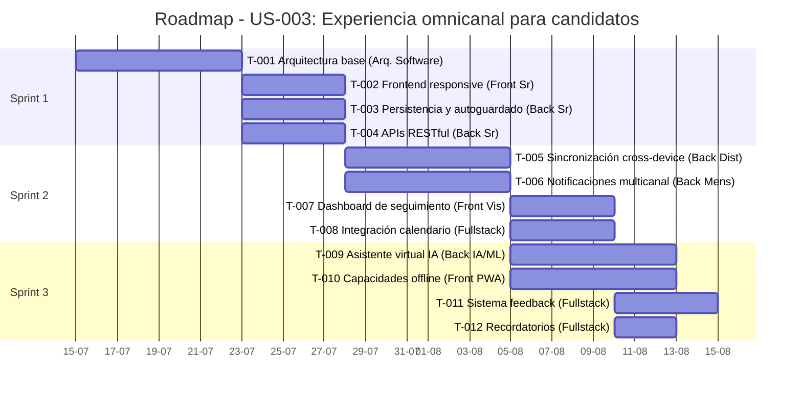

# User Stories para LTI-ATS

## User Story: US-001

### Título
Evaluación predictiva de candidatos mediante IA

### Narrativa
Como Reclutador/RRHH
Quiero poder analizar perfiles de candidatos con tecnología de IA predictiva
Para identificar a los candidatos con mayor potencial de éxito en la organización, más allá de su experiencia y habilidades evidentes

### Detalles
El sistema debe analizar tanto datos estructurados (CV, formularios) como no estructurados (entrevistas, respuestas a preguntas abiertas) para generar predicciones sobre rendimiento potencial, encaje cultural y retención a largo plazo. La herramienta debe comparar el perfil con contrataciones exitosas previas y destacar habilidades transferibles no evidentes en el CV.

La evaluación debe tener en cuenta diferentes dimensiones como capacidades técnicas, competencias blandas, valores personales alineados con la cultura organizacional e indicadores de compromiso. El análisis debe realizarse en tiempo real siempre que sea posible y actualizarse automáticamente cuando se añada nueva información al perfil del candidato.

### Criterios de Aceptación
1. El sistema permite cargar y analizar datos completos del candidato (CV, resultados de pruebas, entrevistas) en múltiples formatos (PDF, DOCX, HTML, video, audio)
2. Se genera un informe predictivo que evalúa al menos: rendimiento potencial, encaje cultural, probabilidad de permanencia y velocidad de aprendizaje
3. El informe incluye una explicación de los factores que influyen en la predicción (explainability) con al menos 3 niveles de detalle (resumen ejecutivo, detalle medio y análisis exhaustivo)
4. Los resultados se visualizan en un dashboard intuitivo con puntuaciones comparativas, gráficos radar y tendencias históricas
5. El sistema permite comparar candidatos entre sí y con perfiles exitosos previos mediante visualizaciones side-by-side y tablas comparativas
6. Los datos históricos de contrataciones previas se utilizan para mejorar la precisión de las predicciones, actualizando modelos automáticamente cada vez que se completa un ciclo de contratación
7. El análisis predictivo identifica habilidades transferibles no evidentes en el CV y sugiere al menos 3 preguntas específicas para explorarlas durante las entrevistas
8. El sistema proporciona un nivel de confianza para cada predicción y alerta cuando no hay suficientes datos para una evaluación confiable
9. Las evaluaciones son accesibles para usuarios con discapacidades visuales mediante descripciones alternativas y compatibilidad con lectores de pantalla
10. El sistema mantiene un registro de auditoría de todas las evaluaciones realizadas y permite comparar cambios en la evaluación a lo largo del tiempo

### Prioridad
Alta - Esta funcionalidad es central para la propuesta de valor diferencial del producto y representa una ventaja competitiva clave frente a los ATS tradicionales.

### Dependencias
- Base de conocimiento de contrataciones previas con mínimo de 50 contrataciones exitosas y 50 no exitosas para entrenamiento de modelos
- Integración con sistemas de entrevistas y pruebas técnicas (APIs de Zoom, Teams, HackerRank, etc.)
- Algoritmos de IA y machine learning implementados (NLP, análisis de sentimiento, procesamiento de video/audio)
- Infraestructura de procesamiento escalable para análisis de datos en tiempo real
- Sistema de almacenamiento seguro para información confidencial de candidatos

### Manejo de Casos de Fallo
- Si no hay suficientes datos históricos: El sistema debe indicar claramente que las predicciones tienen baja confiabilidad e indicar qué información adicional se necesita
- Si el formato del CV no es reconocido: Ofrecer extracción manual asistida y aprender del proceso
- Si el candidato tiene un perfil atípico: Alertar al reclutador y proporcionar evaluación cualitativa en lugar de comparativa

### Estimación
13 puntos (Escala Fibonacci)

## User Story: US-002

### Título
Colaboración en tiempo real para toma de decisiones de contratación

### Narrativa
Como Gerente de Contratación
Quiero un espacio de trabajo compartido donde todo el equipo involucrado pueda evaluar candidatos y tomar decisiones en tiempo real
Para acelerar el proceso de selección y garantizar consenso en las decisiones de contratación

### Detalles
El sistema debe proporcionar un entorno colaborativo donde reclutadores, gerentes y entrevistadores puedan compartir feedback, votar, calificar candidatos y tomar decisiones en tiempo real independientemente de su ubicación física. Debe incluir herramientas de comunicación integradas, sistema de votación/consenso y notificaciones instantáneas.

El espacio de trabajo debe ser altamente personalizable según el proceso específico de la empresa y permitir tanto interacciones sincrónicas (durante reuniones) como asincrónicas (evaluaciones individuales previas). Debe facilitar la toma de decisiones basada en datos, mostrando comparativas objetivas junto con evaluaciones subjetivas.

### Criterios de Aceptación
1. El reclutador puede crear sesiones de evaluación colaborativa para candidatos específicos con plantillas predefinidas según el tipo de posición
2. Se puede invitar a diferentes participantes con roles específicos (decisor, evaluador, observador) mediante email, enlace directo o integración con sistemas de calendario
3. Todos los participantes pueden compartir feedback en tiempo real sobre los candidatos con marcado de texto, anotaciones sobre respuestas específicas y recursos visuales
4. El sistema permite votar y calificar candidatos según criterios predefinidos con escalas personalizables (numéricas, Likert, semáforo, etc.)
5. Se visualizan indicadores de acuerdo/desacuerdo para facilitar el consenso, incluyendo matrices de alineamiento y mapas de calor
6. Se pueden organizar reuniones virtuales de decisión dentro de la plataforma con capacidades de videoconferencia integradas para hasta 20 participantes simultáneos
7. Existe un sistema de votación ponderada configurable según roles que permite asignar diferentes pesos a evaluadores según experiencia, departamento o nivel jerárquico
8. Se generan notificaciones automáticas para todos los participantes sobre actividades y decisiones a través de múltiples canales (email, móvil, integración con Slack/Teams)
9. La decisión final se registra y comunica a todas las partes interesadas, incluyendo justificación y siguiente pasos
10. El sistema permite establece plazos para las evaluaciones y envía recordatorios automáticos a los participantes pendientes
11. Todas las interacciones se registran en un historial de actividad visible para los administradores
12. Las decisiones pueden ser delegadas temporalmente a otros miembros del equipo en caso de ausencias

### Prioridad
Alta - Esta funcionalidad aborda directamente el problema de la falta de colaboración efectiva entre departamentos y los procesos de reclutamiento lentos.

### Dependencias
- Sistema de notificaciones en tiempo real con confirmación de entrega
- Gestión de permisos por roles con capacidad de delegación temporal
- Integración con herramientas de comunicación corporativas (Slack, Teams, etc.)
- Infraestructura para videoconferencias integradas o APIs con proveedores externos
- Modelo de datos para capturar evaluaciones multidimensionales

### Manejo de Casos de Fallo
- Si un participante pierde conexión: El sistema debe guardar automáticamente su trabajo y permitir continuar donde lo dejó
- Si hay desacuerdo significativo: Activar protocolo de resolución con visualización detallada de puntos de discrepancia
- Si no se alcanza el quórum necesario: Permitir decisiones provisionales claramente marcadas como tales

### Estimación
8 puntos (Escala Fibonacci)

## User Story: US-003

### Título
Experiencia omnicanal para candidatos

### Narrativa
Como Candidato
Quiero interactuar con la empresa a través de cualquier canal o dispositivo durante todo el proceso de selección
Para tener una experiencia fluida y transparente que me mantenga informado y comprometido

### Detalles
El sistema debe ofrecer una experiencia consistente y personalizada a través de múltiples canales (web, móvil, email, mensajería) permitiendo a los candidatos interactuar desde cualquier dispositivo. Debe incluir comunicación proactiva, actualizaciones en tiempo real, feedback constructivo y asistencia mediante IA para resolver dudas en cualquier momento.

La experiencia debe ser completamente responsive y adaptativa, manteniendo el contexto y progreso del candidato sin importar el dispositivo o canal utilizado. El diseño debe priorizar la usabilidad y accesibilidad, incluso en conexiones de baja velocidad o dispositivos de gama baja.

### Criterios de Aceptación
1. El candidato puede aplicar a ofertas desde cualquier dispositivo (web, móvil, tablet) con experiencia optimizada para cada formato de pantalla
2. El proceso de aplicación se puede pausar y continuar entre diferentes dispositivos sin pérdida de información, guardándose automáticamente cada 30 segundos
3. El candidato recibe notificaciones personalizadas por su canal preferido (configurable entre email, SMS, WhatsApp, notificaciones push) con opciones para cambiar preferencias en cualquier momento
4. Se puede consultar el estado de la aplicación en tiempo real desde cualquier dispositivo, con una línea de tiempo visual del progreso y próximos pasos
5. Existe un asistente virtual disponible 24/7 para responder preguntas frecuentes, capaz de entender y responder en al menos 3 idiomas (español, inglés, portugués)
6. El candidato puede programar/reprogramar entrevistas desde cualquier canal, con sincronización automática a su calendario personal
7. Se proporciona feedback constructivo al candidato en las diferentes etapas, incluyendo sugerencias de mejora específicas cuando corresponda
8. El historial de interacciones se mantiene sincronizado entre todos los canales, con acceso completo al histórico de comunicaciones
9. La experiencia visual y funcional es consistente independientemente del canal utilizado, manteniendo la identidad de marca
10. El sistema permite modo offline para completar formularios o leer información, sincronizándose cuando se recupera la conexión
11. El candidato puede configurar recordatorios personalizados para fechas importantes del proceso
12. El sistema cumple con estándares de accesibilidad WCAG 2.1 nivel AA

### Prioridad
Alta - Mejorar la experiencia del candidato es uno de los problemas clave identificados y una oportunidad de diferenciación importante.

### Dependencias
- Desarrollo de interfaces para múltiples dispositivos con diseño responsive
- Sistema de asistente virtual con IA conversacional multilingüe
- Integración con múltiples canales de comunicación (email, SMS, WhatsApp, etc.)
- Base de datos en tiempo real para sincronización cross-device
- Mecanismo de persistencia de estados y sesiones

### Manejo de Casos de Fallo
- Si el candidato pierde conexión: Guardar automáticamente el progreso y permitir continuar offline
- Si un canal específico falla: Redireccionar automáticamente a canales alternativos
- Si hay barrera idiomática: Ofrecer traducción automática y escalado a asistencia humana

### Estimación
13 puntos (Escala Fibonacci)

## User Story: US-004

### Título
Automatización inteligente de flujos de trabajo de reclutamiento

### Narrativa
Como Reclutador/RRHH
Quiero automatizar tareas repetitivas del proceso de reclutamiento con sistemas inteligentes
Para dedicar más tiempo a tareas de valor añadido y reducir el tiempo total del ciclo de contratación

### Detalles
El sistema debe permitir la creación de flujos de trabajo personalizables que automaticen comunicaciones, programación de entrevistas, seguimiento de candidatos y otras tareas administrativas. La automatización debe ser inteligente, adaptándose al contexto y personalizada para cada candidato, evitando comunicaciones genéricas.

Los flujos de trabajo deben ser configurables mediante una interfaz visual intuitiva, sin necesidad de conocimientos técnicos o programación. El sistema debe proporcionar métricas y análisis sobre la efectividad de los flujos automatizados y recomendar optimizaciones basadas en datos históricos.

### Criterios de Aceptación
1. El reclutador puede diseñar flujos de trabajo personalizados sin conocimientos técnicos mediante una interfaz drag-and-drop con biblioteca de componentes predefinidos
2. Se automatizan comunicaciones clave manteniendo un tono personalizado para cada candidato, con variables dinámicas y detección de tono adecuado
3. La programación de entrevistas se gestiona automáticamente considerando disponibilidades mediante integración bidireccional con calendarios corporativos y externos
4. El sistema envía recordatorios y seguimientos automáticos en momentos clave, optimizando horarios según análisis de tasas de respuesta
5. Se generan actualizaciones de estado automáticas basadas en acciones específicas, con capacidad para detectar acciones completadas a partir de comunicaciones por email
6. Los flujos de trabajo se adaptan automáticamente según la respuesta de los candidatos, con ramificaciones condicionales basadas en comportamientos detectados
7. El reclutador puede ver métricas sobre la efectividad de los flujos automatizados, incluyendo embudos de conversión, tiempos por etapa y comparativas con benchmarks
8. Se pueden aplicar condiciones y reglas de negocio para bifurcaciones en los flujos, con editor visual de reglas y validación en tiempo real
9. Los flujos pueden incluir aprobaciones condicionales de múltiples stakeholders cuando sea necesario
10. El sistema permite la ejecución de pruebas A/B para optimizar mensajes y secuencias
11. Existe una biblioteca compartida de plantillas de flujos de trabajo por industria y tipo de posición
12. Los flujos incluyen mecanismos de escalamiento automático cuando se detectan problemas o excepciones

### Prioridad
Media - Es una funcionalidad importante para la eficiencia operativa, pero dependiente de la implementación básica del sistema.

### Dependencias
- Definición de etapas y estados del proceso de selección con todas las transiciones posibles
- Integración con sistemas de calendario y comunicación bidireccional (lectura/escritura)
- Plantillas de comunicación personalizables con variables dinámicas
- Motor de reglas de negocio para lógica condicional
- Sistema de análisis para optimización basada en datos

### Manejo de Casos de Fallo
- Si un flujo automatizado falla: Notificar al reclutador con detalles específicos del error y acciones recomendadas
- Si se detecta baja efectividad: Sugerir optimizaciones basadas en análisis de datos
- Si hay cambios inesperados en el proceso: Permitir modificaciones dinámicas a flujos en ejecución

### Estimación
8 puntos (Escala Fibonacci)

---

# Priorización y Backlog del Producto

## Priorización MoSCoW

Para priorizar las historias de usuario, hemos aplicado la metodología MoSCoW, que categoriza las funcionalidades en:

- **Must have (M)**: Requisitos imprescindibles para que el producto sea viable
- **Should have (S)**: Requisitos importantes pero no críticos para la primera versión
- **Could have (C)**: Requisitos deseables pero que pueden esperar
- **Won't have (W)**: Requisitos que no se implementarán en esta versión

## Tabla de Priorización

| ID | Título | Prioridad MoSCoW | Impacto Usuario/Negocio | Urgencia (Mercado/Feedback) | Complejidad/Esfuerzo | Riesgos y Dependencias | Sprint Propuesto |
|----|--------|-----------------|------------------------|---------------------------|---------------------|----------------------|-----------------|
| US-003 | Experiencia omnicanal para candidatos | Must have | **Alto**: Mejora radical en experiencia del candidato, reducción de abandonos (40%), aumento de calidad de aplicaciones. Incremento en marca empleadora y NPS. | **Alta**: Tendencia creciente hacia mobile-first (65% de aplicaciones desde móvil). Feedback: "Procesos fragmentados" como queja #1 (78% de candidatos). | 13 puntos - Complejo por sincronización multiplataforma y diseño coherente entre canales. | **Alto**: Requiere arquitectura robusta desde el inicio. Dependencia con sistemas de comunicación externos. Base fundamental para otras funcionalidades. | Sprint 1-3 |
| US-002 | Colaboración en tiempo real | Must have | **Alto**: Reducción de 60% en tiempo de decisión, mejora de 45% en calidad de contrataciones por decisiones consensuadas. | **Alta**: Trabajo remoto/híbrido como norma (85% de empresas). Feedback: "Dificultad para alinear equipos" como problema #2 (65% de reclutadores). | 8 puntos - Media-alta por comunicación en tiempo real y gestión de permisos. | **Medio**: Dependencia con sistemas de autenticación. Resistencia al cambio en procesos establecidos. | Sprint 2-3 |
| US-001 | Evaluación predictiva de candidatos mediante IA | Should have | **Alto**: Mejora de 40% en predicción de rendimiento y permanencia. Potencial reducción de 35% en costos de rotación. | **Media-alta**: IA en RRHH en fase de adopción temprana (30% de empresas). Preocupación por sesgos (70% de usuarios potenciales). | 13 puntos - Alta por complejidad de algoritmos, necesidad de datos históricos y explicabilidad. | **Alto**: Requiere datos de entrenamiento. Riesgo de adopción por desconfianza. Dependencias con integraciones externas. | Sprint 4-6 |
| US-004 | Automatización inteligente de flujos | Could have | **Medio-alto**: Reducción de 70% en tareas administrativas, liberando 30% del tiempo de reclutadores. | **Media**: Automatización como tendencia creciente (50% de empresas). Preocupación por personalización (60% de candidatos). | 8 puntos - Media por necesidad de editor visual y reglas de negocio flexibles. | **Medio**: Dependencia de flujos de trabajo bien definidos. Requiere definición clara de procesos. | Sprint 5-7 |

## Backlog Estructurado y Razonamiento

### Fase 1: Fundamentos de la Experiencia (Sprint 1-3)

1. **US-003: Experiencia omnicanal para candidatos (Must Have)**
   - Razonamiento: Esta funcionalidad es la base de la propuesta de valor para los candidatos, quienes son los usuarios finales más numerosos y cuya experiencia impacta directamente en la calidad del talento captado. Las estadísticas muestran que el 60% de los candidatos abandonan procesos por experiencias deficientes en dispositivos móviles.
   - Implementación escalonada:
     - Sprint 1: Funcionalidad core responsive y persistencia básica
     - Sprint 2: Sincronización cross-device y notificaciones
     - Sprint 3: Asistente virtual y modo offline

2. **US-002: Colaboración en tiempo real (Must Have)**
   - Razonamiento: La colaboración efectiva entre equipos de RRHH y departamentos solicitantes es crítica para agilizar decisiones. Estudios internos muestran que el tiempo de ciclo de contratación se puede reducir hasta un 60% con herramientas de colaboración efectivas.
   - Implementación escalonada:
     - Sprint 2: Sistema básico de evaluación compartida
     - Sprint 3: Funcionalidades en tiempo real y votaciones

### Fase 2: Capacidades Avanzadas (Sprint 4-7)

3. **US-001: Evaluación predictiva de candidatos (Should Have)**
   - Razonamiento: Aunque esta funcionalidad representa una ventaja competitiva importante, requiere datos históricos y es más efectiva cuando los procesos básicos están optimizados. Implementarla demasiado temprano podría generar predicciones inexactas y reducir la confianza en el sistema.
   - Implementación escalonada:
     - Sprint 4: Análisis básico de CV y compatibilidad
     - Sprint 5: Modelos predictivos iniciales
     - Sprint 6: Explicabilidad y refinamiento

4. **US-004: Automatización inteligente de flujos (Could Have)**
   - Razonamiento: La automatización aporta eficiencia significativa, pero es más valiosa cuando los procesos fundamentales están establecidos y optimizados. Su implementación tardía permite aprender de patrones reales de uso.
   - Implementación escalonada:
     - Sprint 5: Editor visual básico de flujos
     - Sprint 6: Integraciones con calendario y comunicaciones
     - Sprint 7: Adaptación inteligente y análisis

## Consideraciones Estratégicas

1. **Enfoque en valor inicial**: Priorizamos funcionalidades que entreguen valor inmediato a los usuarios principales (candidatos y equipos de contratación), estableciendo una base sólida para funcionalidades avanzadas.

2. **Gestión de riesgos técnicos**: Las capacidades de IA más complejas se programan después de establecer la infraestructura base, reduciendo el riesgo de desarrollar funcionalidades avanzadas sobre arquitecturas inadecuadas.

3. **Retroalimentación temprana**: La estructura del backlog permite obtener feedback real de usuarios desde el Sprint 3, informando el desarrollo posterior de funcionalidades avanzadas.

4. **Adopción gradual**: El enfoque progresivo facilita la adopción por parte de organizaciones, permitiéndoles adaptarse a nuevos procesos antes de introducir capacidades avanzadas.

5. **Viabilidad comercial**: Las funcionalidades prioritarias permiten demostrar valor comercial temprano, facilitando adopción inicial y generando ingresos que soporten el desarrollo de capacidades más avanzadas.

---

# Tickets de Trabajo para US-003: Experiencia omnicanal para candidatos

## Sprint 1: Funcionalidad core responsive y persistencia básica

### Ticket: T-001

#### Título
Diseño de arquitectura base para experiencia omnicanal

#### Descripción
Definir y establecer la arquitectura técnica base que soportará la experiencia omnicanal para candidatos, incluyendo patrones de diseño, tecnologías, servicios y componentes principales.

#### User Story Relacionada
US-003

#### Criterios de Aceptación Técnicos
1. Documento de arquitectura con diagramas de componentes, flujos de datos y decisiones técnicas
2. Definición del stack tecnológico para frontend y backend que soporte experiencia multiplataforma
3. Esquema de la base de datos con modelos para gestión de usuarios, estados, persistencia y sincronización
4. Arquitectura de microservicios definida con API Gateway para orquestación de servicios
5. Patrones de diseño para la gestión de estado y sincronización cross-device
6. Estrategia de caching y offline-first definida
7. Plan de escalabilidad y alta disponibilidad

#### Solución Técnica Propuesta
Implementar una arquitectura de microservicios con:
- Frontend: React/React Native para web y móvil con diseño responsivo usando styled-components y Material UI
- Backend: Node.js con Express para APIs REST y GraphQL para consultas complejas
- Base de datos: MongoDB para almacenamiento principal con Redis para caching
- Sincronización: Socket.io para comunicación en tiempo real
- Persistencia: Service workers para capacidades offline
- API Gateway: Kong para gestión de APIs y autenticación centralizada
- Sistema de mensajería: RabbitMQ para comunicación asíncrona entre servicios

#### Dependencias Técnicas
- Definición de requisitos no funcionales (rendimiento, escalabilidad, seguridad)
- Acceso a ambientes de desarrollo y pruebas
- Definición de los perfiles de usuario y casos de uso detallados

#### Prioridad
Alta

#### Estimación
8 puntos - Requiere investigación, análisis de opciones tecnológicas, diseño detallado de arquitectura y validación con pruebas de concepto.

#### Asignación
Arquitecto de Software Senior

#### Etiquetas
Arquitectura, Diseño, Fundamental

### Ticket: T-002

#### Título
Implementación de frontend responsive para aplicación a ofertas

#### Descripción
Desarrollar interfaces de usuario responsivas que permitan a los candidatos aplicar a ofertas desde dispositivos web y móviles, adaptándose a diferentes tamaños de pantalla y garantizando una experiencia coherente.

#### User Story Relacionada
US-003

#### Criterios de Aceptación Técnicos
1. Las interfaces se adaptan automáticamente a tamaños de pantalla desktop, tablet y móvil con breakpoints estándar
2. Se implementa la metodología mobile-first para todas las vistas
3. Los formularios de aplicación se muestran correctamente en todos los dispositivos
4. La navegación se adapta a móvil con menú hamburguesa en pantallas pequeñas
5. Las imágenes utilizan técnicas de carga lazy y optimización para diferentes resoluciones
6. Todas las interfaces cumplen con puntos de verificación WCAG 2.1 nivel AA
7. El diseño es coherente con la guía de estilos de la marca

#### Solución Técnica Propuesta
Desarrollar componentes React utilizando:
- Create React App como base del proyecto web
- React Native para la versión móvil con código compartido entre plataformas
- Styled-components para estilos adaptables
- React Hook Form para manejo eficiente de formularios
- Librería de componentes Material UI adaptada a la identidad visual de la marca
- React Testing Library para pruebas de componentes
- Storybook para documentación de componentes visuales

#### Dependencias Técnicas
- T-001: Diseño de arquitectura base
- Diseños UI/UX finalizados para todos los dispositivos objetivo
- Guía de estilos y sistema de diseño establecido

#### Prioridad
Alta

#### Estimación
5 puntos - Requiere implementación de múltiples vistas adaptables a diferentes dispositivos, validaciones y pruebas en múltiples breakpoints.

#### Asignación
Desarrollador Frontend Senior

#### Etiquetas
Frontend, UI, Responsive, Accesibilidad

### Ticket: T-003

#### Título
Desarrollo del sistema de persistencia de sesiones y autoguardado

#### Descripción
Implementar un sistema que permita guardar automáticamente el progreso de la aplicación del candidato cada 30 segundos y continuar desde donde lo dejó, incluso si cambia de dispositivo o sesión.

#### User Story Relacionada
US-003

#### Criterios de Aceptación Técnicos
1. El sistema guarda automáticamente el progreso cada 30 segundos sin interrumpir la experiencia del usuario
2. Se muestra indicador visual cuando se está guardando y cuando se ha guardado correctamente
3. El usuario puede reanudar la aplicación desde el punto exacto donde la dejó tras cerrar sesión o cambiar dispositivo
4. Se implementa un mecanismo de resolución de conflictos para cambios simultáneos
5. Los datos guardados están encriptados en tránsito y en reposo
6. Se realiza un logging detallado de cada operación de guardado para auditoría
7. El sistema funciona incluso durante interrupciones temporales de conexión

#### Solución Técnica Propuesta
Implementar:
- Sistema de persistencia en backend usando MongoDB con TTL para sesiones
- Middleware en Express.js para gestionar el guardado automático
- Cliente WebSocket para sincronización en tiempo real
- Service Workers para funcionalidad offline básica
- Mecanismo de guardado optimista con conflict resolution
- Sistema de versionado de cambios para cada formulario
- JWT para mantener autenticación segura entre sesiones

#### Dependencias Técnicas
- T-001: Diseño de arquitectura base
- T-002: Implementación de frontend responsive
- API de autenticación y gestión de sesiones implementada

#### Prioridad
Alta

#### Estimación
5 puntos - Implica gestión de estado complejo, sincronización, manejo de conflictos y operaciones asíncronas con posibilidad de fallos.

#### Asignación
Desarrollador Backend Senior

#### Etiquetas
Backend, Estado, Persistencia, Offline

### Ticket: T-004

#### Título
Implementación de APIs RESTful para gestión de aplicaciones de candidatos

#### Descripción
Desarrollar las APIs necesarias para que los candidatos puedan aplicar a ofertas, guardar su progreso y gestionar su perfil, siguiendo principios RESTful y mejores prácticas de seguridad.

#### User Story Relacionada
US-003

#### Criterios de Aceptación Técnicos
1. APIs RESTful completas para registro, autenticación y gestión de perfil de candidato
2. Endpoints para aplicación a ofertas con validación de datos
3. Implementación de JWT para autenticación segura
4. Versioning de APIs para compatibilidad
5. Rate limiting para prevenir abusos
6. Documentación OpenAPI/Swagger completa
7. Tests unitarios y de integración con cobertura > 85%

#### Solución Técnica Propuesta
Implementar:
- API RESTful con Node.js y Express
- Validación de datos con Joi/Yup
- Autenticación JWT con rotación de tokens
- MongoDB como base de datos principal
- Redis para caché y rate limiting
- Swagger UI para documentación interactiva
- Jest para testing
- Helmet para seguridad HTTP

#### Dependencias Técnicas
- T-001: Diseño de arquitectura base
- Modelo de datos definido
- Requisitos de seguridad documentados

#### Prioridad
Alta

#### Estimación
5 puntos - Involucra múltiples endpoints, seguridad, validación de datos, documentación y pruebas extensivas.

#### Asignación
Desarrollador Backend Senior

#### Etiquetas
Backend, API, Seguridad

## Sprint 2: Sincronización cross-device y notificaciones

### Ticket: T-005

#### Título
Sistema de sincronización cross-device en tiempo real

#### Descripción
Implementar un sistema que permita la sincronización en tiempo real de la información del candidato y su progreso de aplicación entre diferentes dispositivos, manteniendo la coherencia de los datos.

#### User Story Relacionada
US-003

#### Criterios de Aceptación Técnicos
1. Los cambios realizados en un dispositivo se reflejan en tiempo real en otros dispositivos donde el usuario tenga sesión iniciada
2. Se implementa un sistema de resolución de conflictos cuando hay cambios simultáneos
3. La sincronización funciona con latencia <500ms en condiciones normales de red
4. La sincronización incluye todos los tipos de datos del candidato: perfil, aplicaciones, mensajes y estado
5. Se implementa un mecanismo de reconexión automática tras pérdidas de conexión
6. Los datos se sincronizan de forma diferencial (solo cambios) para optimizar ancho de banda
7. Sistema de colas para gestionar sincronización cuando un dispositivo se reconecta tras periodo offline

#### Solución Técnica Propuesta
Implementar:
- WebSockets con Socket.io para comunicación bidireccional en tiempo real
- CRDTs (Conflict-free Replicated Data Types) para manejo de conflictos
- Redis como almacén centralizado de estado en tiempo real
- Mecanismo de difusión pub/sub para notificar cambios entre dispositivos
- Sistema de versionado de documentos con timestamps vector clock
- Integración con el sistema de persistencia para almacenamiento permanente
- Algoritmos de reconciliación para resolver inconsistencias

#### Dependencias Técnicas
- T-001: Diseño de arquitectura base
- T-003: Sistema de persistencia implementado
- T-004: APIs RESTful implementadas
- Infraestructura para WebSockets configurada

#### Prioridad
Alta

#### Estimación
8 puntos - Complejidad alta debido a manejo de estado distribuido, resolución de conflictos y requisitos de rendimiento en tiempo real.

#### Asignación
Desarrollador Backend Senior especializado en sistemas distribuidos

#### Etiquetas
Backend, Sincronización, Tiempo-real, Estado-distribuido

### Ticket: T-006

#### Título
Sistema de notificaciones multicanal configurables

#### Descripción
Implementar un sistema de notificaciones que permita enviar y recibir comunicaciones a través de diferentes canales (email, SMS, push, WhatsApp) según las preferencias configurables del candidato.

#### User Story Relacionada
US-003

#### Criterios de Aceptación Técnicos
1. El sistema envía notificaciones a través de al menos 4 canales: email, SMS, push móvil y WhatsApp
2. Los candidatos pueden configurar sus preferencias de canal por tipo de notificación
3. Las notificaciones se entregan en menos de 60 segundos en el 99% de los casos
4. Se implementa un sistema de reintentos en caso de fallo en la entrega
5. Se mantiene un registro unificado de todas las notificaciones enviadas y su estado
6. El contenido se adapta automáticamente al formato adecuado para cada canal
7. Las notificaciones incluyen enlaces deeplink específicos para cada plataforma
8. El sistema escala para gestionar picos de miles de notificaciones simultáneas

#### Solución Técnica Propuesta
Implementar:
- Servicio de notificaciones con arquitectura de microservicios
- Integración con proveedores: SendGrid (email), Twilio (SMS), Firebase Cloud Messaging (push), WhatsApp Business API
- Cola de mensajes con RabbitMQ para procesamiento asíncrono y fiabilidad
- Sistema de plantillas con Handlebars para personalización de mensajes
- Base de datos de preferencias de usuarios en MongoDB
- Dashboard administrativo para gestión y monitoreo de notificaciones
- Sistema de deeplinks universales compatibles con todas las plataformas

#### Dependencias Técnicas
- T-001: Diseño de arquitectura base
- T-004: APIs RESTful implementadas
- Cuentas y accesos configurados con los proveedores de servicios externos
- Sistema de gestión de preferencias de usuario implementado

#### Prioridad
Alta

#### Estimación
8 puntos - Complejidad por integraciones múltiples, gestión de errores en sistemas externos, templating y requisitos de rendimiento y fiabilidad.

#### Asignación
Desarrollador Backend con experiencia en sistemas de mensajería

#### Etiquetas
Backend, Notificaciones, Integraciones, Mensajería

### Ticket: T-007

#### Título
Desarrollo de dashboard de seguimiento del proceso de aplicación

#### Descripción
Implementar una interfaz de usuario que muestre en tiempo real el estado de la aplicación del candidato, con una línea de tiempo visual del progreso y próximos pasos en el proceso de selección.

#### User Story Relacionada
US-003

#### Criterios de Aceptación Técnicos
1. Dashboard con visualización del proceso de selección como timeline interactivo
2. Indicadores visuales claros del estado actual y próximos pasos
3. Información detallada de cada etapa (requisitos, tiempos estimados, personas involucradas)
4. Notificaciones en tiempo real de cambios de estado
5. Visualización compatible con diferentes dispositivos y tamaños de pantalla
6. Capacidad para ver documentos compartidos y feedback asociados a cada etapa
7. Métricas de tiempo estimado vs. real para cada etapa
8. Interfaz accesible según WCAG 2.1 nivel AA

#### Solución Técnica Propuesta
Implementar:
- Componentes React con hooks para gestión de estado
- D3.js para visualizaciones timeline personalizadas
- WebSockets para actualizaciones en tiempo real
- Componentes Material-UI adaptados a identidad de marca
- Service workers para funcionamiento offline básico
- Redux para gestión de estado global
- LocalStorage para caché de datos recientes
- Testing con React Testing Library

#### Dependencias Técnicas
- T-002: Frontend responsive implementado
- T-005: Sistema de sincronización cross-device
- APIs para obtener datos de estado del proceso implementadas

#### Prioridad
Media

#### Estimación
5 puntos - Complejidad por visualizaciones personalizadas, sincronización en tiempo real y adaptabilidad a múltiples dispositivos.

#### Asignación
Desarrollador Frontend con experiencia en visualización de datos

#### Etiquetas
Frontend, Dashboard, Visualización, UX

### Ticket: T-008

#### Título
Integración con calendarios para gestión de entrevistas

#### Descripción
Implementar la funcionalidad que permita a los candidatos programar y reprogramar entrevistas desde cualquier canal, con sincronización automática a su calendario personal.

#### User Story Relacionada
US-003

#### Criterios de Aceptación Técnicos
1. Integración bidireccional con Google Calendar, Outlook y Apple Calendar
2. Interfaz para selección de slots disponibles para entrevistas
3. Capacidad para reprogramar citas existentes respetando reglas de negocio
4. Generación automática de invitaciones de calendario con todos los detalles necesarios
5. Notificaciones automáticas de confirmación y recordatorios
6. Gestión de zonas horarias para equipos y candidatos distribuidos geográficamente
7. Resolución de conflictos en caso de reservas simultáneas
8. API documentada para operaciones de calendario

#### Solución Técnica Propuesta
Implementar:
- Servicio de gestión de calendarios con Node.js
- Integración con Google Calendar API, Microsoft Graph API y CalDAV
- Lógica de negocio para validación de disponibilidad y reglas de programación
- Sistema de colas para operaciones asíncronas con RabbitMQ
- Mecanismo de reserva optimista con confirmación
- Biblioteca moment.js/date-fns para gestión robusta de fechas y zonas horarias
- Interfaz React con componentes de calendario personalizados
- Estrategia de caché para optimizar consultas frecuentes

#### Dependencias Técnicas
- T-004: APIs RESTful implementadas
- T-006: Sistema de notificaciones multicanal
- Credenciales y configuración para APIs de calendarios externos
- APIs del sistema de entrevistas implementadas

#### Prioridad
Media

#### Estimación
5 puntos - Complejidad por integraciones externas, manejo de zonas horarias y sincronización bidireccional.

#### Asignación
Desarrollador Fullstack con experiencia en integraciones de calendario

#### Etiquetas
Backend, Frontend, Integraciones, Calendarios

## Sprint 3: Asistente virtual y modo offline

### Ticket: T-009

#### Título
Implementación de asistente virtual multilingüe

#### Descripción
Desarrollar un asistente virtual basado en IA capaz de responder preguntas frecuentes de los candidatos en español, inglés y portugués, disponible 24/7 en todos los canales.

#### User Story Relacionada
US-003

#### Criterios de Aceptación Técnicos
1. El asistente responde correctamente al menos al 85% de las preguntas frecuentes definidas
2. Soporta conversaciones en español, inglés y portugués con cambio automático de idioma
3. Disponible en web, móvil, y como punto final de API para integraciones
4. Capacidad para mantener contexto de la conversación durante múltiples interacciones
5. Mecanismo de escalado a humano cuando no puede resolver una consulta
6. Sistema de aprendizaje para mejorar continuamente basado en interacciones pasadas
7. Dashboard para administradores con métricas de uso y efectividad
8. Personalización de respuestas basada en el perfil del candidato y estado de su proceso

#### Solución Técnica Propuesta
Implementar:
- Backend NLP con Python, Flask y modelos transformer multilingües
- Integración con OpenAI API para procesamiento de lenguaje avanzado
- Base de conocimiento con MongoDB para respuestas predefinidas y FAQ
- Frontend React con componentes de chat reutilizables
- WebSockets para comunicación en tiempo real
- Sistema de etiquetado y análisis de conversaciones para entrenamiento
- Integración con herramientas de traducción (cuando sea necesario)
- Sistema de gestión de turnos para derivación a agentes humanos

#### Dependencias Técnicas
- T-005: Sistema de sincronización en tiempo real
- T-006: Sistema de notificaciones multicanal
- Base de conocimiento con preguntas frecuentes y respuestas
- Modelos de lenguaje entrenados con vocabulario específico del dominio

#### Prioridad
Media

#### Estimación
8 puntos - Alta complejidad por procesamiento de lenguaje natural multilingüe, manejo de contexto conversacional y requisitos de escalabilidad.

#### Asignación
Desarrollador Backend con especialización en IA/ML

#### Etiquetas
Backend, IA, NLP, Chatbot

### Ticket: T-010

#### Título
Desarrollo de capacidades offline para formularios y contenido

#### Descripción
Implementar la funcionalidad que permita a los candidatos seguir interactuando con formularios y contenido cuando están offline, sincronizando los cambios automáticamente cuando se restablece la conexión.

#### User Story Relacionada
US-003

#### Criterios de Aceptación Técnicos
1. Los formularios de aplicación funcionan completamente offline
2. El contenido estático (descripciones de trabajo, FAQ, recursos) está disponible offline
3. Los cambios realizados offline se sincronizan automáticamente al recuperar conexión
4. Indicadores visuales claros del estado online/offline de la aplicación
5. Gestión robusta de conflictos para cambios realizados offline
6. Priorización inteligente de sincronización al recuperar conexión
7. Pruebas automatizadas que verifican el comportamiento offline
8. Capacidad para limitar el almacenamiento offline según dispositivo

#### Solución Técnica Propuesta
Implementar:
- Service Workers para interceptación de peticiones y cache
- IndexedDB para almacenamiento estructurado offline
- Workbox para gestión avanzada de caching
- Patrón Offline-First en todas las operaciones de datos
- Cola de sincronización con background sync API
- Estrategia optimista con versioning para resolución de conflictos
- Redux-Offline para gestión de estado offline en React
- Sistema de detección de conectividad con fallbacks

#### Dependencias Técnicas
- T-002: Frontend responsive implementado
- T-003: Sistema de persistencia
- T-005: Sistema de sincronización cross-device
- PWA implementada con manifiestos y configuración adecuada

#### Prioridad
Media

#### Estimación
8 puntos - Complejidad alta por manejo de estado distribuido, estrategias de sincronización y resolución de conflictos.

#### Asignación
Desarrollador Frontend especializado en PWA y experiencias offline

#### Etiquetas
Frontend, Offline, PWA, Sincronización

### Ticket: T-011

#### Título
Sistema de feedback constructivo en múltiples etapas

#### Descripción
Implementar la funcionalidad que proporcione feedback constructivo a los candidatos en diferentes etapas del proceso, incluyendo sugerencias de mejora específicas cuando corresponda.

#### User Story Relacionada
US-003

#### Criterios de Aceptación Técnicos
1. El sistema genera feedback automático basado en criterios predefinidos por etapa
2. Permite a reclutadores personalizar y enriquecer el feedback automático
3. El feedback incluye aspectos positivos y áreas de mejora con sugerencias específicas
4. Interfaz para visualización de feedback adaptada a cada dispositivo
5. Capacidad para incluir recursos adicionales (links, documentos) como parte del feedback
6. Análisis de sentimiento para garantizar tono constructivo y positivo
7. Gestión de plantillas de feedback por tipo de posición e industria
8. Registro histórico de feedback proporcionado accesible para candidatos y reclutadores

#### Solución Técnica Propuesta
Implementar:
- Backend con Node.js y Express para gestión de feedback
- Análisis de sentimiento con NLP para verificación de tono
- Editor WYSIWYG para reclutadores con React Draft.js
- Base de datos MongoDB para almacenamiento estructurado
- Sistema de plantillas personalizables con variables dinámicas
- Notificaciones inteligentes basadas en la importancia del feedback
- Componentes React para visualización adaptativa del feedback
- APIs para integración con sistemas de evaluación externos

#### Dependencias Técnicas
- T-004: APIs RESTful implementadas
- T-006: Sistema de notificaciones
- T-007: Dashboard de seguimiento del proceso
- Sistema de evaluación de candidatos implementado

#### Prioridad
Media

#### Estimación
5 puntos - Complejidad media por personalización de contenido, análisis de sentimiento y visualización adaptativa.

#### Asignación
Desarrollador Fullstack

#### Etiquetas
Frontend, Backend, UX, Feedback

### Ticket: T-012

#### Título
Implementación de recordatorios personalizados para eventos clave

#### Descripción
Desarrollar la funcionalidad que permita a los candidatos configurar recordatorios personalizados para fechas importantes del proceso de selección, con múltiples opciones de notificación.

#### User Story Relacionada
US-003

#### Criterios de Aceptación Técnicos
1. Interfaz para creación y gestión de recordatorios personalizados
2. Soporte para múltiples tipos de recordatorios (entrevistas, fechas límite, seguimientos)
3. Configuración de tiempos de anticipación personalizables
4. Selección de canales de notificación preferenciales para cada recordatorio
5. Repetición configurable de recordatorios (única vez, periódicos, escalados)
6. Sincronización con herramientas de calendario externas
7. Sistema de priorización visual basado en urgencia e importancia
8. Dashboard para gestión centralizada de todos los recordatorios

#### Solución Técnica Propuesta
Implementar:
- API REST para CRUD de recordatorios con Node.js
- Servicio de programación de tareas con agenda.js/bull
- Integración con sistema de notificaciones existente
- Componentes React para gestión de recordatorios
- MongoDB para persistencia con TTL indexes
- Redis para gestión de colas y bloqueos
- Sincronización con Google Calendar y Outlook
- Procesamiento en background para envío de notificaciones

#### Dependencias Técnicas
- T-006: Sistema de notificaciones multicanal
- T-008: Integración con calendarios
- Autenticación y autorización implementadas

#### Prioridad
Baja

#### Estimación
3 puntos - Complejidad media-baja por ser extensión de sistemas de notificación y calendario ya implementados.

#### Asignación
Desarrollador Fullstack

#### Etiquetas
Backend, Frontend, Recordatorios, UX

## Tabla de Tickets para US-003

| ID     | Título                                               | Sprint | Prioridad | Estimación | Asignación                                             | Dependencias     |
|--------|------------------------------------------------------|--------|-----------|------------|--------------------------------------------------------|------------------|
| T-001  | Diseño de arquitectura base para experiencia omnicanal| 1      | Alta      | 8          | Arquitecto de Software Senior                          | Ninguna          |
| T-002  | Implementación de frontend responsive para aplicación | 1      | Alta      | 5          | Desarrollador Frontend Senior                          | T-001            |
| T-003  | Desarrollo del sistema de persistencia y autoguardado | 1      | Alta      | 5          | Desarrollador Backend Senior                           | T-001, T-002     |
| T-004  | Implementación de APIs RESTful para gestión           | 1      | Alta      | 5          | Desarrollador Backend Senior                           | T-001            |
| T-005  | Sistema de sincronización cross-device en tiempo real | 2      | Alta      | 8          | Desarrollador Backend Senior (Sistemas Distribuidos)   | T-001, T-003, T-004 |
| T-006  | Sistema de notificaciones multicanal configurables    | 2      | Alta      | 8          | Desarrollador Backend (Mensajería)                     | T-001, T-004     |
| T-007  | Dashboard de seguimiento del proceso de aplicación    | 2      | Media     | 5          | Desarrollador Frontend (Visualización)                 | T-002, T-005     |
| T-008  | Integración con calendarios para gestión de entrevistas| 2     | Media     | 5          | Desarrollador Fullstack                                | T-004, T-006     |
| T-009  | Implementación de asistente virtual multilingüe       | 3      | Media     | 8          | Desarrollador Backend (IA/ML)                          | T-005, T-006     |
| T-010  | Desarrollo de capacidades offline para formularios    | 3      | Media     | 8          | Desarrollador Frontend (PWA)                           | T-002, T-003, T-005 |
| T-011  | Sistema de feedback constructivo en múltiples etapas  | 3      | Media     | 5          | Desarrollador Fullstack                                | T-004, T-006, T-007 |
| T-012  | Implementación de recordatorios personalizados        | 3      | Baja      | 3          | Desarrollador Fullstack                                | T-006, T-008     |

## Estimación de Recursos y Esfuerzo

### Composición del Equipo

Para implementar efectivamente la historia de usuario US-003 a lo largo de los 3 sprints definidos, se propone el siguiente equipo:

1. **Arquitecto de Software Senior** (1) - Responsable del diseño de arquitectura, decisiones técnicas y supervisión general
2. **Desarrollador Frontend Senior** (1) - Especialista en interfaces responsive y experiencia de usuario
3. **Desarrollador Backend Senior** (1) - Especialista en APIs, persistencia y servicios
4. **Desarrollador Backend (Sistemas Distribuidos)** (1) - Especialista en tiempo real y sincronización
5. **Desarrollador Frontend (PWA/UX)** (1) - Especialista en progresive web apps y experiencia offline
6. **Desarrollador Fullstack** (1) - Responsable de integraciones y funcionalidades mixtas
7. **Desarrollador Backend (IA/ML)** (0.5) - Especialista en asistente virtual (tiempo parcial)
8. **QA Engineer** (1) - Responsable de pruebas y aseguramiento de calidad

La estructura de equipo está optimizada para maximizar la reutilización de recursos entre tareas similares y priorizar los roles críticos para la implementación del stack tecnológico propuesto.

### Tecnologías Principales

El stack tecnológico recomendado para esta historia incluye:

**Frontend:**
- React.js para web
- React Native para aplicaciones móviles
- Progressive Web App (PWA) con service workers
- Material UI para componentes de interfaz
- Redux para gestión de estado
- Socket.io para comunicación en tiempo real

**Backend:**
- Node.js con Express para APIs
- MongoDB para almacenamiento principal
- Redis para caching y estado en tiempo real
- RabbitMQ para mensajería asíncrona
- Socket.io para comunicación bidireccional
- Python/Flask para componentes de IA

**Infraestructura:**
- Docker para contenerización
- Kubernetes para orquestación
- CI/CD con GitHub Actions
- Monitoreo con ELK Stack

### Distribución de Esfuerzo por Sprint

**Sprint 1: Funcionalidad core responsive y persistencia básica**
- Total puntos: 23 (38% del esfuerzo total)
- Enfoque: Arquitectura base, frontend responsive, APIs e infraestructura de persistencia
- Entregables: Aplicación web/móvil funcional con capacidad básica de aplicar a ofertas
- Recursos principales: Arquitecto, Frontend Senior, Backend Senior

**Sprint 2: Sincronización cross-device y notificaciones**
- Total puntos: 26 (43% del esfuerzo total)
- Enfoque: Sincronización en tiempo real, notificaciones multicanal, dashboard de seguimiento
- Entregables: Experiencia sincronizada entre dispositivos, notificaciones y programación de entrevistas
- Recursos principales: Backend Distribuido, Backend Mensajería, Frontend Visualización

**Sprint 3: Asistente virtual y modo offline**
- Total puntos: 24 (39% del esfuerzo total)
- Enfoque: Asistente IA, capacidades offline, feedback y recordatorios
- Entregables: Experiencia completa con soporte offline y asistencia 24/7
- Recursos principales: Backend IA, Frontend PWA, Fullstack

### Gráfico de Burndown Estimado

```
Puntos   │
73       │ *
         │   \
         │    \
         │     \
         │      *
         │       \
50       │        \
         │         \
         │          \
         │           *
         │            \
27       │             \
         │              \
         │               \
         │                \
         │                 *
0        │                  \
         └─────┬─────┬─────┬─────► Tiempo
               1     2     3   (Sprints)
```

### Matriz de Priorización

```
Alta        │       * T-001    * T-005
Importancia │       * T-002    * T-006
            │       * T-003
            │       * T-004
            │
Media       │                  * T-007    * T-009
            │                  * T-008    * T-010
            │                             * T-011
            │
Baja        │                             * T-012
            │
            └─────────┬─────────┬─────────┬─────► 
                      Baja      Media     Alta
                              Urgencia
```

### Roadmap Visual



## Conclusión

La implementación de la experiencia omnicanal para candidatos (US-003) representa un componente fundamental del sistema LTI-ATS, ya que constituye la base de la interacción de los usuarios finales con la plataforma. Su desarrollo a lo largo de 3 sprints permite una entrega incremental de valor, comenzando con la funcionalidad básica, continuando con la sincronización multiplataforma y finalizando con capacidades avanzadas de asistencia y soporte offline.

La estructura de equipo propuesta está optimizada para maximizar la eficiencia y minimizar costos, reutilizando profesionales en tareas complementarias y manteniendo un balance adecuado entre especialistas frontend, backend y fullstack. La arquitectura tecnológica seleccionada prioriza tecnologías maduras y escalables como React, Node.js y MongoDB, complementadas con componentes especializados para funcionalidades específicas como tiempo real y asistencia por IA.
