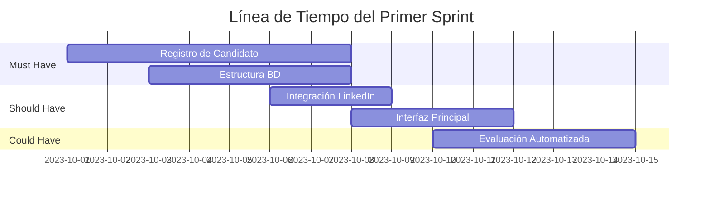

# Asistente
    Cursor, Agent (deepseek-v3)

# Prompt

```markdown
Debes trabajar como un Product Manager y un Busines Analist expertos, cambia de rol según te sea necesario, en desarrollo de aplicaciones con buenas prácticas y metedologías ágiles como estándar en tu trabajo y planificación.

En base al documento aportado, realiza las siguientes tareas:
- Genera las Historias de Usuario, agrupándolas en Épicas funcionaeles, con el formato siguiente:
```
Título de la Historia de Usuario:

Como [rol del usuario],
quiero [acción que desea realizar el usuario],
para que [beneficio que espera obtener el usuario].

Criterios de Aceptación:
[Detalle específico de funcionalidad]

Notas Adicionales:
[Cualquier consideración adicional]

Historias de Usuario Relacionadas:
[Relaciones con otras historias de usuario]
```
- Dame el backlog para el inicio del primer sprint, priorizando las historias de usuario generadas en base a MoSCoW
- Añade también, para cada historia de usuario, los tickets de trabajo o subtareas sobre la historia de usuario, aterrízalos a nivel técnico, incluso agrúpalos para los diferentes pefiles técnicos, siendo la salida de una reunión de planificación
- Para cada ticket de trabajo debes dar una estimación según la metodología de tallas de camiseta, aquí deberías tomar el rol de los diferentes perfiles técnicos en que hayas agrupado los tickets de trabajo

Todo esto dámelo en un fichero markdwon enriquecido con diagramas mermadi si es necesario, en la misma carpeta que el documento aportado
```

## Respuesta

```markdown
# Backlog del Producto - LTI ATS

## Épicas Funcionales

### 1. Gestión de Candidatos
### 2. Automatización de Procesos
### 3. Colaboración en Equipo
### 4. Integraciones Externas
### 5. Análisis Predictivo con IA

## Historias de Usuario

### Título de la Historia de Usuario: Registro de Nuevo Candidato

Como reclutador,
quiero poder registrar nuevos candidatos en el sistema,
para que pueda gestionar eficientemente el proceso de selección.

Criterios de Aceptación:
- Formulario con campos obligatorios: nombre, email, teléfono
- Validación de formato de email y teléfono
- Almacenamiento en base de datos
- Confirmación visual del registro exitoso

Notas Adicionales:
- Considerar integración con LinkedIn para autocompletar datos

Historias de Usuario Relacionadas:
- Evaluación Automatizada de Candidatos
- Colaboración en Proceso de Selección

### Título de la Historia de Usuario: Evaluación Automatizada de Candidatos

Como reclutador,
quiero que el sistema evalúe automáticamente a los candidatos,
para que pueda priorizar los perfiles más adecuados.

Criterios de Aceptación:
- Integración con módulo de IA
- Puntuación basada en experiencia, educación y habilidades
- Visualización clara de los resultados

Notas Adicionales:
- Considerar ponderación personalizable de criterios

Historias de Usuario Relacionadas:
- Registro de Nuevo Candidato
- Colaboración en Proceso de Selección

## Backlog del Primer Sprint (MoSCoW)

### Must Have
1. Registro de Nuevo Candidato
2. Estructura Base de Datos

### Should Have
1. Integración Básica con LinkedIn
2. Interfaz de Usuario Principal

### Could Have
1. Evaluación Automatizada de Candidatos (Versión Básica)

### Won't Have
1. Colaboración en Equipo (Postergado para sprint 2)

## Tickets de Trabajo

### Registro de Nuevo Candidato

#### Frontend
- Diseño de formulario de registro (S)
- Implementación de validaciones (M)
- Integración con API (M)

#### Backend
- Creación de endpoint para registro (M)
- Implementación de validaciones de servidor (M)
- Conexión con base de datos (L)

#### Base de Datos
- Diseño de modelo de datos para candidatos (L)
- Implementación de migraciones (M)

### Estructura Base de Datos

#### Backend
- Configuración de ORM (L)
- Definición de modelos principales (L)
- Implementación de relaciones (M)

#### DevOps
- Configuración de base de datos en entorno de desarrollo (M)
- Creación de scripts de migración (S)

## Estimación de Esfuerzo

| Tarea | Talla | Justificación |
|-------|-------|---------------|
| Diseño de formulario | S | Componente básico con campos estándar |
| Endpoint de registro | M | Requiere validaciones y conexión con BD |
| Modelo de datos | L | Necesita definición de relaciones y tipos |
| Configuración ORM | L | Requiere integración con múltiples componentes |
| Validaciones frontend | S | Implementación de reglas básicas |
| Scripts de migración | S | Generación automática con ORM |



Este documento representa el backlog inicial y la planificación del primer sprint para el desarrollo del sistema LTI ATS. Las prioridades y estimaciones están basadas en el análisis de las necesidades del producto y la complejidad técnica de cada tarea.
```