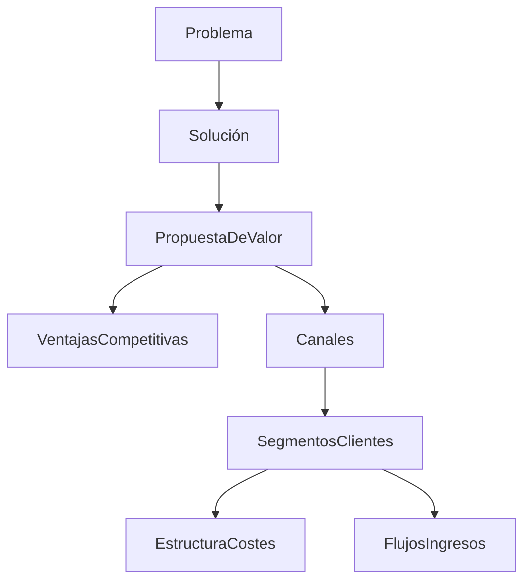
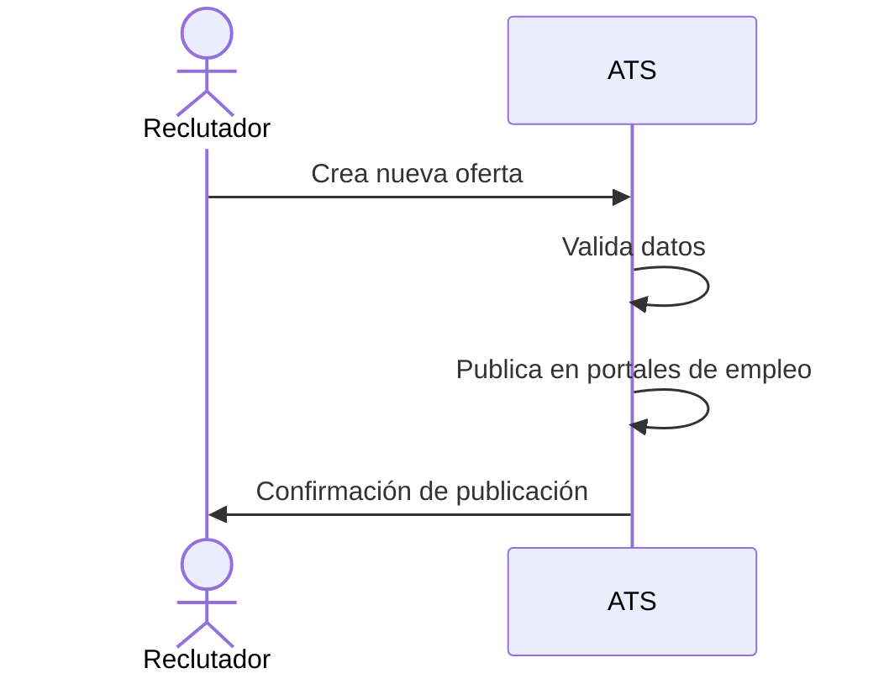
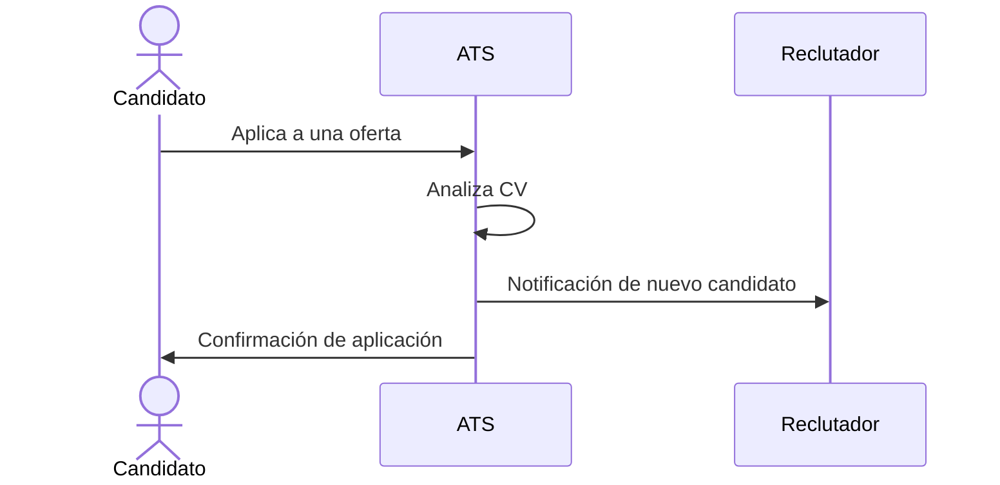
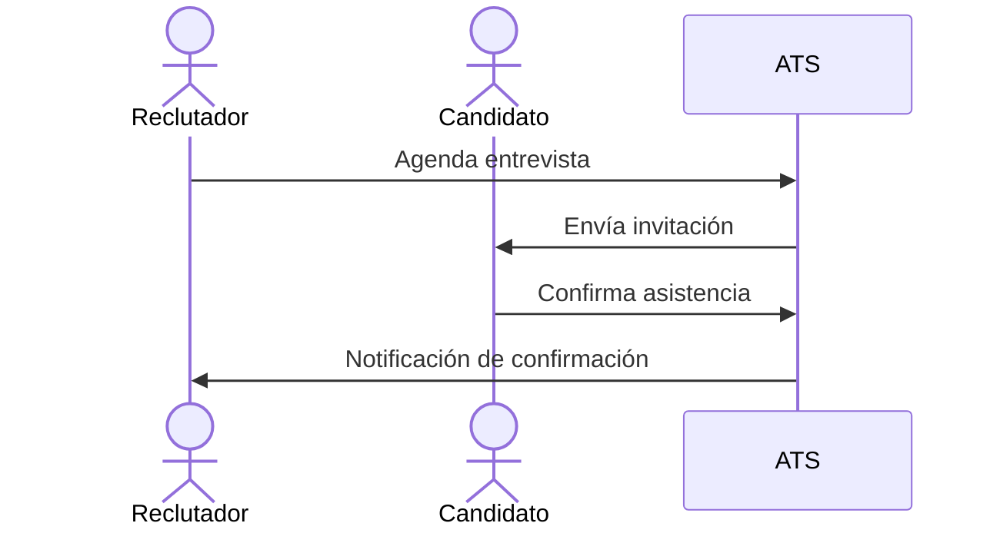
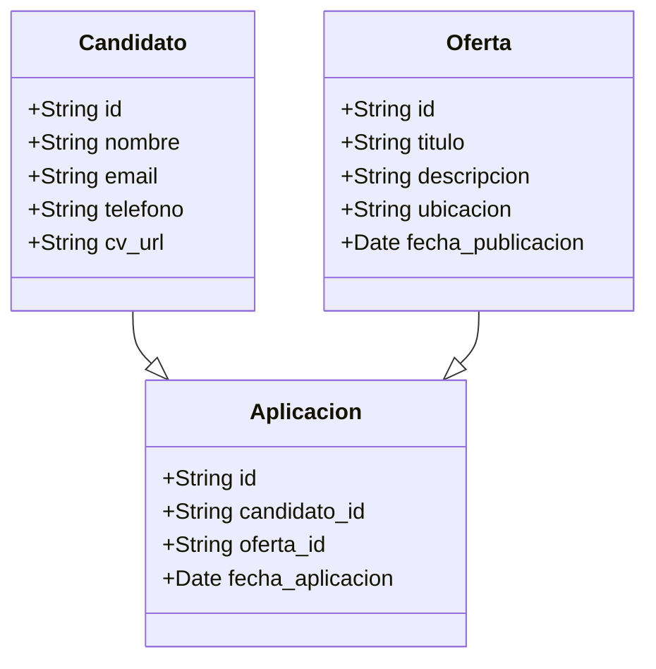
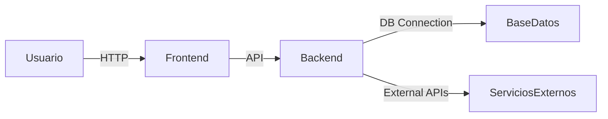
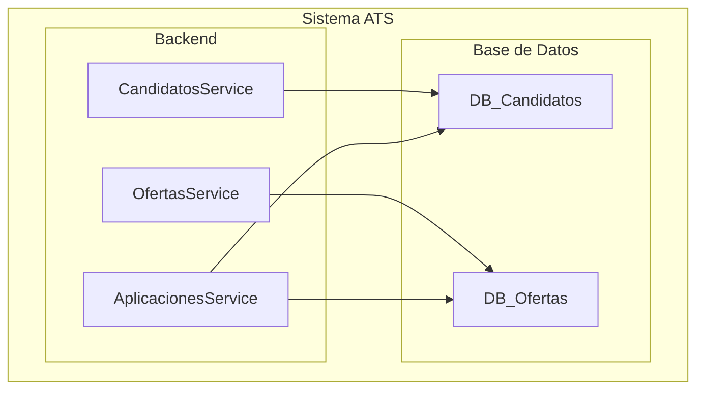

# Diseño de Software para un ATS (Applicant Tracking System)

## 1. Descripción breve del software

El sistema ATS (Applicant Tracking System) es una solución SaaS que automatiza y optimiza el proceso de reclutamiento, permitiendo a las empresas gestionar eficazmente sus ofertas de empleo, candidatos y procesos de selección.

## 2. Valor añadido

- Reducción del tiempo de contratación gracias a la automatización del filtrado de candidatos.
- Mejora de la experiencia del candidato con comunicación fluida y transparente.
- Centralización de toda la información del proceso de selección en una única plataforma.

## 3. Ventajas competitivas

- **IA y Machine Learning**: Filtrado automático de CVs basado en palabras clave y criterios personalizados.
- **Integraciones**: Compatible con LinkedIn, Indeed y herramientas de evaluación.
- **Análisis y métricas avanzadas**: Reportes detallados sobre desempeño y tiempos de contratación.

---

## 4. Lean Canvas

---

## 5. Casos de uso principales

### Caso de Uso 1: Publicación de Oferta de Empleo

**Descripción**: Un reclutador crea y publica una oferta de empleo en múltiples plataformas.

### Caso de Uso 2: Aplicación de Candidato

**Descripción**: Un candidato aplica a una oferta de empleo y su CV es analizado automáticamente.

### Caso de Uso 3: Gestión de Entrevistas

**Descripción**: Un reclutador agenda y gestiona entrevistas con los candidatos seleccionados.

---

## 6. Modelo de Datos

---

## 7. Diseño del sistema a alto nivel

**Explicación:**
El sistema se basa en una arquitectura de microservicios con módulos independientes para gestión de ofertas, candidatos y análisis de datos. Utiliza una API REST para la comunicación entre servicios y un frontend basado en React.js.

---

## 8. Diagrama C4 (Zoom en el componente de Gestión de Candidatos)

# Historias de Usuario y Tickets de Trabajo - MVP ATS

## **Historias de Usuario**

### **Historia de Usuario 1: Publicación de Oferta de Empleo**
**Como** reclutador, **quiero** crear y publicar una oferta de empleo en múltiples plataformas **para** atraer candidatos adecuados de manera eficiente.

**Descripción:**
El reclutador podrá definir los detalles de la oferta de empleo y publicarla en portales como LinkedIn e Indeed desde el ATS.

**Criterios de Aceptación:**
- **Dado que** un reclutador accede a la sección de creación de ofertas, **cuando** complete los datos requeridos y confirme la publicación, **entonces** la oferta se publicará en los portales seleccionados y aparecerá en el ATS.
- **Dado que** el reclutador intenta publicar una oferta sin completar los campos obligatorios, **cuando** intente confirmarla, **entonces** el sistema mostrará un mensaje de error indicando los campos faltantes.

**Notas Adicionales:**
- La integración con portales de empleo puede ser mockeada inicialmente.

---

### **Historia de Usuario 2: Aplicación de Candidato**
**Como** candidato, **quiero** postularme a una oferta de empleo desde el sistema ATS **para** participar en un proceso de selección.

**Descripción:**
El candidato podrá aplicar a una oferta con su CV, el cual será analizado automáticamente.

**Criterios de Aceptación:**
- **Dado que** un candidato accede a una oferta publicada, **cuando** haga clic en "Aplicar" y suba su CV, **entonces** el sistema registrará su postulación y enviará una notificación al reclutador.
- **Dado que** un candidato intenta postularse sin adjuntar un CV, **cuando** intente confirmar la postulación, **entonces** el sistema mostrará un mensaje de error.

**Notas Adicionales:**
- Se puede usar un sistema de almacenamiento temporal para los CVs.

---

### **Historia de Usuario 3: Gestión de Entrevistas**
**Como** reclutador, **quiero** agendar entrevistas con los candidatos seleccionados **para** optimizar la gestión del proceso de selección.

**Descripción:**
El reclutador podrá seleccionar candidatos y programar entrevistas directamente desde el sistema.

**Criterios de Aceptación:**
- **Dado que** el reclutador selecciona un candidato, **cuando** elija una fecha y hora y envíe la invitación, **entonces** el candidato recibirá una notificación con los detalles.
- **Dado que** el candidato recibe una invitación, **cuando** confirme su asistencia, **entonces** el reclutador verá la confirmación reflejada en el ATS.

**Notas Adicionales:**
- La integración con calendarios externos puede ser opcional en el MVP.

---

### **Historia de Usuario 4: Filtrado Automático de Candidatos**
**Como** reclutador, **quiero** que el sistema ATS analice los CVs automáticamente **para** preseleccionar a los candidatos más adecuados.

**Descripción:**
El ATS analizará los CVs basándose en palabras clave y criterios personalizados.

**Criterios de Aceptación:**
- **Dado que** un candidato aplica a una oferta, **cuando** su CV es analizado, **entonces** el sistema lo clasificará según la coincidencia con los requisitos.
- **Dado que** un reclutador revisa la lista de postulantes, **cuando** se haya aplicado el filtrado, **entonces** verá a los candidatos ordenados por relevancia.

**Notas Adicionales:**
- Se puede usar un modelo de IA básico o una búsqueda de palabras clave en el MVP.

---

### **Historia de Usuario 5: Reportes de Proceso de Selección**
**Como** gerente de RRHH, **quiero** acceder a reportes detallados sobre el estado de los procesos de selección **para** tomar decisiones informadas.

**Descripción:**
El ATS generará métricas sobre tiempos de contratación y desempeño de las ofertas publicadas.

**Criterios de Aceptación:**
- **Dado que** un gerente accede al módulo de reportes, **cuando** seleccione un proceso de selección, **entonces** verá métricas como el número de postulantes y el tiempo medio de contratación.
- **Dado que** un gerente quiere comparar procesos, **cuando** seleccione dos o más ofertas, **entonces** verá una comparación gráfica de sus métricas.

**Notas Adicionales:**
- El MVP puede incluir reportes básicos con gráficos simples.

---

## **Tickets de Trabajo**

### **1. Diseño del formulario de creación de ofertas**
📌 **Descripción:** Diseñar la interfaz donde el reclutador podrá ingresar los detalles de la oferta de empleo.
🔢 **Estimación:** 3 puntos (implementación moderada)
🛠 **Tareas:**
- Definir los campos requeridos (Título, Descripción, Ubicación, Salario, Tipo de Contrato, etc.).
- Crear los wireframes y validar con stakeholders.
- Implementar el formulario en el frontend.
- Estilizar el formulario con UI/UX adecuados.
- Hacer pruebas de usabilidad.

---

### **2. Implementación del backend para gestión de ofertas**
📌 **Descripción:** Crear las APIs necesarias para manejar la publicación de ofertas en la base de datos.
🔢 **Estimación:** 5 puntos (requiere integración con la base de datos y validaciones)
🛠 **Tareas:**
- Diseñar la estructura del modelo de datos para las ofertas.
- Crear endpoints para crear, actualizar y eliminar ofertas.
- Implementar validaciones de datos obligatorios.
- Manejar errores y excepciones.
- Escribir pruebas unitarias para la API.

...

### **Total estimado:** **26 puntos**  
(Distribuidos en tareas de 2, 3, 5 y 8 puntos según la serie de Fibonacci)

