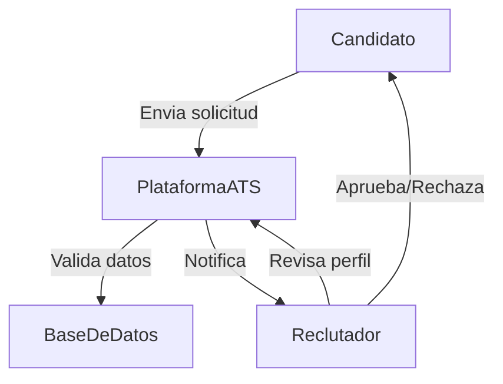
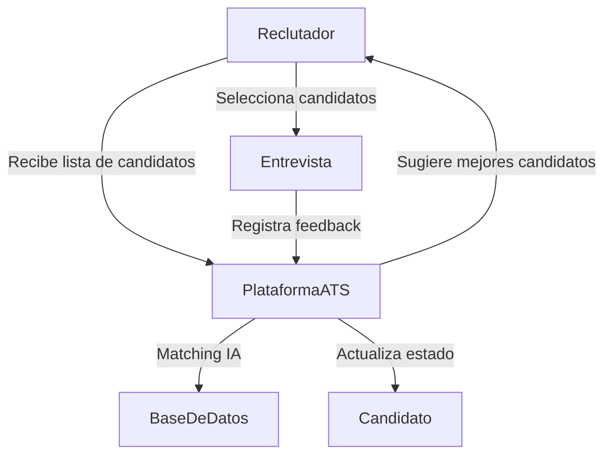
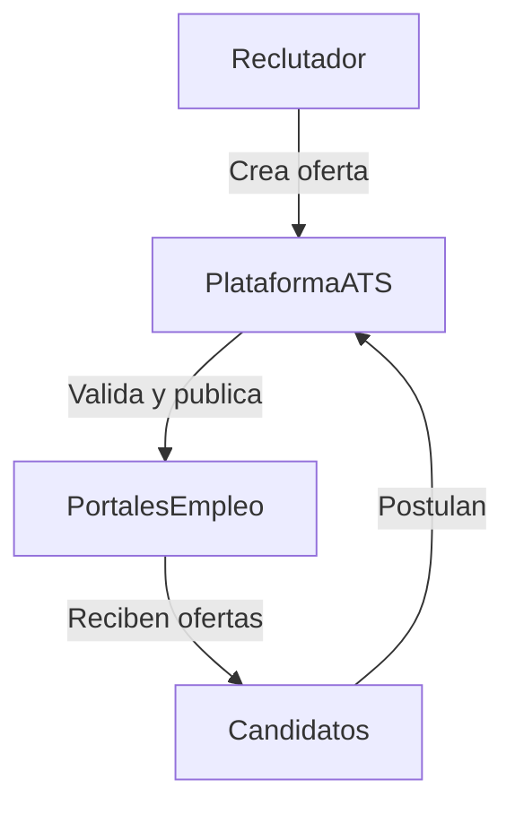
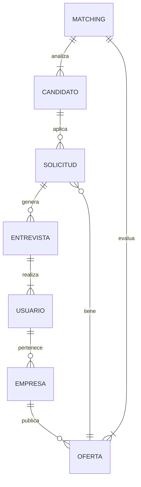
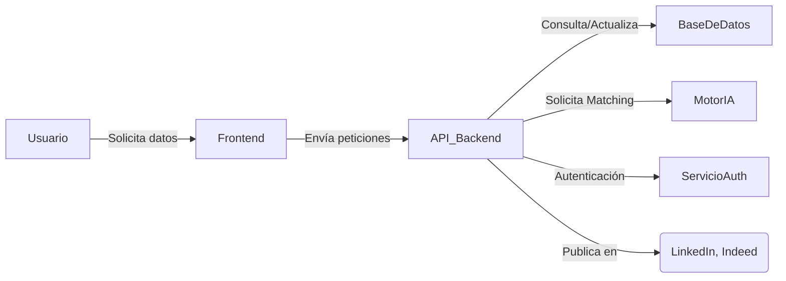
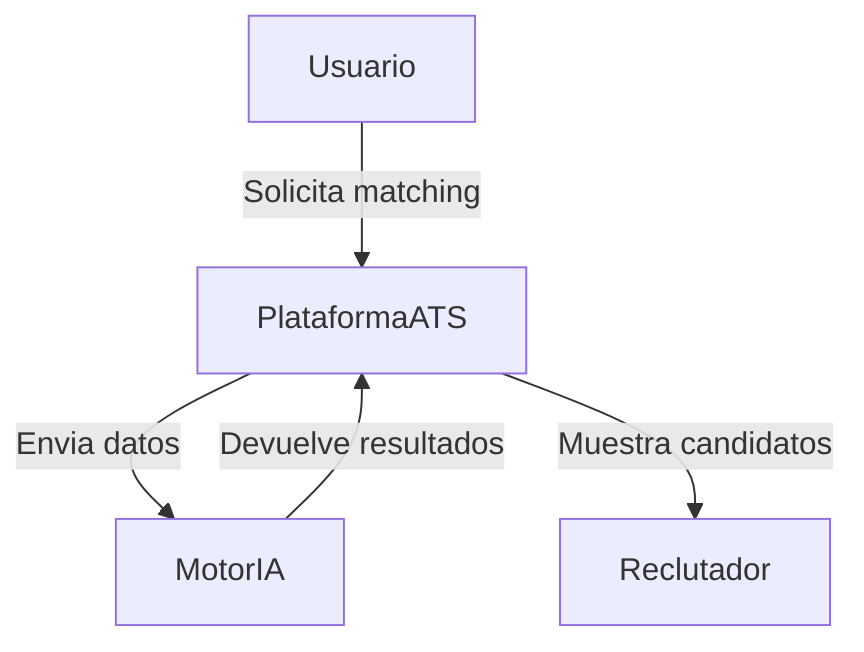
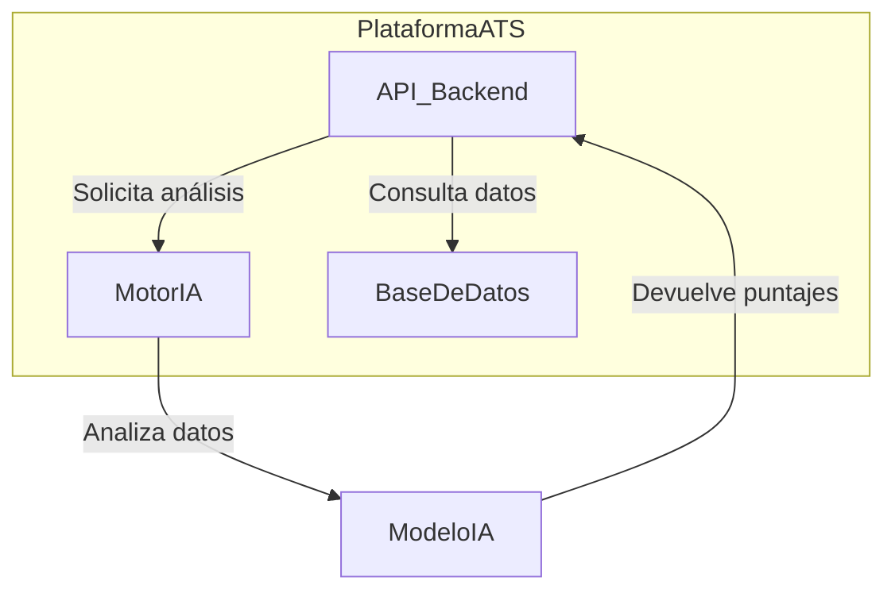
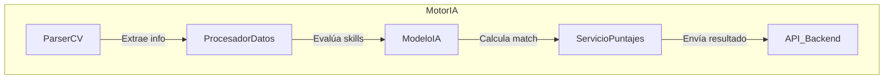

# Descripción del Software LTI

## 1. Descripción Breve y Valor Añadido
LTI es un sistema de seguimiento de candidatos (ATS) especializado en el sector IT, diseñado para optimizar el proceso de selección mediante inteligencia artificial avanzada. Su valor diferencial radica en su motor de *matching* automático, que analiza las características de los candidatos y las compara con los requisitos de la oferta para maximizar la precisión en la contratación.

### **Ventajas Competitivas**
- **Matching Inteligente:** Utiliza IA avanzada para evaluar la compatibilidad entre candidatos y vacantes, reduciendo el tiempo de selección.
- **Enfoque en IT:** Adaptado a las necesidades del sector tecnológico, considerando habilidades específicas y certificaciones.
- **Integraciones Clave:** Conexión con LinkedIn e Indeed para automatizar la captación de talento.
- **Gestón Multiempresa y Multirol:** Permite a diferentes organizaciones y usuarios gestionar procesos de selección con niveles de acceso personalizados.
- **SaaS Escalable:** Infraestructura en la nube con capacidad de integrarse con otros sistemas y expandirse según las necesidades del mercado.

## 2. Funciones Principales
- **Gestión de Candidatos:** Creación y seguimiento de perfiles con CV estructurado y archivos adjuntos.
- **Publicación de Ofertas:** Automatización de la difusión en portales de empleo.
- **Matching Automático:** Recomendaciones basadas en IA para agilizar la selección.
- **Historial de Interacciones:** Registro de entrevistas, evaluaciones y feedback.
- **Roles y Permisos:** Diferentes niveles de acceso según el tipo de usuario.
- **Autenticación Segura:** Sistema robusto de inicio de sesión con control de roles.

## 3. Lean Canvas

| Sección              | Descripción |
|----------------------|-------------|
| **Problema**        | Reclutadores de IT tienen dificultades para encontrar rápidamente el talento adecuado. Los candidatos no siempre reciben retroalimentación sobre sus aplicaciones. |
| **Segmentos de Clientes** | Empresas tecnológicas, agencias de reclutamiento IT, startups en crecimiento. |
| **Propuesta de Valor** | Matching inteligente con IA, integración con portales de empleo y gestión multiempresa. |
| **Solución**        | ATS basado en IA que automatiza el filtrado y selección de talento IT. |
| **Canales**         | Venta directa, asociaciones con portales de empleo, marketing digital. |
| **Fuentes de Ingreso** | Modelo SaaS con suscripción mensual. |
| **Estructura de Costos** | Desarrollo y mantenimiento de software, infraestructura en la nube, IA y data processing. |
| **Métricas Clave** | Tiempo de contratación reducido, precisión del *matching*, cantidad de vacantes cubiertas. |

## 4. Diagramas de Casos de Uso

### **1. Aplicación de un Candidato**

### **2. Evaluación y Selección de Candidatos**

### **3. Publicación de Ofertas**

## 5. Modelo de Datos

### **Entidades y Atributos**
- **Candidato** (id, nombre, email, teléfono, experiencia, habilidades, CV, archivos adjuntos)
- **Oferta** (id, título, empresa, requisitos, ubicación, salario, beneficios, estado)
- **Solicitud** (id, candidato_id, oferta_id, estado, fecha_aplicación)
- **Empresa** (id, nombre, descripción, sector)
- **Usuario** (id, nombre, email, rol, empresa_id)
- **Entrevista** (id, solicitud_id, reclutador_id, fecha, feedback)
- **Matching** (id, candidato_id, oferta_id, puntaje)

### **Diagrama de Modelo de Datos**

## 6. Diseño del Sistema a Alto Nivel

El sistema sigue una arquitectura basada en microservicios para garantizar escalabilidad y modularidad.

### **Componentes Principales:**
- **Frontend:** Aplicación web en React.
- **Backend:** API en Node.js con Express.
- **Base de Datos:** PostgreSQL para datos estructurados y MongoDB para almacenamiento de CVs.
- **Motor de Matching:** Servicio en Python con modelos de IA.
- **Autenticación:** OAuth 2.0 con JWT para control de acceso.
- **Integraciones:** APIs de LinkedIn e Indeed.

### **Diagrama de Arquitectura**

## 7. Diagrama C4 - Motor de Matching

### **Nivel 1: Contexto**

### **Nivel 2: Contenedores**

### **Nivel 3: Componentes del MotorIA**

## 8. Conclusión
El motor de matching es un servicio modular basado en IA que permite evaluar candidatos de manera automatizada, optimizando el proceso de selección para empresas tecnológicas.

# User Stories para el MVP de LTI

## User Story 1: Registro y Autenticación de Usuarios

**Como** reclutador de una empresa de tecnología, **quiero** poder registrarme y acceder al sistema con credenciales seguras **para** gestionar los procesos de selección de mi organización.

**Descripción:**  
El sistema debe permitir a los usuarios registrarse con información básica de la empresa, crear credenciales de acceso y autenticarse de manera segura con diferentes niveles de permisos según su rol.

**Criterios de Aceptación:**
- **Dado que** soy un nuevo usuario, **cuando** accedo a la plataforma por primera vez, **entonces** puedo completar un formulario de registro con datos de la empresa y mis credenciales.
- **Dado que** soy un usuario registrado, **cuando** ingreso mis credenciales correctas, **entonces** puedo acceder a la plataforma con los permisos correspondientes a mi rol.
- **Dado que** soy un administrador, **cuando** accedo al panel de control, **entonces** puedo crear nuevos usuarios para mi empresa y asignarles roles específicos.
- **Dado que** soy un usuario, **cuando** olvido mi contraseña, **entonces** puedo solicitar un restablecimiento seguro por correo electrónico.

**Notas adicionales:**
- Implementar OAuth 2.0 con JWT como se menciona en la sección 6 del documento.
- Considerar la estructura multiempresa mencionada en las ventajas competitivas.

**Tareas:**
1. Diseñar y desarrollar la interfaz de registro y login
2. Implementar el sistema de autenticación con JWT
3. Desarrollar la funcionalidad de recuperación de contraseña
4. Crear el sistema de roles y permisos (admin, reclutador, etc.)
5. Implementar validaciones de seguridad para las credenciales

## User Story 2: Creación y Gestión de Ofertas de Trabajo

**Como** reclutador, **quiero** poder crear y gestionar ofertas de trabajo **para** publicarlas y atraer candidatos adecuados.

**Descripción:**  
El sistema debe permitir a los reclutadores crear ofertas de trabajo detalladas con requisitos específicos del sector IT, gestionar su estado y publicarlas en la plataforma.

**Criterios de Aceptación:**
- **Dado que** soy un reclutador, **cuando** accedo a la sección de ofertas, **entonces** puedo crear una nueva oferta con campos específicos para el sector IT.
- **Dado que** estoy creando una oferta, **cuando** completo el formulario, **entonces** puedo especificar requisitos técnicos, habilidades, experiencia y otros detalles relevantes.
- **Dado que** tengo ofertas creadas, **cuando** accedo al listado de ofertas, **entonces** puedo ver, editar, activar/desactivar o eliminar mis ofertas.
- **Dado que** tengo una oferta lista, **cuando** la publico, **entonces** esta se hace visible en la plataforma para los candidatos.

**Notas adicionales:**
- Enfocarse en campos específicos para el sector IT como se menciona en la ventaja competitiva "Enfoque en IT".
- Preparar la estructura para futuras integraciones con LinkedIn e Indeed.

**Tareas:**
1. Diseñar el modelo de datos para las ofertas según la estructura definida en la sección 5
2. Desarrollar el formulario de creación de ofertas con validaciones
3. Implementar el listado y gestión de ofertas (CRUD)
4. Crear la funcionalidad de publicación/despublicación
5. Diseñar la visualización pública de ofertas activas

## User Story 3: Registro y Gestión de Candidatos

**Como** reclutador, **quiero** poder registrar y gestionar perfiles de candidatos **para** mantener una base de datos de talento organizada.

**Descripción:**  
El sistema debe permitir crear perfiles de candidatos con información estructurada, adjuntar CVs y documentos relevantes, y mantener un seguimiento de su estado en los diferentes procesos.

**Criterios de Aceptación:**
- **Dado que** soy un reclutador, **cuando** accedo a la sección de candidatos, **entonces** puedo registrar un nuevo candidato con sus datos personales y profesionales.
- **Dado que** estoy registrando un candidato, **cuando** completo el formulario, **entonces** puedo adjuntar su CV y documentos adicionales.
- **Dado que** tengo candidatos registrados, **cuando** accedo al listado de candidatos, **entonces** puedo buscar, filtrar y ordenar por diferentes criterios.
- **Dado que** visualizo un perfil de candidato, **cuando** lo reviso, **entonces** puedo editar su información, ver su historial y actualizar su estado.

**Notas adicionales:**
- Considerar la estructura de datos definida en la sección 5 para la entidad Candidato.
- Preparar la integración con el sistema de almacenamiento MongoDB para los CVs como se menciona en la sección 6.

**Tareas:**
1. Diseñar el modelo de datos para candidatos según la estructura definida
2. Desarrollar el formulario de registro de candidatos con validaciones
3. Implementar la funcionalidad de carga y almacenamiento de documentos
4. Crear el listado de candidatos con filtros y búsqueda
5. Desarrollar la vista detallada del perfil del candidato

## User Story 4: Matching Básico entre Candidatos y Ofertas

**Como** reclutador, **quiero** que el sistema me sugiera candidatos adecuados para mis ofertas **para** agilizar el proceso de selección.

**Descripción:**  
El sistema debe implementar una versión básica del motor de matching que analice las habilidades y experiencia de los candidatos y las compare con los requisitos de las ofertas para sugerir las mejores coincidencias.

**Criterios de Aceptación:**
- **Dado que** soy un reclutador con una oferta activa, **cuando** solicito ver candidatos recomendados, **entonces** el sistema me muestra una lista ordenada por nivel de compatibilidad.
- **Dado que** estoy viendo las recomendaciones, **cuando** selecciono un candidato, **entonces** puedo ver qué criterios cumple y cuáles no.
- **Dado que** tengo un candidato en mi base de datos, **cuando** creo una nueva oferta, **entonces** el sistema evalúa automáticamente su compatibilidad.
- **Dado que** estoy viendo el perfil de un candidato, **cuando** solicito ver ofertas recomendadas para él, **entonces** el sistema me muestra las ofertas más adecuadas.

**Notas adicionales:**
- Esta es una versión simplificada del motor de matching descrito en la sección 7.
- Para el MVP, se puede implementar un algoritmo básico de coincidencia basado en palabras clave y requisitos explícitos.

**Tareas:**
1. Diseñar el algoritmo básico de matching
2. Implementar la extracción de habilidades y requisitos de candidatos y ofertas
3. Desarrollar el cálculo de puntuación de compatibilidad
4. Crear la interfaz para visualizar candidatos recomendados para una oferta
5. Implementar la visualización de ofertas recomendadas para un candidato

## User Story 5: Gestión del Proceso de Selección

**Como** reclutador, **quiero** poder gestionar el flujo de selección de candidatos **para** mantener un seguimiento organizado del proceso.

**Descripción:**  
El sistema debe permitir registrar las diferentes etapas del proceso de selección, programar entrevistas, registrar feedback y actualizar el estado de los candidatos a lo largo del proceso.

**Criterios de Aceptación:**
- **Dado que** tengo candidatos aplicando a una oferta, **cuando** accedo a la gestión de la oferta, **entonces** puedo ver todos los candidatos organizados por etapas del proceso.
- **Dado que** estoy revisando un candidato, **cuando** decido avanzarlo en el proceso, **entonces** puedo cambiar su estado y programar la siguiente acción.
- **Dado que** he realizado una entrevista, **cuando** la finalizo, **entonces** puedo registrar feedback y notas sobre el candidato.
- **Dado que** un candidato ha completado el proceso, **cuando** tomo una decisión final, **entonces** puedo marcar la solicitud como aceptada o rechazada y enviar una notificación.

**Notas adicionales:**
- Relacionado con la entidad "Solicitud" y "Entrevista" definidas en la sección 5.
- Considerar la implementación del "Historial de Interacciones" mencionado en las funciones principales.

**Tareas:**
1. Diseñar el flujo de estados del proceso de selección
2. Implementar la vista de candidatos por etapas (tipo Kanban)
3. Desarrollar la funcionalidad de programación de entrevistas
4. Crear el formulario de registro de feedback
5. Implementar el sistema de cambio de estado y notificaciones

# Backlogs de Producto para LTI

## 1. Backlog priorizado con metodología MoSCoW

La metodología MoSCoW clasifica las user stories en:
- **Must have**: Requisitos críticos sin los cuales el sistema no funcionaría
- **Should have**: Importantes pero no críticos
- **Could have**: Deseables pero no necesarios
- **Won't have**: No se incluirán en esta versión

### Backlog MoSCoW

#### Must have
1. **Registro y Autenticación de Usuarios**
   - Como reclutador, quiero poder registrarme y acceder al sistema con credenciales seguras para gestionar los procesos de selección.
   - *Justificación*: Funcionalidad base sin la cual el sistema no puede operar de forma segura.

2. **Gestión de Roles y Permisos**
   - Como administrador, quiero poder asignar diferentes roles y permisos a los usuarios para controlar su acceso a las funcionalidades del sistema.
   - *Justificación*: Crítico para la seguridad y la estructura multiempresa del sistema.

3. **Creación y Gestión de Ofertas de Trabajo**
   - Como reclutador, quiero poder crear y gestionar ofertas de trabajo para publicarlas y atraer candidatos.
   - *Justificación*: Funcionalidad core del ATS sin la cual no se pueden iniciar procesos de selección.

4. **Registro y Gestión de Candidatos**
   - Como reclutador, quiero poder registrar y gestionar perfiles de candidatos para mantener una base de datos de talento.
   - *Justificación*: Componente esencial para el funcionamiento básico del ATS.

#### Should have
5. **Matching Básico entre Candidatos y Ofertas**
   - Como reclutador, quiero que el sistema me sugiera candidatos adecuados para mis ofertas para agilizar el proceso de selección.
   - *Justificación*: Importante para el valor diferencial, pero puede implementarse con algoritmos simples inicialmente.

6. **Gestión del Proceso de Selección**
   - Como reclutador, quiero poder gestionar el flujo de selección de candidatos para mantener un seguimiento organizado.
   - *Justificación*: Importante para la operación completa, pero puede simplificarse en la primera versión.

#### Could have
7. **Integración con LinkedIn**
   - Como reclutador, quiero poder importar perfiles desde LinkedIn para agilizar la creación de candidatos.
   - *Justificación*: Añade valor pero no es esencial para el funcionamiento inicial.

8. **Dashboard de Métricas**
   - Como gerente de RRHH, quiero visualizar métricas clave del proceso de selección para evaluar la eficiencia.
   - *Justificación*: Útil pero no crítico para la primera versión.

#### Won't have (en esta versión)
9. **Motor de Matching Avanzado con IA**
   - Como reclutador, quiero un sistema de matching avanzado que utilice IA para analizar competencias no explícitas.
   - *Justificación*: Se implementará una versión básica primero, dejando la versión avanzada para futuras iteraciones.

10. **Integración con Indeed y otros portales**
    - Como reclutador, quiero publicar ofertas automáticamente en múltiples portales.
    - *Justificación*: Funcionalidad que puede esperar a versiones posteriores.

## 2. Backlog priorizado con Matriz de Eisenhower

La Matriz de Eisenhower clasifica las tareas según su urgencia e importancia:
- **Urgente e Importante**: Hacer inmediatamente
- **Importante pero No Urgente**: Planificar
- **Urgente pero No Importante**: Delegar
- **Ni Urgente ni Importante**: Eliminar

### Backlog Eisenhower

#### Urgente e Importante
1. **Registro y Autenticación de Usuarios**
   - Como reclutador, quiero poder registrarme y acceder al sistema con credenciales seguras.
   - *Justificación*: Sin esta funcionalidad, el sistema no puede ser utilizado de forma segura.

2. **Gestión de Roles y Permisos**
   - Como administrador, quiero poder asignar diferentes roles y permisos a los usuarios.
   - *Justificación*: Fundamental para la seguridad y la estructura organizativa del sistema.

3. **Creación y Gestión de Ofertas de Trabajo**
   - Como reclutador, quiero poder crear y gestionar ofertas de trabajo.
   - *Justificación*: Funcionalidad básica sin la cual el sistema no tiene propósito.

#### Importante pero No Urgente
4. **Registro y Gestión de Candidatos**
   - Como reclutador, quiero poder registrar y gestionar perfiles de candidatos.
   - *Justificación*: Esencial pero puede implementarse después de las ofertas.

5. **Matching Básico entre Candidatos y Ofertas**
   - Como reclutador, quiero que el sistema me sugiera candidatos adecuados.
   - *Justificación*: Importante para el valor diferencial pero puede desarrollarse con tiempo.

6. **Gestión del Proceso de Selección**
   - Como reclutador, quiero poder gestionar el flujo de selección de candidatos.
   - *Justificación*: Importante para el ciclo completo pero puede implementarse progresivamente.

#### Urgente pero No Importante
7. **Interfaz de Usuario Responsiva**
   - Como usuario, quiero poder acceder al sistema desde cualquier dispositivo.
   - *Justificación*: Mejora la experiencia pero no afecta la funcionalidad core.

8. **Notificaciones por Email**
   - Como reclutador, quiero recibir notificaciones sobre actividades relevantes.
   - *Justificación*: Útil pero puede delegarse a fases posteriores.

#### Ni Urgente ni Importante
9. **Personalización de la Interfaz**
   - Como usuario, quiero personalizar la apariencia de mi dashboard.
   - *Justificación*: Característica de confort que puede esperar.

10. **Exportación de Informes en Múltiples Formatos**
    - Como gerente, quiero exportar informes en diferentes formatos.
    - *Justificación*: Funcionalidad secundaria que puede implementarse más adelante.

## 3. Backlog priorizado con metodología RICE

La metodología RICE evalúa cada elemento según:
- **Reach**: Cuántos usuarios se verán afectados
- **Impact**: Qué impacto tendrá en los usuarios (3=masivo, 2=alto, 1=medio, 0.5=bajo, 0.25=mínimo)
- **Confidence**: Nivel de confianza en las estimaciones (100%=alta, 80%=media, 50%=baja)
- **Effort**: Esfuerzo requerido en persona-semanas

La puntuación RICE se calcula como: (Reach × Impact × Confidence) ÷ Effort

### Backlog RICE

1. **Registro y Autenticación de Usuarios**
   - RICE: 24 (Reach: 100, Impact: 3, Confidence: 100%, Effort: 12.5)
   - Como reclutador, quiero poder registrarme y acceder al sistema con credenciales seguras.
   - *Justificación*: Afecta a todos los usuarios, impacto crítico, alta confianza, esfuerzo moderado.

2. **Creación y Gestión de Ofertas de Trabajo**
   - RICE: 20 (Reach: 80, Impact: 3, Confidence: 100%, Effort: 12)
   - Como reclutador, quiero poder crear y gestionar ofertas de trabajo.
   - *Justificación*: Afecta a la mayoría de usuarios, impacto alto, confianza alta, esfuerzo moderado.

3. **Gestión de Roles y Permisos**
   - RICE: 16 (Reach: 100, Impact: 2, Confidence: 100%, Effort: 12.5)
   - Como administrador, quiero poder asignar diferentes roles y permisos a los usuarios.
   - *Justificación*: Afecta a todos los usuarios, impacto alto, confianza alta, esfuerzo moderado.

4. **Registro y Gestión de Candidatos**
   - RICE: 15 (Reach: 80, Impact: 3, Confidence: 90%, Effort: 14.4)
   - Como reclutador, quiero poder registrar y gestionar perfiles de candidatos.
   - *Justificación*: Afecta a muchos usuarios, impacto alto, confianza alta, esfuerzo considerable.

5. **Matching Básico entre Candidatos y Ofertas**
   - RICE: 8.4 (Reach: 70, Impact: 3, Confidence: 80%, Effort: 20)
   - Como reclutador, quiero que el sistema me sugiera candidatos adecuados.
   - *Justificación*: Alcance bueno, impacto alto, confianza media (algoritmo nuevo), esfuerzo alto.

6. **Gestión del Proceso de Selección**
   - RICE: 7.2 (Reach: 60, Impact: 2, Confidence: 90%, Effort: 15)
   - Como reclutador, quiero poder gestionar el flujo de selección de candidatos.
   - *Justificación*: Alcance medio, impacto alto, confianza alta, esfuerzo considerable.

7. **Integración con LinkedIn**
   - RICE: 4.8 (Reach: 50, Impact: 2, Confidence: 80%, Effort: 16.7)
   - Como reclutador, quiero poder importar perfiles desde LinkedIn.
   - *Justificación*: Alcance medio, impacto alto, confianza media (depende de API externa), esfuerzo alto.

8. **Dashboard de Métricas**
   - RICE: 3.2 (Reach: 40, Impact: 2, Confidence: 80%, Effort: 20)
   - Como gerente de RRHH, quiero visualizar métricas clave del proceso.
   - *Justificación*: Alcance limitado (solo gerentes), impacto alto, confianza media, esfuerzo alto.

9. **Notificaciones por Email**
   - RICE: 2.4 (Reach: 100, Impact: 1, Confidence: 80%, Effort: 33.3)
   - Como usuario, quiero recibir notificaciones sobre actividades relevantes.
   - *Justificación*: Alcance total, impacto medio, confianza media, esfuerzo considerable.

10. **Exportación de Informes**
    - RICE: 1.6 (Reach: 30, Impact: 1, Confidence: 80%, Effort: 15)
    - Como gerente, quiero exportar informes de los procesos de selección.
    - *Justificación*: Alcance limitado, impacto medio, confianza media, esfuerzo moderado.

## Conclusión

Cada metodología de priorización ofrece una perspectiva diferente sobre qué funcionalidades desarrollar primero:

- **MoSCoW** nos ayuda a identificar lo que es absolutamente necesario vs. lo que puede esperar.
- **Eisenhower** nos permite equilibrar la urgencia con la importancia estratégica.
- **RICE** proporciona un enfoque más cuantitativo que considera el alcance, impacto, confianza y esfuerzo.

En las tres metodologías, las funcionalidades de **Registro y Autenticación**, **Gestión de Roles y Permisos**, y **Creación y Gestión de Ofertas** aparecen consistentemente como prioritarias, lo que sugiere que deberían ser el foco inicial del desarrollo del MVP.

# Tickets de Trabajo para Creación y Gestión de Ofertas

## Ticket #1: Diseño del Modelo de Datos para Ofertas
Título: Implementar modelo de datos para ofertas de trabajo

Descripción: Crear la estructura de datos para las ofertas de trabajo según el modelo definido en la documentación, incluyendo todos los campos necesarios y sus relaciones con otras entidades.

Tareas:

1. Definir el esquema de la entidad Oferta en PostgreSQL
2. Implementar relaciones con las entidades Empresa y Solicitud
3. Crear índices para optimizar búsquedas
4. Documentar el modelo de datos implementado
Criterios de Aceptación:

- El modelo debe incluir todos los campos definidos (id, título, empresa, requisitos, ubicación, salario, beneficios, estado)
- Las relaciones con otras entidades deben estar correctamente implementadas
- Deben existir validaciones básicas para los campos obligatorios
- El modelo debe ser accesible desde la API del backend
Estimación: 2 días (Talla M) Prioridad: Alta Asignado a: [Desarrollador Backend]

## Ticket #2: Desarrollo de API para Gestión de Ofertas
Título: Implementar endpoints de API para CRUD de ofertas

Descripción: Desarrollar los endpoints necesarios en la API de Node.js con Express para crear, leer, actualizar y eliminar ofertas de trabajo, incluyendo la validación de permisos según el rol del usuario.

Tareas:

1. Crear endpoint para listar ofertas con filtros y paginación
2. Implementar endpoint para crear nuevas ofertas
3. Desarrollar endpoint para actualizar ofertas existentes
4. Crear endpoint para eliminar/desactivar ofertas
5. Implementar validaciones de datos y permisos
6. Documentar la API con Swagger
Criterios de Aceptación:

- Todos los endpoints deben validar los permisos del usuario según su rol
- Las operaciones CRUD deben funcionar correctamente
- La API debe manejar errores de forma adecuada y devolver mensajes claros
- La documentación de la API debe estar actualizada
Estimación: 3 días (Talla L) Prioridad: Alta Asignado a: [Desarrollador Backend]

## Ticket #3: Desarrollo de Interfaz para Creación de Ofertas
Título: Implementar formulario de creación de ofertas

Descripción: Desarrollar la interfaz de usuario en React para la creación de nuevas ofertas de trabajo, incluyendo todos los campos necesarios y validaciones.

Tareas:

1. Diseñar el formulario de creación de ofertas
2. Implementar validaciones en el frontend
3. Integrar con la API del backend
4. Añadir funcionalidad para guardar borradores
5. Implementar carga de archivos adjuntos (si aplica)
Criterios de Aceptación:

- El formulario debe incluir todos los campos definidos en el modelo
- Las validaciones deben funcionar correctamente
- El usuario debe recibir feedback claro sobre errores
- La interfaz debe ser responsiva y accesible
Estimación: 3 días (Talla L) Prioridad: Alta Asignado a: [Desarrollador Frontend]

## Ticket #4: Desarrollo de Interfaz para Listado y Gestión de Ofertas
Título: Implementar vista de listado y gestión de ofertas

Descripción: Desarrollar la interfaz de usuario para visualizar, filtrar, ordenar y gestionar las ofertas de trabajo existentes.

Tareas:

1. Diseñar la vista de listado de ofertas
2. Implementar filtros y ordenación
3. Crear funcionalidad de búsqueda
4. Añadir opciones para editar, desactivar y eliminar ofertas
5. Implementar paginación
Criterios de Aceptación:

- La vista debe mostrar las ofertas con información relevante
- Los filtros y la búsqueda deben funcionar correctamente
- Las acciones de gestión deben estar disponibles según los permisos del usuario
- La interfaz debe ser responsiva y accesible
Estimación: 3 días (Talla L) Prioridad: Alta Asignado a: [Desarrollador Frontend]

## Ticket #5: Implementación de Publicación de Ofertas
Título: Desarrollar funcionalidad para publicar ofertas

Descripción: Implementar la funcionalidad para cambiar el estado de las ofertas y publicarlas en la plataforma, preparando la estructura para futuras integraciones con portales externos.

Tareas:

1. Desarrollar la lógica de cambio de estado de las ofertas
2. Implementar validaciones previas a la publicación
3. Crear notificaciones para los usuarios relevantes
4. Preparar estructura para futuras integraciones con LinkedIn e Indeed
Criterios de Aceptación:

- Las ofertas deben poder cambiar de estado (borrador, publicada, cerrada, etc.)
- El sistema debe validar que la oferta cumple con todos los requisitos antes de publicarla
- Los usuarios relevantes deben recibir notificaciones sobre cambios de estado
Estimación: 2 días (Talla M) Prioridad: Media Asignado a: [Desarrollador Backend]

## Ticket #6: Implementación de Permisos para Gestión de Ofertas
Título: Configurar permisos para gestión de ofertas según roles

Descripción: Implementar la lógica de permisos para que los usuarios puedan gestionar ofertas según su rol y empresa, en línea con la funcionalidad de "Gestión Multiempresa y Multirol" mencionada en las ventajas competitivas.

Tareas:

1. Definir matriz de permisos para cada acción sobre ofertas
2. Implementar validaciones de permisos en el backend
3. Adaptar la interfaz de usuario según los permisos del usuario actual
4. Crear pruebas para verificar el correcto funcionamiento
Criterios de Aceptación:

- Los usuarios solo deben poder ver y gestionar ofertas según sus permisos
- Las acciones no permitidas deben estar deshabilitadas en la interfaz
- El backend debe rechazar peticiones no autorizadas
- Los administradores deben poder gestionar todas las ofertas de su empresa
Estimación: 2 días (Talla M) Prioridad: Alta Asignado a: [Desarrollador Full Stack]

## Ticket #7: Desarrollo de Vista Detallada de Oferta
Título: Implementar vista detallada de oferta

Descripción: Desarrollar la interfaz para visualizar todos los detalles de una oferta, incluyendo información sobre candidatos aplicantes y métricas básicas.

Tareas:

1. Diseñar la vista detallada de oferta
2. Implementar sección de candidatos aplicantes
3. Añadir métricas básicas (visualizaciones, aplicaciones, etc.)
4. Crear acciones rápidas para gestión
Criterios de Aceptación:

- La vista debe mostrar toda la información relevante de la oferta
- Debe incluir una sección con los candidatos que han aplicado
- Las métricas básicas deben visualizarse correctamente
- Las acciones de gestión deben estar disponibles según permisos
Estimación: 2 días (Talla M) Prioridad: Media Asignado a: [Desarrollador Frontend]

## Ticket #8: Implementación de Duplicación de Ofertas
Título: Desarrollar funcionalidad para duplicar ofertas existentes

Descripción: Implementar la capacidad de duplicar ofertas existentes para facilitar la creación de nuevas ofertas similares, ahorrando tiempo a los reclutadores.

Tareas:

1. Desarrollar la lógica de duplicación en el backend
2. Implementar la interfaz de usuario para esta funcionalidad
3. Añadir opciones para modificar campos específicos durante la duplicación
4. Crear pruebas para verificar el correcto funcionamiento
Criterios de Aceptación:

- La funcionalidad debe crear una nueva oferta con los mismos datos que la original
- El usuario debe poder modificar campos específicos durante el proceso
- La nueva oferta debe estar en estado borrador
- La interfaz debe ser intuitiva y proporcionar feedback claro
Estimación: 1 día (Talla S) Prioridad: Baja Asignado a: [Desarrollador Full Stack]

## Ticket #9: Pruebas de Integración para Gestión de Ofertas
Título: Implementar pruebas de integración para el módulo de ofertas

Descripción: Desarrollar pruebas de integración automatizadas para verificar el correcto funcionamiento del módulo completo de gestión de ofertas.

Tareas:

1. Crear casos de prueba para todas las funcionalidades
2. Implementar pruebas automatizadas
3. Configurar entorno de pruebas
4. Documentar los resultados y procedimientos
Criterios de Aceptación:

- Las pruebas deben cubrir todos los flujos principales
- Deben verificar la correcta integración entre frontend y backend
- El informe de pruebas debe ser claro y completo
- La cobertura de código debe ser al menos del 80%
Estimación: 2 días (Talla M) Prioridad: Media Asignado a: [QA Engineer]

## Ticket #10: Documentación del Módulo de Ofertas
Título: Crear documentación para el módulo de ofertas

Descripción: Desarrollar documentación técnica y de usuario para el módulo de gestión de ofertas.

Tareas:

1. Crear documentación técnica para desarrolladores
2. Desarrollar guía de usuario para reclutadores
3. Documentar la API y sus endpoints
4. Crear material de capacitación básico
Criterios de Aceptación:

- La documentación debe ser clara y completa
- Debe incluir ejemplos de uso y capturas de pantalla
- La documentación técnica debe facilitar el mantenimiento futuro
- El material debe estar disponible en formato digital
Estimación: 1 día (Talla S) Prioridad: Baja Asignado a: [Technical Writer]

