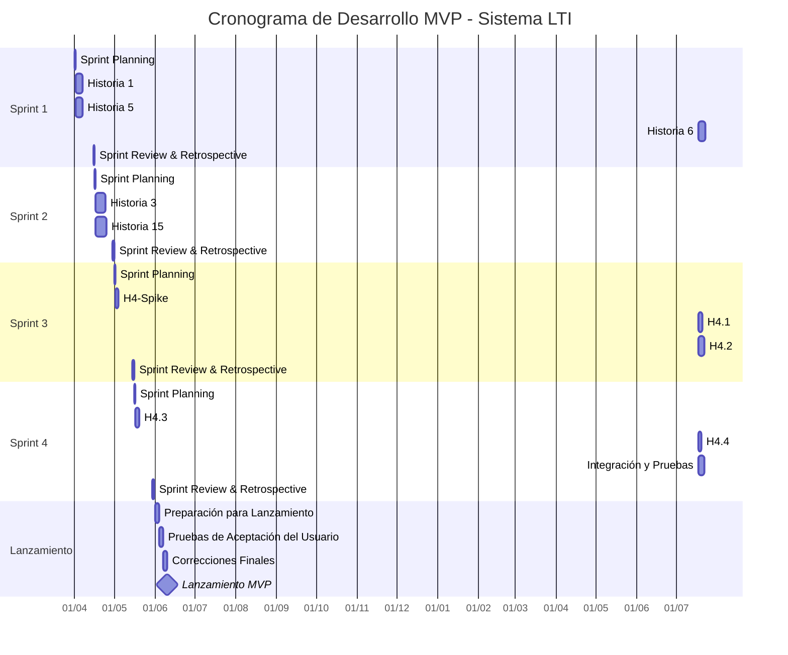

# Historias de Usuario del MVP del Sistema LTI - Grupo 1

Este documento contiene el detalle de las historias de usuario prioritarias para el MVP del Sistema Lean Talent Intelligence (LTI). Estas historias fueron seleccionadas con base en un enfoque combinado de priorización, considerando valor de negocio, esfuerzo técnico, flujo del usuario y alineación con la propuesta de valor central del sistema.

## Historia 1: Registro de Candidato

**Como** candidato,  
**Quiero** registrarme en la plataforma LTI,  
**Para** poder crear mi perfil y postularme a vacantes.

### Descripción
Esta historia involucra la implementación del flujo completo de registro de candidatos en la plataforma, permitiendo la creación de cuentas por diferentes medios y garantizando la seguridad y conformidad con regulaciones de protección de datos.

### Criterios de Aceptación
- El sistema debe permitir registro usando email y contraseña
- El sistema debe ofrecer integración con login social (LinkedIn)
- El candidato debe poder visualizar y aceptar términos de uso y política de privacidad
- El sistema debe enviar email de confirmación para validar la dirección de email
- El candidato debe recibir confirmación visual del registro exitoso
- El sistema debe validar campos obligatorios (nombre, email, contraseña)
- La contraseña debe seguir requisitos mínimos de seguridad (8 caracteres, letras y números)
- El sistema debe identificar y prevenir registros duplicados
- El candidato debe poder guardar progreso parcial de registro y continuar posteriormente
- El sistema debe ser responsivo para diferentes dispositivos (desktop, tablet, móvil)

### Definición Técnica
- Implementar API de autenticación con endpoints para registro, validación y login
- Crear tablas de usuarios y candidatos en la base de datos
- Integrar servicio de email para confirmación de registro
- Implementar integración OAuth con LinkedIn
- Aplicar encriptación para contraseñas (bcrypt o similar)
- Desarrollar pantallas de registro responsivas siguiendo design system
- Implementar validaciones de frontend y backend
- Configurar logs de auditoría para intentos de registro
- Implementar mecanismo de sesión temporal para registro parcial

### Métricas de Éxito
- Tasa de conversión del flujo de registro > 80%
- Tiempo promedio para completar registro < 3 minutos
- Tasa de validación de emails > 75%
- Reducción de 100% de cuentas duplicadas

---

## Historia 4: Carga y Gestión de Currículums

**Como** candidato,  
**Quiero** cargar mi currículum,  
**Para** que mis datos sean automáticamente extraídos y pueda gestionar diferentes versiones.

### Descripción
Esta historia abarca el desarrollo de la funcionalidad de carga de currículums en diversos formatos, con enfoque en la extracción automática de datos para completar el perfil del candidato, permitiendo revisión de los datos extraídos y gestión de múltiples versiones de currículum.

### Criterios de Aceptación
- El sistema debe aceptar archivos en los formatos PDF, DOCX y TXT
- La carga debe funcionar por arrastrar y soltar o selección de archivo
- El sistema debe extraer automáticamente datos estructurados del currículum
- El candidato debe poder visualizar los datos extraídos antes de confirmar
- El candidato debe poder corregir o complementar datos extraídos incorrectamente
- El sistema debe identificar y extraer: datos personales, experiencias profesionales, formación académica y habilidades
- El sistema debe permitir guardar múltiples versiones de currículum
- El candidato debe poder definir un currículum como principal
- El sistema debe mostrar progreso de la carga y procesamiento
- El sistema debe notificar errores de forma clara en caso de fallo en el procesamiento
- Límite de tamaño del archivo: 5MB

### Definición Técnica
- Implementar componente de carga de archivos con soporte para drag-and-drop
- Desarrollar servicio de procesamiento asíncrono para extracción de datos
- Utilizar algoritmos de NLP para procesamiento de texto no estructurado
- Implementar extractores específicos para cada formato de archivo
- Crear base de datos para almacenamiento de currículums y datos extraídos
- Desarrollar interfaz de validación y corrección de datos extraídos
- Implementar sistema de versionado de currículums
- Integrar con servicio de almacenamiento de objetos para los archivos originales
- Implementar validaciones de tipo y tamaño de archivo
- Desarrollar sistema de logs para seguimiento de fallos en el procesamiento

### Métricas de Éxito
- Precisión de la extracción automática de datos > 85%
- Tiempo promedio de procesamiento < 30 segundos
- Tasa de carga exitosa > 95%
- Porcentaje de candidatos que usan extracción automática vs. llenado manual > 80%

---

## Historia 5: Visualización de Vacantes Disponibles

**Como** candidato,  
**Quiero** visualizar vacantes disponibles con detalles completos,  
**Para** poder encontrar oportunidades alineadas a mi perfil.

### Descripción
Esta historia involucra el desarrollo de la funcionalidad de listado y visualización detallada de vacantes disponibles, incluyendo filtros para facilitar la búsqueda, presentación clara de los requisitos y beneficios, y la posibilidad de marcar vacantes como favoritas.

### Criterios de Aceptación
- El sistema debe listar todas las vacantes disponibles en formato de cards
- El candidato debe poder filtrar vacantes por área, ubicación, nivel de experiencia, tipo de contrato
- Cada vacante debe mostrar: título, empresa, ubicación, fecha de publicación y resumen
- El candidato debe poder acceder a una página detallada de la vacante
- La página detallada debe mostrar: descripción completa, requisitos, responsabilidades, beneficios
- El sistema debe presentar claramente requisitos obligatorios vs. deseables
- El candidato debe poder guardar vacantes como favoritas
- El sistema debe ofrecer búsqueda por palabras clave
- Las vacantes deben ser ordenadas por relevancia o fecha de publicación
- El sistema debe ser responsivo y optimizado para diferentes dispositivos
- Cuando sea aplicable, el sistema debe mostrar rango salarial

### Definición Técnica
- Implementar API para consulta paginada de vacantes con filtros
- Desarrollar componentes de listado y cards de vacantes
- Implementar sistema de búsqueda con indexación de texto
- Crear páginas detalladas de vacantes con toda la información necesaria
- Desarrollar sistema de marcación de favoritos
- Implementar caché para mejorar rendimiento de listados
- Desarrollar algoritmo de ordenación por relevancia basado en el perfil del candidato
- Crear sistema responsivo adaptable a diferentes tamaños de pantalla
- Implementar tratamiento de vacantes expiradas o cubiertas

### Métricas de Éxito
- Tiempo promedio en la página de listado > 2 minutos
- Tasa de visualización detallada > 40% de las impresiones de vacantes
- Porcentaje de vacantes guardadas como favoritas > 15%
- Uso de los filtros de búsqueda por > 60% de los usuarios

---

## Historia 6: Postulación a Vacantes

**Como** candidato,  
**Quiero** postularme a vacantes de interés,  
**Para** participar en los procesos selectivos.

### Descripción
Esta historia abarca el desarrollo del proceso de postulación a vacantes, enfocándose en una experiencia fluida y simplificada para el candidato, permitiendo la utilización de currículums ya registrados, adición de información complementaria, y confirmación clara de la candidatura.

### Criterios de Aceptación
- El candidato debe poder postularse a una vacante desde la página detallada
- El proceso de postulación no debe exceder 5 clics
- El candidato debe poder seleccionar qué versión del currículum utilizar
- El sistema debe permitir carga de nuevo currículum si se desea
- El candidato debe poder añadir carta de presentación opcional
- El sistema debe presentar preguntas específicas de la vacante, si existen
- El sistema debe mostrar resumen de la candidatura antes de la confirmación
- El candidato debe recibir confirmación visual tras la postulación
- El sistema debe enviar email de confirmación de la candidatura
- El sistema debe impedir nueva postulación para vacantes donde el candidato ya se ha inscrito
- El candidato debe poder cancelar una candidatura recién realizada (hasta 24h)

### Definición Técnica
- Implementar API para procesar postulaciones a vacantes
- Desarrollar flujo de UI para el proceso de postulación
- Crear sistema de selección de currículum ya registrado
- Implementar componentes para carga de documentos adicionales
- Desarrollar módulo para preguntas personalizadas por vacante
- Crear sistema de notificaciones por email
- Implementar validaciones de candidaturas duplicadas
- Desarrollar mecanismo de cancelación de candidatura
- Implementar registro de timestamp y origen de la candidatura
- Crear logs de auditoría para el proceso de postulación

### Métricas de Éxito
- Tasa de conclusión del proceso de postulación > 90%
- Tiempo promedio para completar postulación < 2 minutos
- Porcentaje de candidaturas con documentos adicionales > 30%
- Tasa de abandono durante el proceso < 15%

---

## Historia 15: Visualización Kanban de Candidaturas

**Como** reclutador,  
**Quiero** visualizar candidaturas en formato Kanban por etapas,  
**Para** tener una visión clara del pipeline de reclutamiento.

### Descripción
Esta historia involucra el desarrollo de la interfaz principal para reclutadores, presentando un tablero Kanban que muestra los candidatos organizados por etapas del proceso selectivo, permitiendo movimiento intuitivo, visualización de información esencial y filtrado por diversos criterios.

### Criterios de Aceptación
- El sistema debe mostrar un tablero Kanban con columnas representando las etapas del proceso
- Cada columna debe mostrar cards de candidatos en la respectiva etapa
- Los cards deben mostrar información esencial: nombre, foto, título de la vacante, fecha de inscripción
- El reclutador debe poder mover candidatos entre etapas mediante drag-and-drop
- El sistema debe permitir filtrar candidaturas por vacante, fuente, fecha de inscripción
- El reclutador debe poder hacer clic en un card para ver detalles completos del candidato
- El sistema debe actualizarse automáticamente cuando otros reclutadores hacen cambios
- El reclutador debe poder configurar qué etapas son mostradas
- El sistema debe indicar visualmente candidatos destacados o con alertas
- El tablero debe mostrar conteo de candidatos por etapa
- El sistema debe permitir ordenación de candidatos dentro de cada etapa

### Definición Técnica
- Implementar componente de Kanban responsivo e interactivo
- Desarrollar API para consulta de candidaturas por etapa
- Crear sistema de actualización en tiempo real (WebSockets)
- Implementar drag-and-drop entre columnas con persistencia
- Desarrollar modal de detalles del candidato
- Crear sistema de filtros avanzados
- Implementar indicadores visuales y badges
- Desarrollar mecanismo de ordenación dentro de las columnas
- Crear sistema de configuración de visualización
- Implementar logs de acciones para auditoría

### Métricas de Éxito
- Tiempo promedio para localizar un candidato específico < 30 segundos
- Reducción de 60% en el tiempo para mover candidatos entre etapas
- Tasa de utilización diaria por reclutadores > 80%
- Satisfacción de los reclutadores con la interfaz > 4.5/5

---

## Historia 3: Creación de Perfil Profesional

**Como** candidato,  
**Quiero** crear y editar mi perfil profesional,  
**Para** que los reclutadores puedan ver mis cualificaciones.

### Descripción
Esta historia abarca el desarrollo de la funcionalidad que permite a los candidatos crear, editar y complementar su perfil profesional, incluyendo datos personales, experiencias, formación, habilidades y otras informaciones relevantes para su candidatura.

### Criterios de Aceptación
- El candidato debe poder llenar datos personales (nombre, contacto, ubicación)
- El sistema debe permitir añadir múltiples experiencias profesionales con:
  - Empresa, cargo, período, ubicación, descripción de actividades
- El candidato debe poder registrar formación académica:
  - Institución, curso, nivel, período, estado (completo/en curso)
- El sistema debe permitir añadir habilidades técnicas y comportamentales con nivel de competencia
- El candidato debe poder informar conocimientos de idiomas con niveles de fluidez
- El sistema debe permitir añadir un resumen profesional
- El candidato debe poder incluir enlaces a portafolio, LinkedIn y otras redes profesionales
- El sistema debe calcular automáticamente el porcentaje de completitud del perfil
- El candidato debe recibir sugerencias para mejorar su perfil
- El sistema debe permitir edición de cualquier información en cualquier momento
- El perfil debe tener una visualización de cómo los reclutadores lo verán

### Definición Técnica
- Implementar formularios para cada sección del perfil
- Desarrollar sistema de progresión de completitud del perfil
- Crear APIs para CRUD de cada componente del perfil
- Implementar validaciones para datos ingresados
- Desarrollar sistema de sugerencias basado en buenas prácticas
- Crear modelo de datos para almacenar todas las informaciones
- Implementar componente de vista previa
- Desarrollar sistema de edición inline para facilitar actualizaciones
- Crear mecanismo de historial para cambios significativos
- Implementar funcionalidad de auto-guardado durante edición

### Métricas de Éxito
- Tasa de completitud media de los perfiles > 85%
- Tiempo promedio para crear perfil inicial < 10 minutos
- Porcentaje de perfiles con al menos 2 experiencias y 1 formación > 90%
- Tasa de retorno para edición/complementación del perfil > 60% en 30 días

---

# Estimaciones de Desarrollo

Esta sección contiene las estimaciones de esfuerzo y tiempo de desarrollo para cada historia de usuario del Grupo 1, considerando un equipo estándar compuesto por 1 Product Owner, 1 Diseñador y 2-3 Desarrolladores Full Stack.

## Método de Estimación

Utilizamos dos enfoques complementarios:
1. **Story Points**: Escala Fibonacci (1, 2, 3, 5, 8, 13, 21) para indicar complejidad relativa
2. **Días de Desarrollo**: Estimación de tiempo con equipo completo

## Estimaciones Detalladas

### Historia 1: Registro de Candidato
- **Story Points**: 5
- **Estimación en días**: 4-5 días
- **Justificación**: Funcionalidad relativamente común, pero requiere integraciones (email, OAuth) y consideraciones de seguridad.
- **Detalle por disciplina**:
  - Frontend: 2 días (pantallas de registro, validaciones)
  - Backend: 2 días (APIs, autenticación, seguridad)
  - Pruebas: 1 día
- **Riesgos**: Integración con proveedores externos (LinkedIn), conformidad con LGPD/GDPR

### Historia 4: Carga y Gestión de Currículums
- **Story Points**: 13
- **Estimación en días**: 10-12 días
- **Justificación**: Alta complejidad técnica debido a la extracción de datos de documentos en diversos formatos. Elemento crítico del diferencial competitivo.
- **Detalle por disciplina**:
  - Frontend: 3 días (carga, visualización, edición de datos extraídos)
  - Backend: 6 días (procesamiento de documentos, extracción vía NLP)
  - Algoritmos de ML/extracción: 3 días
  - Pruebas: 2 días
- **Riesgos**: Precisión de la extracción de datos, rendimiento con archivos grandes, soporte a diferentes formatos de currículum
- **Observación**: Se recomienda dividir en sub-historias o implementar en fases incrementales

### Historia 5: Visualización de Vacantes Disponibles
- **Story Points**: 5
- **Estimación en días**: 4-5 días
- **Justificación**: Funcionalidad de listado y filtrado relativamente directa.
- **Detalle por disciplina**:
  - Frontend: 3 días (listado, filtros, página detallada)
  - Backend: 1-2 días (APIs, búsquedas)
  - Pruebas: 1 día
- **Riesgos**: Rendimiento con gran número de vacantes, complejidad de los filtros avanzados

### Historia 6: Postulación a Vacantes
- **Story Points**: 5
- **Estimación en días**: 4-5 días
- **Justificación**: Proceso lineal con buena definición, pero que requiere integraciones con otras partes del sistema.
- **Detalle por disciplina**:
  - Frontend: 2 días (flujo de postulación, formularios)
  - Backend: 2 días (APIs, validaciones)
  - Pruebas: 1 día
- **Riesgos**: Integración con el sistema de currículums, validaciones específicas por vacante

### Historia 15: Visualización Kanban de Candidaturas
- **Story Points**: 8
- **Estimación en días**: 7-8 días
- **Justificación**: Interfaz compleja con drag-and-drop y actualizaciones en tiempo real.
- **Detalle por disciplina**:
  - Frontend: 4 días (componente Kanban, drag-and-drop, filtros)
  - Backend: 2 días (APIs, persistencia de estados)
  - WebSockets/tiempo real: 1 día
  - Pruebas: 1 día
- **Riesgos**: Concurrencia de múltiples usuarios, complejidad de la UI responsiva, rendimiento con muchos candidatos

### Historia 3: Creación de Perfil Profesional
- **Story Points**: 8
- **Estimación en días**: 6-7 días
- **Justificación**: Formularios complejos y múltiples secciones a implementar.
- **Detalle por disciplina**:
  - Frontend: 3 días (múltiples formularios, validaciones)
  - Backend: 2 días (APIs, persistencia de datos)
  - Cálculos y sugerencias: 1 día
  - Pruebas: 1 día
- **Riesgos**: Complejidad de los formularios dinámicos, validaciones específicas por campo

## Total Estimado para Grupo 1
- **Total Story Points**: 44
- **Total en días de desarrollo**: 35-42 días

## Recomendaciones para la Planificación

1. **Paralelización**: Algunas historias pueden ser desarrolladas simultáneamente:
   - Historia 1 + Historia 5 (flujos independientes)
   - Historia 3 + Historia 15 (perfil y dashboard)

2. **Priorización en Sprints**:
   - **Sprint 1**: Historias 1, 5 y 6 (flujo básico de entrada)
   - **Sprint 2**: Historias 3 y 15 (perfil y visualización de candidaturas)
   - **Sprint 3**: Historia 4 (compleja, puede requerir un sprint dedicado)

3. **Enfoque para Historia 4**:
   - Realizar spike técnico inicial para validar enfoque de extracción
   - Implementar en fases incrementales:
     - Fase 1: Carga básica de documentos
     - Fase 2: Extracción de datos simples
     - Fase 3: Refinamiento de la extracción y gestión de versiones

4. **Dependencias Críticas**:
   - Historia 6 depende parcialmente de Historia 1
   - Historia 15 depende de las Historias 1, 3 y 6
   - Historia 4 puede ser desarrollada en paralelo con menor dependencia

---

# Tickets de Trabajo - MVP Sistema LTI

Este documento contiene tickets de trabajo detallados derivados de las historias de usuario del Grupo 1, organizados por sprint de desarrollo conforme al plan del MVP.

---

## Sprint 1 (01/04 - 15/04)

### LTI-001: Configuración Inicial del Proyecto
**Tipo**: Técnico  
**Estimación**: 1 día  
**Descripción**: Configurar repositorio, entorno de desarrollo, CI/CD y estructura inicial del proyecto.  
**Tareas**:
- Crear repositorio Git
- Configurar entorno de desarrollo
- Configurar pipeline CI/CD básico
- Definir estructura de carpetas y arquitectura base
- Documentar estándares de desarrollo

### LTI-002: Backend - API de Registro de Candidato
**Tipo**: Desarrollo/Backend  
**Estimación**: 2 días  
**Relacionado con**: Historia 1  
**Descripción**: Desarrollar APIs para registro, validación y autenticación de candidatos.  
**Tareas**:
- Implementar endpoint de registro
- Implementar validaciones de datos
- Crear sistema de confirmación por email
- Configurar autenticación JWT
- Desarrollar integración OAuth con LinkedIn
- Documentar APIs con Swagger

### LTI-003: Frontend - Pantallas de Registro de Candidato
**Tipo**: Desarrollo/Frontend  
**Estimación**: 2 días  
**Relacionado con**: Historia 1  
**Descripción**: Crear interfaces de usuario para registro y confirmación de cuenta.  
**Tareas**:
- Desarrollar pantalla de registro responsiva
- Implementar formulario con validaciones
- Crear pantalla de confirmación de email
- Implementar login social
- Desarrollar flujo de registro parcial y continuación
- Probar en diferentes dispositivos

### LTI-004: Backend - API de Listado de Vacantes
**Tipo**: Desarrollo/Backend  
**Estimación**: 2 días  
**Relacionado con**: Historia 5  
**Descripción**: Desarrollar APIs para listado y filtrado de vacantes disponibles.  
**Tareas**:
- Implementar endpoints para listado paginado
- Crear sistema de filtrado
- Desarrollar endpoint de búsqueda por palabra clave
- Implementar ordenación por relevancia/fecha
- Configurar caché para mejorar rendimiento
- Documentar APIs

### LTI-005: Frontend - Visualización de Vacantes
**Tipo**: Desarrollo/Frontend  
**Estimación**: 3 días  
**Relacionado con**: Historia 5  
**Descripción**: Crear componentes de listado y visualización detallada de vacantes.  
**Tareas**:
- Desarrollar componente de listado en cards
- Crear sistema de filtros interactivos
- Implementar página detallada de vacante
- Desarrollar sistema de favoritos
- Crear componente de búsqueda
- Probar responsividad

### LTI-006: Backend - API de Postulación
**Tipo**: Desarrollo/Backend  
**Estimación**: 2 días  
**Relacionado con**: Historia 6  
**Descripción**: Desarrollar APIs para permitir postulación a vacantes.  
**Tareas**:
- Implementar endpoint de postulación
- Crear validaciones de elegibilidad
- Desarrollar sistema de anexos (currículum, carta)
- Implementar detección de postulaciones duplicadas
- Crear sistema de cancelación de postulación
- Desarrollar notificaciones por email

### LTI-007: Frontend - Flujo de Postulación
**Tipo**: Desarrollo/Frontend  
**Estimación**: 2 días  
**Relacionado con**: Historia 6  
**Descripción**: Crear interfaces para el proceso de postulación a vacantes.  
**Tareas**:
- Desarrollar flujo de postulación en etapas
- Implementar selección de currículum
- Crear componente de carga de documentos adicionales
- Desarrollar visualización de resumen antes de la confirmación
- Implementar confirmación visual y notificaciones
- Crear opción de cancelación

### LTI-008: Pruebas y QA - Flujo de Registro y Postulación
**Tipo**: Pruebas  
**Estimación**: 1 día  
**Relacionado con**: Historias 1, 5 y 6  
**Descripción**: Realizar pruebas integradas del flujo completo de registro y postulación.  
**Tareas**:
- Definir plan de pruebas
- Ejecutar pruebas funcionales
- Validar flujo completo (registro → visualización de vacantes → postulación)
- Verificar responsividad en diferentes dispositivos
- Documentar y reportar problemas encontrados

---

## Sprint 2 (16/04 - 30/04)

### LTI-009: Backend - API de Perfil Profesional
**Tipo**: Desarrollo/Backend  
**Estimación**: 3 días  
**Relacionado con**: Historia 3  
**Descripción**: Desarrollar APIs para gestión de perfil profesional de candidatos.  
**Tareas**:
- Implementar CRUD para datos personales
- Crear endpoints para experiencias profesionales
- Desarrollar endpoints para formación académica
- Implementar sistema de habilidades e idiomas
- Crear cálculo de completitud del perfil
- Documentar APIs

### LTI-010: Frontend - Creación y Edición de Perfil
**Tipo**: Desarrollo/Frontend  
**Estimación**: 3 días  
**Relacionado con**: Historia 3  
**Descripción**: Crear interfaces para gestión completa del perfil profesional.  
**Tareas**:
- Desarrollar formularios de datos personales
- Crear interfaz para añadir/editar experiencias profesionales
- Implementar formularios de formación académica
- Desarrollar componentes de habilidades e idiomas
- Crear indicador de progreso de perfil
- Implementar sistema de sugerencias

### LTI-011: Backend - API Kanban de Candidaturas
**Tipo**: Desarrollo/Backend  
**Estimación**: 3 días  
**Relacionado con**: Historia 15  
**Descripción**: Desarrollar APIs para visualización y gestión de candidaturas en formato Kanban.  
**Tareas**:
- Implementar endpoints para listar candidaturas por etapa
- Crear sistema de movimiento entre etapas
- Desarrollar filtros avanzados
- Implementar ordenación de candidaturas
- Crear sistema de tiempo real con WebSockets
- Documentar APIs

### LTI-012: Frontend - Tablero Kanban de Candidaturas
**Tipo**: Desarrollo/Frontend  
**Estimación**: 4 días  
**Relacionado con**: Historia 15  
**Descripción**: Crear interfaz Kanban interactiva para gestión de candidaturas.  
**Tareas**:
- Desarrollar componente Kanban responsivo
- Implementar drag-and-drop entre columnas
- Crear cards de candidato con información relevante
- Desarrollar sistema de filtros y búsqueda
- Implementar modal de detalles del candidato
- Crear sistema de actualización en tiempo real

### LTI-013: Pruebas y QA - Perfil y Kanban
**Tipo**: Pruebas  
**Estimación**: 1 día  
**Relacionado con**: Historias 3 y 15  
**Descripción**: Realizar pruebas de los módulos de perfil profesional y Kanban de candidaturas.  
**Tareas**:
- Verificar funcionamiento del perfil en diversos escenarios
- Probar Kanban con múltiples usuarios simultáneos
- Validar drag-and-drop y persistencia de datos
- Probar responsividad y comportamiento móvil
- Documentar y reportar problemas encontrados

---

## Sprint 3 (01/05 - 15/05)

### LTI-014: Spike Técnico - Extracción de Datos de Currículos
**Tipo**: Investigación Técnica  
**Estimación**: 2 días  
**Relacionado con**: Historia 4  
**Descripción**: Validar enfoques técnicos para extracción de datos de currículos.  
**Tareas**:
- Investigar bibliotecas y herramientas disponibles
- Probar procesamiento de PDFs, DOCXs y TXTs
- Evaluar algoritmos de NLP para extracción de información
- Comparar precisión de diferentes enfoques
- Desarrollar prueba de concepto
- Documentar resultados y recomendar enfoque

### LTI-015: Backend - Carga Básica de Documentos
**Tipo**: Desarrollo/Backend  
**Estimación**: 2 días  
**Relacionado con**: Historia 4 (Parte 1)  
**Descripción**: Desarrollar sistema de carga y almacenamiento de currículos.  
**Tareas**:
- Implementar endpoint de carga de archivos
- Crear sistema de validación de archivos (tipo, tamaño)
- Desarrollar integración con almacenamiento de objetos
- Implementar sistema de versionado de documentos
- Crear mecanismo de procesamiento asíncrono
- Documentar APIs

### LTI-016: Frontend - Componente de Carga
**Tipo**: Desarrollo/Frontend  
**Estimación**: 1 día  
**Relacionado con**: Historia 4 (Parte 1)  
**Descripción**: Crear interfaz para carga y gestión de currículos.  
**Tareas**:
- Desarrollar componente de carga con drag-and-drop
- Implementar feedback visual de progreso
- Crear interfaz para gestionar versiones de currículum
- Desarrollar visualización de documento cargado
- Implementar tratamiento de errores amigable

### LTI-017: Backend - Extracción Simple de Datos
**Tipo**: Desarrollo/Backend  
**Estimación**: 3 días  
**Relacionado con**: Historia 4 (Parte 2)  
**Descripción**: Implementar extracción básica de datos estructurados de currículos.  
**Tareas**:
- Desarrollar procesadores para diferentes formatos de archivo
- Implementar extracción de datos personales básicos
- Crear sistema de extracción de experiencias profesionales
- Desarrollar extracción de formación académica
- Implementar sistema de persistencia de datos extraídos
- Crear APIs para recuperación de datos extraídos

### LTI-018: Frontend - Validación de Datos Extraídos
**Tipo**: Desarrollo/Frontend  
**Estimación**: 1 día  
**Relacionado con**: Historia 4 (Parte 2)  
**Descripción**: Crear interfaz para validación y edición de datos extraídos de currículos.  
**Tareas**:
- Desarrollar pantalla de visualización de datos extraídos
- Implementar formularios de corrección/complementación
- Crear sistema de confirmación de datos
- Desarrollar indicadores de confianza de la extracción
- Implementar UX para orientar al usuario en el proceso

### LTI-019: Pruebas y QA - Carga y Extracción Básica
**Tipo**: Pruebas  
**Estimación**: 1 día  
**Relacionado con**: Historia 4 (Partes 1 y 2)  
**Descripción**: Probar sistema de carga y extracción básica de datos de currículos.  
**Tareas**:
- Probar carga con diferentes formatos y tamaños
- Verificar precisión de la extracción con diversos tipos de currículum
- Validar tratamiento de errores y excepciones
- Probar flujo completo de carga y validación de datos
- Documentar y reportar problemas encontrados

---

## Sprint 4 (16/05 - 30/05)

### LTI-020: Backend - Extracción Avanzada con NLP
**Tipo**: Desarrollo/Backend  
**Estimación**: 3 días  
**Relacionado con**: Historia 4 (Parte 3)  
**Descripción**: Implementar extracción avanzada de datos usando técnicas de NLP.  
**Tareas**:
- Desarrollar algoritmos avanzados para extracción de habilidades
- Implementar reconocimiento de entidades nombradas
- Crear sistema de clasificación de experiencias y formaciones
- Desarrollar mecanismo de detección de idiomas
- Implementar optimización de rendimiento
- Documentar implementación técnica

### LTI-021: Backend - Gestión de Versiones de Currículum
**Tipo**: Desarrollo/Backend  
**Estimación**: 1 día  
**Relacionado con**: Historia 4 (Parte 4)  
**Descripción**: Desarrollar sistema completo de versionado de currículos.  
**Tareas**:
- Implementar sistema de historial de versiones
- Crear APIs para comparación entre versiones
- Desarrollar mecanismos de definición de currículum principal
- Implementar archivado de versiones antiguas
- Crear sistema de migración de datos entre versiones

### LTI-022: Frontend - Gestión de Versiones
**Tipo**: Desarrollo/Frontend  
**Estimación**: 1 día  
**Relacionado con**: Historia 4 (Parte 4)  
**Descripción**: Crear interfaces para gestión avanzada de versiones de currículum.  
**Tareas**:
- Desarrollar interfaz de historial de versiones
- Crear visualización comparativa entre versiones
- Implementar sistema de selección de currículum principal
- Desarrollar flujo de carga de nueva versión
- Crear interfaz para archivado de versiones

### LTI-023: Integración y Pruebas Finales
**Tipo**: Desarrollo/Pruebas  
**Estimación**: 4 días  
**Relacionado con**: Todas las historias  
**Descripción**: Integrar todos los componentes y realizar pruebas end-to-end del sistema.  
**Tareas**:
- Integrar todos los módulos desarrollados
- Realizar pruebas de flujos completos
- Identificar y corregir problemas de integración
- Verificar consistencia visual y comportamental
- Probar en diferentes navegadores y dispositivos
- Validar requisitos no-funcionales (rendimiento, seguridad)

### LTI-024: Preparación para Deploy
**Tipo**: DevOps  
**Estimación**: 1 día  
**Descripción**: Preparar entorno y configuraciones para el deploy en producción.  
**Tareas**:
- Configurar entorno de producción
- Crear scripts de automatización de deploy
- Implementar monitoreo y alertas
- Configurar backups y recuperación
- Preparar documentación de operación
- Realizar prueba de carga

---

## Fase de Lanzamiento (01/06 - 10/06)

### LTI-025: Preparación Final para Lanzamiento
**Tipo**: Gerencial  
**Estimación**: 3 días  
**Descripción**: Preparar todos los elementos necesarios para el lanzamiento del MVP.  
**Tareas**:
- Finalizar documentación de usuario
- Preparar materiales de entrenamiento
- Configurar entorno de soporte
- Definir plan de comunicación de lanzamiento
- Establecer KPIs y métricas de monitoreo

### LTI-026: Pruebas de Aceptación del Usuario (UAT)
**Tipo**: Pruebas  
**Estimación**: 3 días  
**Descripción**: Realizar pruebas con usuarios reales para validar el MVP.  
**Tareas**:
- Seleccionar grupo de usuarios para prueba
- Preparar guiones de prueba
- Conducir sesiones de prueba asistidas
- Recopilar y analizar feedback
- Documentar problemas y sugerencias

### LTI-027: Correcciones Finales y Ajustes
**Tipo**: Desarrollo  
**Estimación**: 3 días  
**Descripción**: Implementar correcciones basadas en el feedback de UAT.  
**Tareas**:
- Priorizar problemas reportados
- Implementar correcciones críticas
- Realizar ajustes de usabilidad
- Optimizar rendimiento si es necesario
- Ejecutar pruebas de regresión

### LTI-028: Lanzamiento del MVP
**Tipo**: Gerencial/DevOps  
**Estimación**: 1 día  
**Descripción**: Realizar el lanzamiento oficial del MVP en producción.  
**Tareas**:
- Ejecutar plan de deploy en producción
- Realizar verificaciones post-deploy
- Activar sistema de monitoreo
- Comunicar lanzamiento a los stakeholders
- Iniciar soporte post-lanzamiento

---

# Cronograma de Desarrollo

Este cronograma representa la programación estimada para el desarrollo de las historias de usuario del Grupo 1 del MVP del Sistema LTI, con base en las estimaciones definidas previamente.

## Gráfico de Gantt - Visión Mensual

## Detalle del Cronograma

### Sprint 1 (01/04 - 15/04)
* **Objetivo**: Implementar el flujo básico de inscripción del candidato
* **Historias**:
  * Historia 1: Registro de Candidato (5 días)
  * Historia 5: Visualización de Vacantes Disponibles (5 días)
  * Historia 6: Postulación a Vacantes (5 días)
* **Entregable**: Flujo completo de registro hasta candidatura

### Sprint 2 (16/04 - 30/04)
* **Objetivo**: Desarrollar el perfil del candidato y la gestión de candidaturas
* **Historias**:
  * Historia 3: Creación de Perfil Profesional (7 días)
  * Historia 15: Visualización Kanban de Candidaturas (8 días)
* **Entregable**: Interfaz de gestión para reclutadores y perfil completo para candidatos

### Sprint 3 (01/05 - 15/05)
* **Objetivo**: Iniciar la implementación del recurso de extracción de currículums
* **Tareas**:
  * Spike: Validación técnica del enfoque de extracción (2 días)
  * H4.1: Carga básica de documentos (3 días)
  * H4.2: Extracción simple de datos (4 días)
* **Entregable**: Funcionalidad básica de carga y extracción de currículums

### Sprint 4 (16/05 - 30/05)
* **Objetivo**: Concluir la implementación de la gestión de currículums
* **Tareas**:
  * H4.3: Extracción avanzada con NLP (3 días)
  * H4.4: Gestión de múltiples versiones (2 días)
  * Integración y pruebas (4 días)
* **Entregable**: Funcionalidad completa de carga y gestión de currículums

### Lanzamiento (01/06 - 10/06)
* **Objetivo**: Preparar y lanzar el MVP
* **Tareas**:
  * Preparación para lanzamiento (3 días)
  * Pruebas de aceptación del usuario (3 días)
  * Correcciones finales (3 días)
  * Lanzamiento del MVP
* **Entregable**: Sistema MVP funcionando en producción

## Premisas y Observaciones

1. **Duración de los Sprints**: Sprints de 2 semanas (10 días hábiles)

2. **Composición del Equipo**:
   * 1 Product Owner
   * 1 Diseñador UX/UI
   * 3 Desarrolladores Full Stack
   * 1 QA Tester

3. **Paralelización**:
   * Algunas historias serán desarrolladas en paralelo cuando sea posible
   * La Historia 4 (Carga y Gestión de Currículums) fue dividida en subpartes debido a su complejidad

4. **Dependencias**:
   * Historia 6 depende parcialmente de Historia 1
   * Historia 15 utiliza componentes desarrollados en las Historias 1, 3 y 6
   * Las partes de la Historia 4 tienen dependencias secuenciales

5. **Riesgos Mapeados**:
   * La extracción de datos de currículums (Historia 4) puede presentar desafíos técnicos imprevistos
   * Integración entre componentes puede requerir ajustes no planificados
   * Disponibilidad del equipo completo durante todo el período

6. **Hitos (Milestones)**:
   * Final del Sprint 1: Flujo básico funcionando
   * Final del Sprint 2: Interfaz de gestión funcionando
   * Final del Sprint 4: Todas las funcionalidades del MVP implementadas
   * 10/06/2025: Fecha prevista para lanzamiento del MVP

   